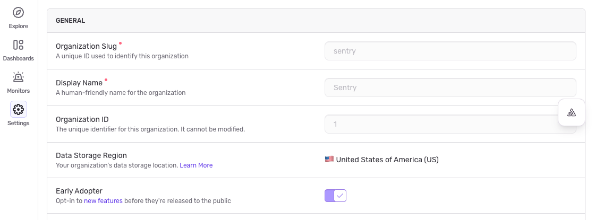

If you're interested in being an Early Adopter, you can turn your organization's Early Adopter status on/off in [**Settings > General Settings**](https://sentry.io/orgredirect/organizations/:orgslug/settings/organization/#isEarlyAdopter). This will affect all users in your organization and can be turned back off just as easily.

This page lists the features that you'll have access to when you opt-in as "Early Adopter". Note that features are sometimes released to early adopters in waves, so you may not see a feature immediately upon enabling the "Early Adopter" setting.

Limitations:

- This list only includes new features controlled by the "Early Adopter" organiation setting. Alphas, closed betas, or limited availability features that require manual opt-in are not included.

{/* AUTO-GENERATED CONTENT BELOW - DO NOT EDIT MANUALLY */}
{/* Run: pnpm ts-node scripts/sync-ea-features.ts --update */}

## Current Early Adopter Features

### AI & Automation

- [Seer Slack Workflows](/product/ai-in-sentry/seer/autofix/#autofix-in-slack-beta)

### Dashboards

- [Prebuilt Sentry Dashboards](/product/dashboards/sentry-dashboards/)
