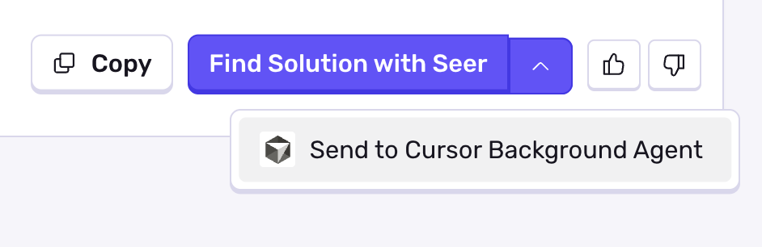
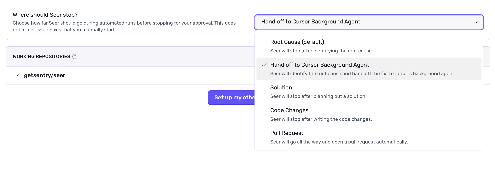

You can trigger Cursor Cloud Agents from your [Seer Issue Fix](/product/ai-in-sentry/seer/issue-fix/) tab. The Cloud Agents will be provided with Seer's Root Cause Analysis alongside the issue context to help the Cloud Agent understand the issue and generate a solution.

## Install and Configure

<Alert>

Sentry Owner, Manager, or Admin permissions are required to install this integration.

</Alert>

1. In Sentry, navigate to **Settings > Integrations > [Cursor Agent](https://sentry.io/orgredirect/organizations/:orgslug/settings/integrations/cursor)**

2. Click **Install**.

3. Provide your Cursor API key. You can find this in [Cursor Account Settings](https://cursor.com/dashboard?tab=integrations) under **Integrations > User API Keys**.

## Using the Integration

Once installed, you can trigger Cursor Cloud Agents from the Seer Root Cause Analysis card on any issue. Click the dropdown next to **Find Solution** to launch a Cursor Cloud Agent.

### Triggering via Automation

You can trigger Cursor Cloud Agents automatically via Seer Automation.

Go to your [Seer settings](https://sentry.io/orgredirect/organizations/:orgslug/settings/seer/), select your project, and configure Cursor Cloud Agent as the target in the "Where should Seer stop?" section or hit the "Set Seer to hand off to Cursor" button below.

