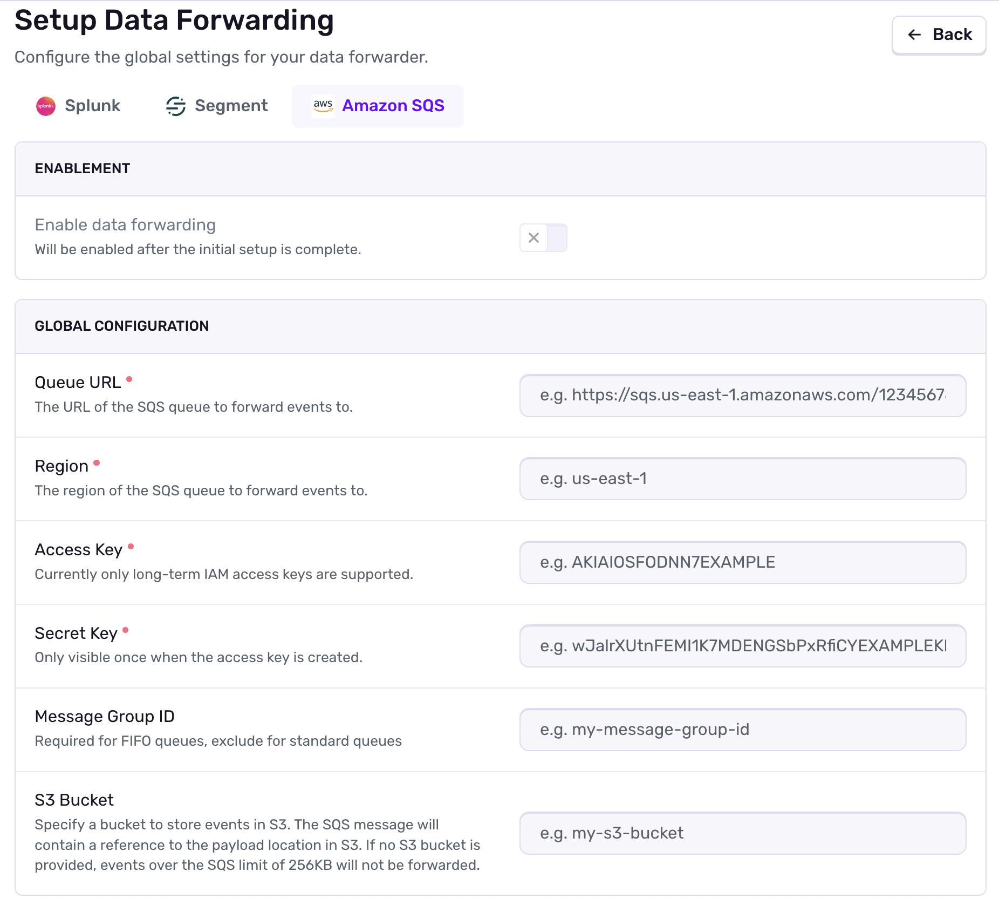
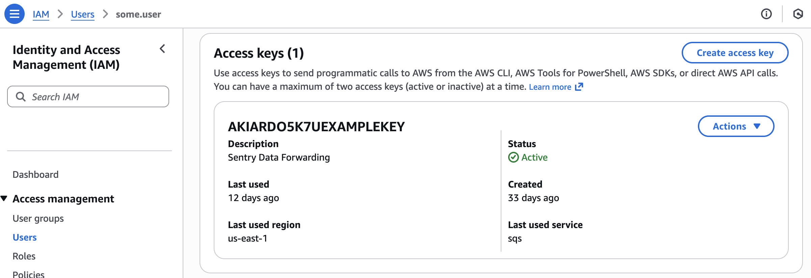
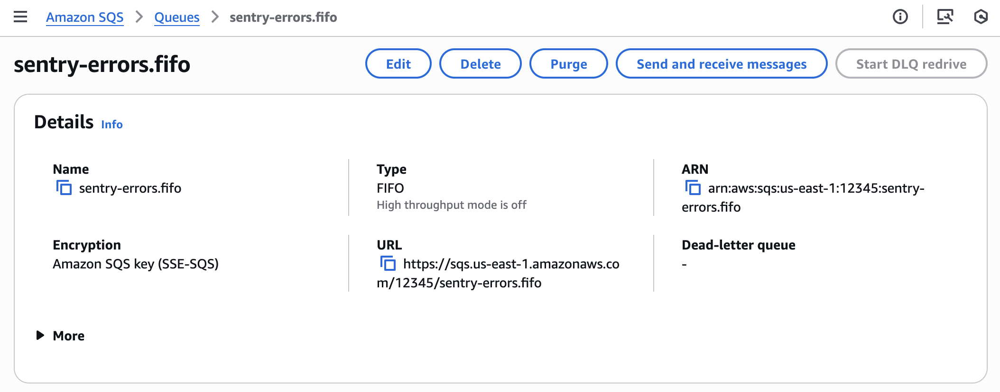

Amazon SQS is a generic queueing service provided by Amazon Web Services that Sentry supports sending error events to. The SQS forwarder may be useful for building your own data pipelines that might require Sentry errors as a source to eventually compare with some other data living elsewhere.

Sentry supports Amazon SQS as a first-party **Data Forwarder**, which currently only supports forwarding error events. For more details on Data Forwarding in general (including basic setup and overrides), check out the [Data Forwarding](/organization/integrations/data-forwarding/) documentation.

## Installation

Navigate to **Settings » Data Forwarding** and add a new forwarder.

Ensure you have selected _Amazon SQS_ as the provider. For standard queues, the required fields are the **Queue URL**, **Region**, **Access Key**, and **Secret Key**.
If you are using a FIFO queue (`.fifo` suffix on your Queue URL), you will also need to provide a **Message Group ID**.

Optionally, you can also provide an **S3 Bucket** for storing events. This will allow forwarding of event payloads greater than 256KB, and the SQS message will contain the bucket URL for the event instead of the event payload itself.

For an AWS Access Key and Secret Key, you can get these from the AWS IAM console. Navigate to **IAM > Users > [Your User] > Security credentials** and click on **Create access key**.

For the Queue URL, Navigate to **Amazon SQS > Queues > [Your Queue]** and click on the name of the queue you'd like to use, or create a new one. Afterward, the details should be visible. This also apples to the S3 Bucket (if you are using one, **Amazon S3 > Buckets > [Your Bucket]**).

If you are using an S3 Bucket, ensure it is in the same region as the SQS queue.

The payload for the SQS message (or S3 bucket object) is identical to our standard API event payload, and will evolve over time. For more details on the format of this data, see our [API documentation](/api/events/retrieve-an-event-for-a-project/).

Once you’ve filled in the required fields, and added any projects you'd like events forwarded for, click **Complete Setup**. These projects will now begin forwarding events to your SQS queue!

If you modify any of the above details from the AWS console, you'll have to update the forwarder you've configured in Sentry as well, manually.

If you wish to modify your forwarder configuration per project, you can do so by following the [Project Overrides documentation](/organization/integrations/data-forwarding/#project-overrides).

## Troubleshooting

- Unlike the other data forwarders, Sentry does not rate limit its sending of events to Amazon SQS. This is separate from the rate limit Amazon SQS enforces. Keep that in mind if you are noticing inconsistencies in your data, or missing events.
- Double check that your specified region is correct, both when monitoring the queue/bucket in AWS, and configuring the forwarder in Sentry. Sentry expects the region in the format of `us-east-1`, `us-west-1`, etc.
- If your Sentry event payloads are greater than 256KB and you have not provided an S3 Bucket, the event will _not_ be forwarded to your SQS queue. You'll need to setup an S3 Bucket for these events to be forwarded.
- If you are using an S3 Bucket, ensure it is in the same AWS region as the SQS queue otherwise you may experience issues with forwarding events.