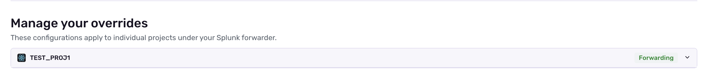
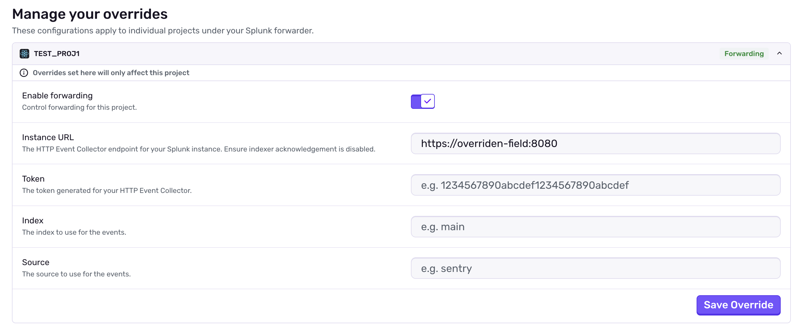

<Include name="feature-available-for-plan-trial-business.mdx" />

<Alert>

The plugins listed on this page have been deprecated and will be removed from Sentry in a future date.

</Alert>

Sentry provides the ability to forward processed error events to certain third-party providers, namely [Segment](https://segment.com), [Amazon SQS](https://aws.amazon.com/sqs/), and [Splunk](https://www.splunk.com/).

This is often useful when you may want to analyze exceptions more deeply, or empower other teams, such as a Business Intelligence function.

Only error events will be forwarded. Forwarding of transaction events is not supported.

Configure Data Forwarding for your organization by navigating to **Settings » Data Forwarding**, then providing the required information for the given integration. Note that only one org-level forwarder can be created for each integration. However,
configs can be overridden with project overrides.

## Project Overrides

Project Overrides allows you to have a different forwarding configuration to be different for a particular project. They can be configured for each provider by navigating to **Settings » Data Forwarding » [Provider] » Edit** and scrolling down to **Manage your overrides**.



Click on the project you wish to override and provide inputs for the particular fields you wish to override. Note that fields you do not fill in will use the main org-level config fields. 



## Amazon SQS

Integration with Amazon SQS makes it quick and easy to pipe exceptions back into your own systems.

The payload for Amazon is identical to our standard API event payload, and will evolve over time. For more details on the format of this data, see our [API documentation](/api/events/retrieve-an-event-for-a-project/).

## Segment

The Segment integration will generate _Error Captured_ events within your data pipeline. These events will **only** be captured for `error` events, and only when an ID is present the user context. The general shape of the event will look roughly similar to:

```json
{
  "userId": "1",
  "event": "Error Captured",
  "properties": {
    "environment": "production",
    "eventId": "002c8bbde8324dae9f12a0b96f5b1e51",
    "exceptionType": "ValueError",
    "release": "a2def1",
    "transaction": "/api/0/users/{user}/",
    "userAgent": "Mozilla/5.0 (X11; Linux x86_64; rv:54.0) Gecko/20100101 Firefox/54.0",
    "page": {
      "url": "https://sentry.io/api/0/users/{user}/",
      "method": "GET",
      "search": "",
      "referer": "https://sentry.io/"
    }
  },
  "timestamp": "2017-05-20T15:29:06Z"
}
```

## Splunk

For details on the Splunk integration, visit the dedicated [Splunk integration documentation](/organization/integrations/data-visualization/splunk/).
