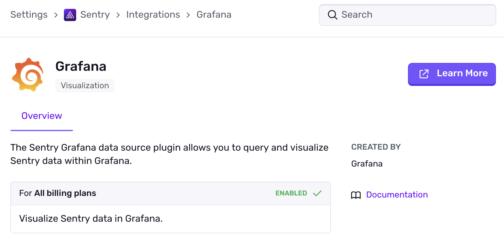

<Alert level="warning">
If you make changes to your organization slug, you'll need to update your configuration for this integration. Learn more in our [troubleshooting guide](/organization/integrations/troubleshooting).
</Alert>

Visualize your Sentry [Issues](/product/issues/) and [Stats](/product/stats/) data in Grafana with the Sentry [data source plugin](https://grafana.com/grafana/plugins/grafana-sentry-datasource/). Once installed, you can combine Sentry data with that of other sources, like your infrastructure data through Prometheus or your business data from your data warehouse, in a single dashboard.

Unlike [Segment](../segment/), [Amazon SQS](../amazon-sqs/), and [Splunk](../splunk/), Grafana is not supported as a first-party data forwarder. Instead, you can find the installation instructions in the integration directory page.

Note: These instructions and the Grafana integration are maintained by Grafana Labs.
