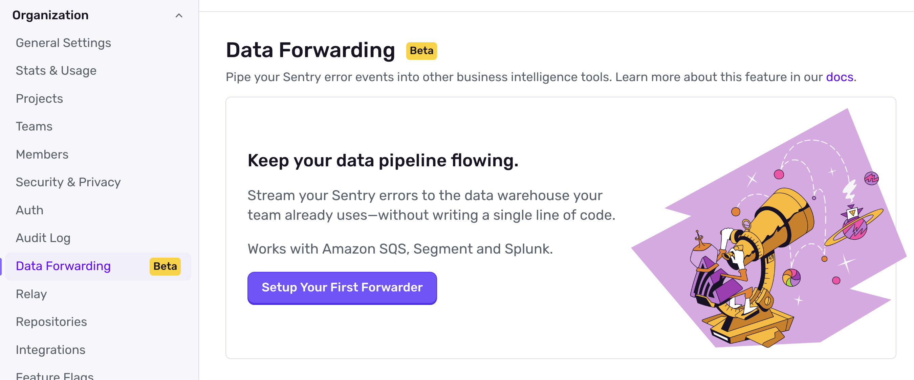
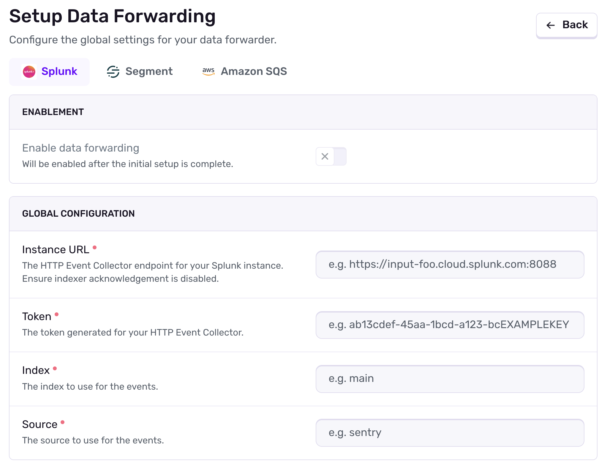
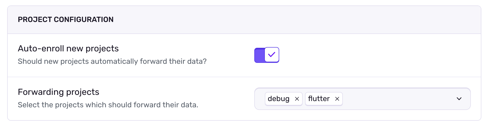
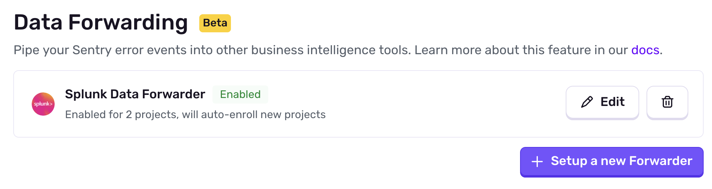
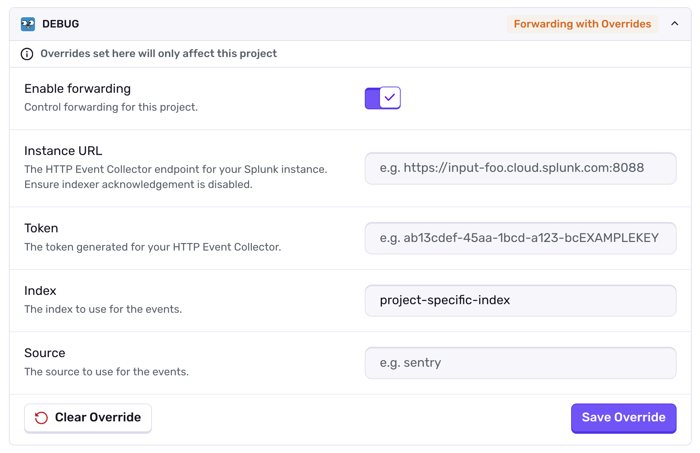

<Alert>
Data Forwarding is currently in a limited preview, and may not be accessible to all organizations.
</Alert>

<Include name="feature-available-for-plan-trial-business.mdx" />

Sentry provides the ability to forward processed error events to certain third-party providers, namely [Segment](https://segment.com), [Amazon SQS](https://aws.amazon.com/sqs/), and [Splunk](https://www.splunk.com/).

This is often useful when you may want to analyze errors in relation to other datasets, empower teams outside of engineering, and other business intelligence use cases.
Currently, only error events will be forwarded. Forwarding of other event types (such as spans or logs) is not supported.

For more details on setup and troubleshooting with specific data forwarders, refer to the provider documentation below:
 - [Splunk](/organization/integrations/data-forwarding/splunk/)
 - [Amazon SQS](/organization/integrations/data-forwarding/amazon-sqs/)
 - [Segment](/organization/integrations/data-forwarding/segment/)'

Note: Grafana is not a first-party data forwarder, and must be configured separately. For more details, refer to the [these docs](/organization/integrations/data-forwarding/grafana/).

## Global Configuration

<Alert>
Sentry owner or manager permissions are required to setup/modify a global data forwarder.
</Alert>

If you've been a Sentry customer for a while, you may have seen a legacy version of data forwarding which was applied at the project level through plugins. This is no longer supported, and organizations should be automatically migrated to the new global (organization-level) configuration.

With a global configuration, you can setup a single forwarder for your organization and apply it to how ever many projects you'd like, with the additional ability to automatically begin forwarding events from new projects as soon as they're created.

To setup a global forwarder, navigate to **Settings » Data Forwarding**, and start the setup for a new provider. Note that we only allow one forwarder per provider per organization.

When creating a new forwarder, select the provider you'd like to forward events to and fill in the required fields. Each provider requires different configuration and permissions on that service, so please refer to the documentation below for more details on your specific provider. After a forwarder is created, you will not be able to switch providers, but you can modify the forwarding details at any time.

You cannot create project-level overrides until you've setup the forwarder for the first time. Any projects you connect to the forwarder will begin forwarding (with the global configuration) as soon you complete the setup. You can also specify if new projects should automatically adopt the global configuration now.

After completing the setup, you will be redirected to the forwarder list page, where you can see the newly-enabled forwarder and it's current status. Now you can edit the forwarder to add project-level overrides, if necessary.

## Project Overrides

<Alert>
Sentry owner, manager, or admin permissions allow creating project-level overrides.

Additionally, users without these permissions can modify overrides for projects associated with teams of which they are a Team Admin.
</Alert>

You can manage your project overrides by navigating to **Settings » Data Forwarding » [Provider] » Edit** and scrolling to **Manage your overrides**.

A project override will allow you to replace specified fields in the global configuration with custom values for a particular project. All the previously required fields on the provider are marked as optional, and only the specified fields will be overridden. If no value is provided for a field, the global configuration will be used.

Empty values (`""`) are permitted in the override form, so manually deleting an override will _not_ revert to the global configuration. If you wish to remove an override, be sure to click the **Clear Override** button at the bottom of the form. After saving, be sure to check the status of the override in the corner of it's form.

## Troubleshooting

For provider-specific troubleshooting, refer to the provider documentation below:
 - [Splunk](/organization/integrations/data-forwarding/splunk/#troubleshooting)
 - [Amazon SQS](/organization/integrations/data-forwarding/amazon-sqs/#troubleshooting)
 - [Segment](/organization/integrations/data-forwarding/segment/#troubleshooting)
 - [Grafana (Third-Party)](/organization/integrations/data-forwarding/grafana/)
 

