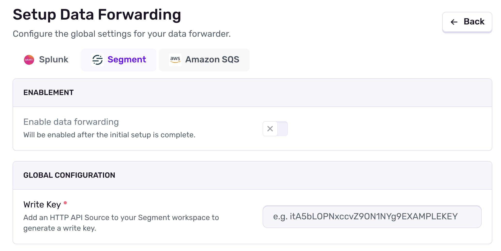
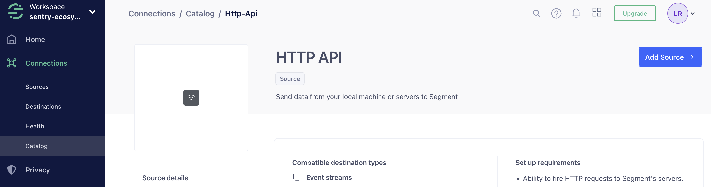
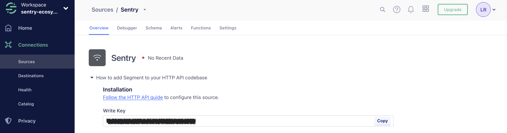

<Alert>
Data Forwarding is currently in a limited preview, and may not be accessible to all organizations.
</Alert>

Segment is useful for collecting, responsibly managing, and integrating your customer data with many other applications, including Sentry.

Sentry supports Segment as a first-party **Data Forwarder**, which currently only supports forwarding error events. For more details on Data Forwarding in general (including basic setup and overrides), check out the [Data Forwarding](/organization/integrations/data-forwarding/) documentation.

## Installation

Navigate to **Settings » Data Forwarding** and add a new forwarder.

Ensure you have selected _Segment_ as the provider. The only required field for Segment is the **Write Key**.

You can get this value in your Segment workspace by navigating to **Connections > Catalog** and searching for **HTTP API**. This is a generic server forwarder that has the write key we'll need.

Click on **Add Source**, and it should provide you with a write key you can copy into Sentry's configuration form.

You may now modify any other settings on the Segment source as necessary. If you modify or change the Segment write key later on, you'll have to update the forwarder you've configured in Sentry as well.

If you wish to modify your forwarder configuration per project, you can do so by following the [Project Overrides documentation](/organization/integrations/data-forwarding/#project-overrides).