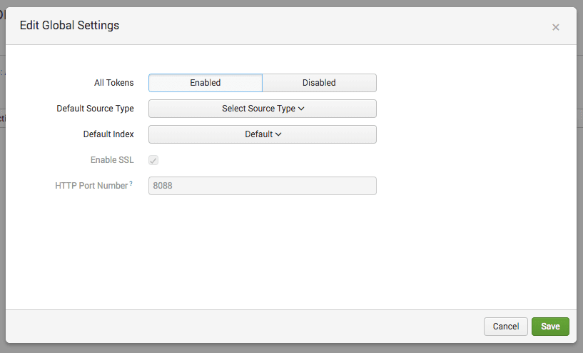
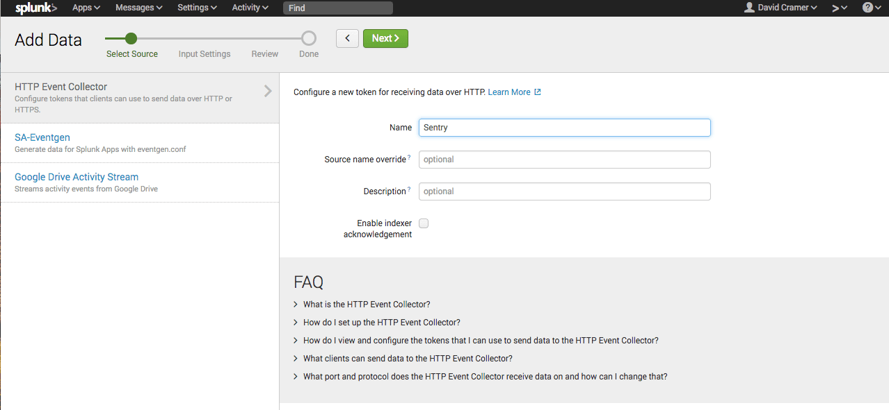
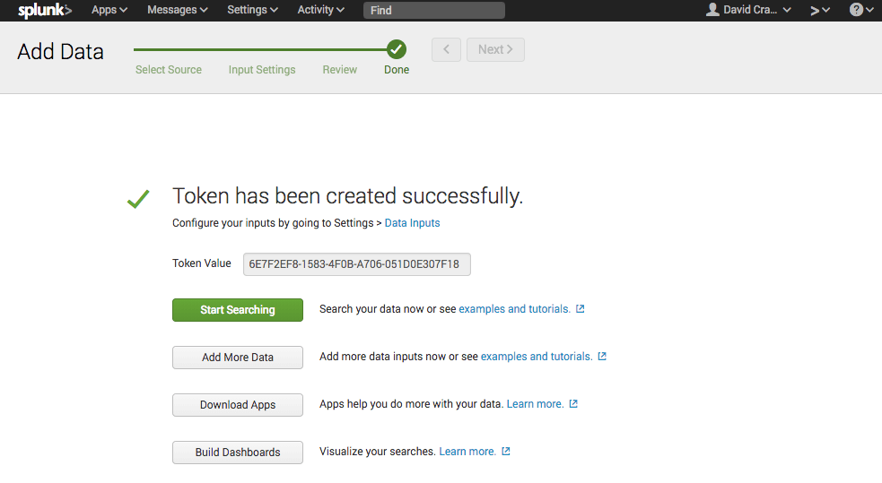

Splunk is a popular business intelligence and analytics platform for collecting, storing and analyzing your data from whatever source you need, including Sentry. 

Sentry supports Splunk as a first-party **Data Forwarder**, which currently only supports forwarding error events. For more details on Data Forwarding in general (including basic setup and overrides), check out the [Data Forwarding](/organization/integrations/data-forwarding/) documentation.

<Alert>
We only support Splunk Cloud plans. We do not support Splunk Enterprise plans. See the [Splunk documentation](https://dev.splunk.com/) for specific details on your Splunk installation.
</Alert>

## Installation


Navigate to **Settings » Data Forwarding** and add a new forwarder.

Ensure you have selected _Splunk_ as the provider. All of the fields are required for splunk; **Instance URL**, **Index**, **Source**, and **Token**.


To fill out these values, you'll need your Splunk instance setup properly first.

### Enabling an HTTP Event Collector in Splunk

To get started, you’ll need to first enable the HTTP Event Collector:

Under **Settings**, select **Data Inputs**:


Select **HTTP Event Collector** under Local Inputs:


Under your HEC settings, click "Global Settings":


Change **All Tokens** to **Enabled**, and note the HTTP Port Number (`8088` by default):



<Alert>

If you’re running Splunk in a privileged environment, you may need to expose the HEC port.

</Alert>

### Creating a Sentry Input in Splunk

Under HTTP Event Collector, create a new Sentry input by clicking "New Token":


Enter a name (e.g. `sentry`), and click "Next":



Select the index you wish to make accessible (e.g. `main`), and click "Review":


You’ll be prompted to review the input details. Click "Submit" to continue:


The input has now been created, and you should be presented with the **Token Value**:



### Finish the Setup in Sentry

Now, you can finish setting up the forwarder in Sentry.

Your **Instance URL** is going to vary based on the type of Splunk service you’re using. If you’re using self-service Splunk Cloud, the instance URL will be the URL of the Splunk instance running the HTTP Event Collector (HEC):

```
https://<host>:8088
```

For all other Splunk Cloud plans, you’ll use the `http-inputs` prefix:

```
https://http-inputs-<host>:8088
```

If you’re using Splunk behind your firewall, you’ll need to fill in the appropriate host.

Once you’ve filled in the required fields, and added any projects you'd like events forwarded for, click **Complete Setup**. These projects will now begin forwarding events to your Splunk instance!


If you modify any of the above details from the Splunk console, you'll have to update the forwarder you've configured in Sentry as well, manually.

If you wish to modify your forwarder configuration per project, you can do so by following the [Project Overrides documentation](/organization/integrations/data-forwarding/#project-overrides).

## Troubleshooting

- Sentry rate limits its sending of events to Splunk at approximately 1000 requests per second per _unique token_. This is separate from the rate limit Splunk enforces. Keep that in mind if you are noticing inconsistencies in your data, or missing events.