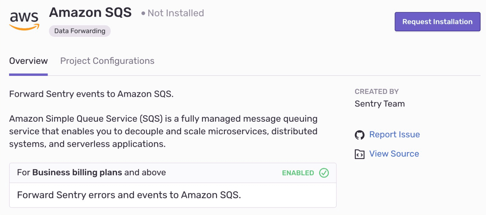

Amazon SQS is useful for a more in-depth analysis of exceptions, making it quick and easy to pipe exceptions back into your own systems. Or, use it to empower other teams, such as a Business Intelligence function.

This integration needs to be set up in each project for which you wish to use it. It is maintained and supported by the [Sentry community](https://open.sentry.io/).

## Install and Configure

<Note>

Sentry owner, manager, or admin permissions are required to install this integration.

</Note>

Navigate to **Settings > Integrations > Amazon SQS**

### Data Forwarding

Configure [data forwarding](/concepts/data-management/data-forwarding/) in **[Project] > Settings > Data Forwarding**, and provide the required information for the given integration.

The payload for Amazon is identical to our standard API event payload and will evolve over time. For more details on the format of this data, see our [API documentation](/api/events/retrieve-an-event-for-a-project/).
