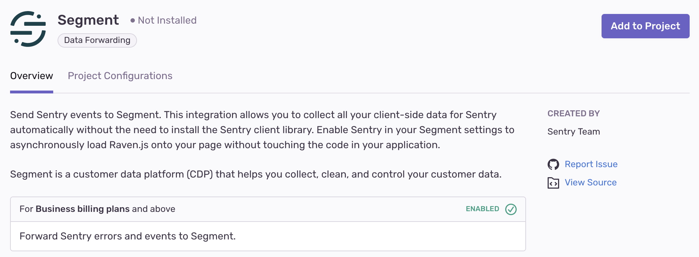

<Alert level="warning">

If you make changes to your organization slug, you'll need to update your configuration for this integration. Learn more in our [troubleshooting guide](/organization/integrations/troubleshooting).

</Alert>

Segment is useful for collecting, responsibly managing, and integrating your customer data with many other applications, including Sentry.

This integration needs to be set up in each project for which you wish to use it. It is maintained and supported by the [Sentry community](https://open.sentry.io/).

## Install and Configure

<Note>

Sentry owner, manager, or admin permissions are required to install this integration.

</Note>

Navigate to **Settings > Integrations > Segment**

### Data Forwarding

Configure [data forwarding](/concepts/data-management/data-forwarding/) in **[Project] > Settings > Data Forwarding**, and provide the required information for the given integration.
