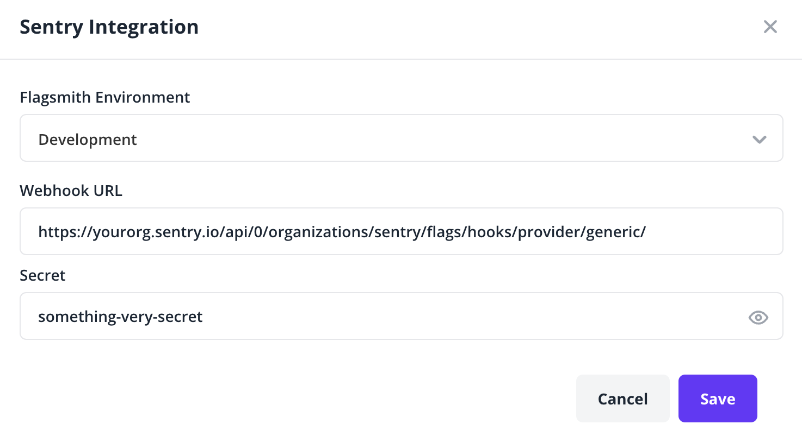

## Evaluation Tracking

Sentry can track flag evaluations as they happen within your application.  Flag evaluations will appear in the "Feature Flag" section of the Issue Details page as a table, with "suspect" flag predictions highlighted in yellow. Learn more about how to interact with feature flag insights within the Sentry UI by reading the [Issue Details page documentation](/product/issues/issue-details/#feature-flags).

### Set Up Evaluation Tracking

To set up evaluation tracking, visit one of our supported languages pages:
* [JavaScript](/platforms/javascript/configuration/integrations/flagsmith/)
* [Python](/platforms/python/integrations/flagsmith/)

## Change Tracking

Sentry can track changes to feature flag definitions and report suspicious feature flag edits.

### Set Up Change Tracking

Enabling Change Tracking is a three-step process. To get started, visit the [feature flags settings page](https://sentry.io/orgredirect/organizations/:orgslug/settings/feature-flags/change-tracking/) in a new tab. Then follow the steps listed below.

1. **Click the "Add New Provider" button.**
    - One webhook secret can be registered per provider type.
    - Select Generic in the dropdown that says "Select a provider".
2. **Register the webhook URL**.
    
    - Go to your Flagsmith project dashboard and navigate to the `/project/:projectid/integrations` page, which can be found by clicking "Integrations" on the top navigation bar.
    - Find the Sentry option, and click "Add Integration", which will open a modal.
    - Select the Environment from which flag change events will trigger.
    - Copy the provided Sentry webhook URL and paste it into "Webhook URL" in the Flagsmith "Sentry Integration" modal.
3. **Set the Signing Secret**.
    - Still in the Flagsmith "Sentry Integration" modal, type in any string between 10 and 60 characters to use as your authorization token ("secret").
    - Copy the authorization token from the previous step and paste it into the input box next to "Secret" in Sentry settings.

Once saved, Sentry will now accept and authenticate all inbound hooks to your organization's feature flag webhook endpoint.
