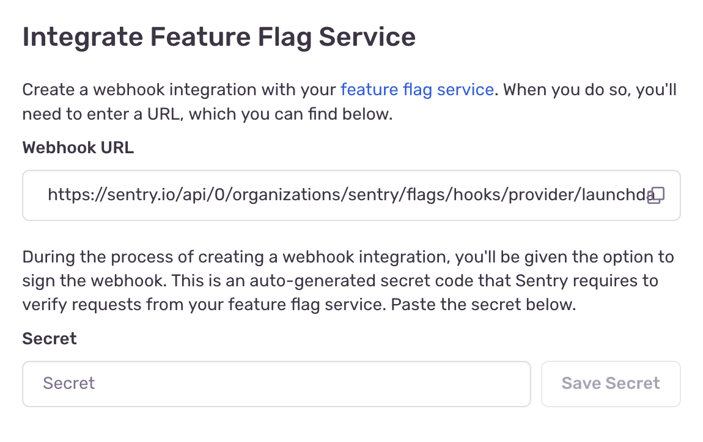

## Evaluation Tracking

Sentry can track flag evaluations as they happen within your application.  Flag evaluations will appear in the "Feature Flag" section of Issue Details page as a table, with "suspect" flag predictions highlighted in yellow. Learn more about how to interact with feature flag insights within the Sentry UI by reading the [Issue Details page documentation](/product/issues/issue-details/#feature-flags).

### Set Up Evaluation Tracking

To set up evaluation tracking visit one of our supported languages documentation page:
* [JavaScript](/platforms/javascript/configuration/integrations/launchdarkly/)
* [Python](/platforms/python/integrations/launchdarkly/)

## Change Tracking

Sentry can track changes to feature flag definitions and report suspicious feature flag edits.

### Install and Configure

To enable the change-tracking integration, go to the **Issue Details** page and click the "Set Up Integration" button on the feature flag table. This will trigger a flyout, which will guide you through the two-step process.

Under the "Integrate Feature Flag Service" heading a Sentry webhook URL has been provided. The Sentry URL must be registered with LaunchDarkly as a webhook integration within their [webhook integration UI](https://app.launchdarkly.com/settings/integrations/webhooks/new). Paste the Sentry URL into the input box labeled "URL" within the LaunchDarkly webhook registration UI.

Next a signing secret must be created. Check the box that says "Sign this webhook". This will reveal an input element which contains your signing secret. Copy and paste this signing secret into the input box labeled "Secret" on the Sentry fly out. Click "Save Secret" in the Sentry UI, click "Save Settings" in the LaunchDarkly UI, and you're done. Sentry will now accept and authenticate all inbound hooks to your organization's feature flag webhook endpoint.

## Metrics Integration

This integration is maintained and supported by the company that created it. For more details or questions, feel free to contact rrosefigura@launchdarkly.com.

### Install and Configure

<Note>

Sentry owner or manager permissions are required to install this integration.

</Note>

<Note>

The LaunchDarkly integration is only available to organizations with a Business or Enterprise plan.

</Note>

1. Navigate to **Settings > Integrations > LaunchDarkly**

2. Follow the full [LaunchDarkly installation instructions](https://docs.launchdarkly.com/integrations/sentry).
