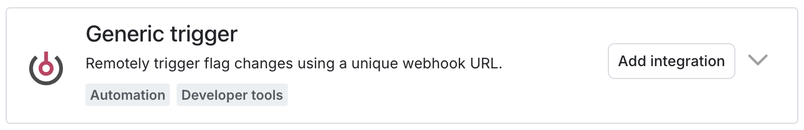

## Metrics Integration

This integration is maintained and supported by the company that created it. For more details or questions, feel free to contact rrosefigura@launchdarkly.com.

## Install and Configure

<Note>

Sentry owner or manager permissions are required to install this integration.

</Note>

<Note>

The LaunchDarkly integration is only available to organizations with a Business or Enterprise plan.

</Note>

1. Navigate to **Settings > Integrations > LaunchDarkly**

2. Follow the full [LaunchDarkly installation instructions](https://docs.launchdarkly.com/integrations/sentry).

## Change Tracking Integration

Sentry offers a flag change tracking integration which allows Sentry to associate flag definition changes with errors that occurred in your application. To enable this integration, create a new <Link to="https://app.launchdarkly.com/settings/integrations?q=generic+trigger">"Generic Trigger"</Link> integration and paste the Sentry web hook URL generated by the Feature Flag Integration Modal. For information on how to generate a Sentry Web Hook URL visit the <PlatformLink to="/product/issues/issue-details/#feature-flags">feature flag integration documentation here</PlatformLink>. Learn more about LaunchDarkly's "Generic Triggers" <Link to="https://docs.launchdarkly.com/home/releases/triggers">here</Link>.

