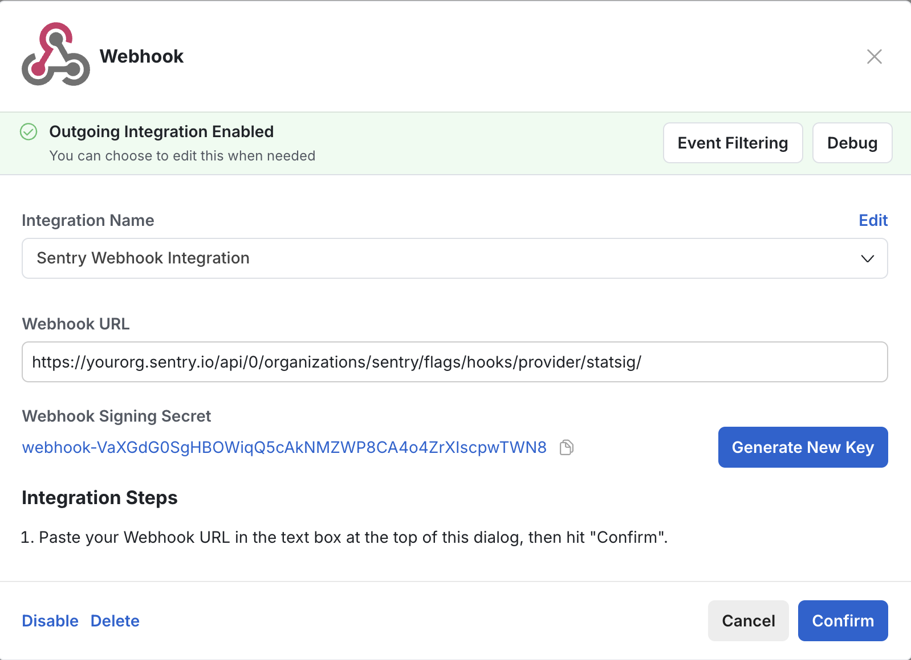
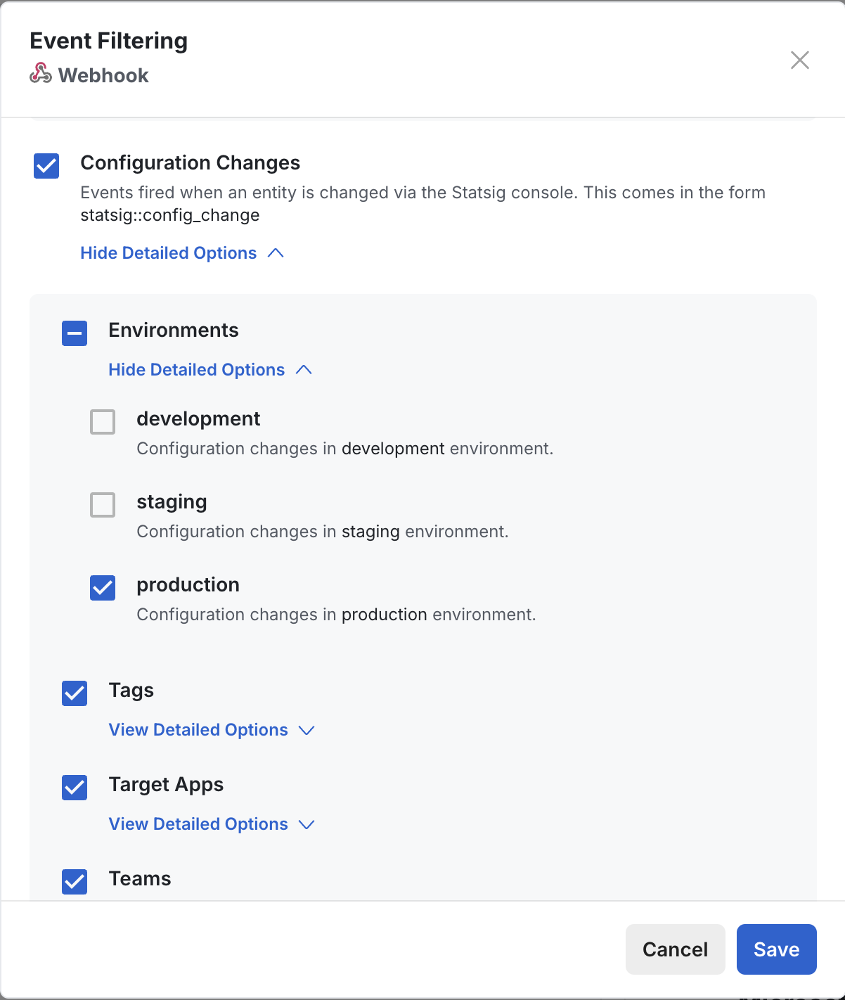

## Evaluation Tracking

Sentry can track flag evaluations as they happen within your application.  Flag evaluations will appear in the "Feature Flag" section of the Issue Details page as a table, with "suspect" flag predictions highlighted in yellow. Learn more about how to interact with feature flag insights within the Sentry UI by reading the [Issue Details page documentation](/product/issues/issue-details/#feature-flags).

### Set Up Evaluation Tracking

To set up evaluation tracking, visit one of our supported languages pages:
* [JavaScript](/platforms/javascript/configuration/integrations/statsig/)
* [Python](/platforms/python/integrations/statsig/)

## Change Tracking

Sentry can track changes to feature flag definitions and report suspicious feature flag edits.

### Set Up Change Tracking

Enabling Change Tracking is a three-step process. To get started, visit the [feature flags settings page](https://sentry.io/orgredirect/organizations/:orgslug/settings/feature-flags/change-tracking/) in a new tab. Then follow the steps listed below.

1. **Click the "Add New Provider" button.**
    - One webhook secret can be registered per provider type.
    - Select Statsig in the dropdown that says "Select a provider".
2. **Register the webhook URL**.
    
    - Go to your Statsig console and navigate to the `/integrations/` page, which can be found by clicking settings on the left-hand sidebar navigation, then "Integrations" under the "Product Configuration" heading.
    - Select the Webhook option, which will open a modal.
    - Copy the webhook URL provided in Sentry settings and paste it into the modal's "Webhook URL" input box.
3. **Set the Signing Secret**.
    - Copy the Webhook Signing Secret from below the URL, and paste it into the input box next to "Secret" in Sentry settings.
    - Keep this string safe and note it down somewhere in case you need it in the future. Statsig will still show you the secret when reopening the webhook modal. Keep in mind that if you click "Generate New Key", you will need to add the secret to Sentry settings again.
4. **Optional: Event Filters**.
   - We currently only support change tracking events from this webhook. To avoid sending unnecessary events, click "Event Filtering" on the top right of the Statsig modal and check off "Configuration Changes". Click save to confirm.
   - If you would like to only track changes from your Statsig development, staging, and/or production environments, check off the corresponding environment(s) under "Configuration Changes" > "Environments" in Event Filtering. Click save to confirm.
   - Similar to Environments, you may also filter by Configuration Changes by "Tags", "Target Apps", or "Teams".
   

5. **Save your webhook**.
    - Save the secret by clicking "Add Provider" in Sentry settings.
    - Save the webhook by clicking "Confirm" in Statsig.

Once saved, Sentry will now accept and authenticate all inbound hooks to your organization's feature flag webhook endpoint.
