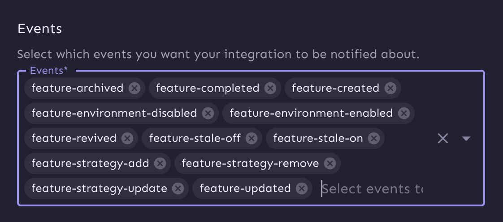

## Evaluation Tracking

Sentry can track flag evaluations as they happen within your application.  Flag evaluations will appear in the "Feature Flag" section of the Issue Details page as a table, with "suspect" flag predictions highlighted in yellow. Learn more about how to interact with feature flag insights within the Sentry UI by reading the [Issue Details page documentation](/product/issues/issue-details/#feature-flags).

### Set Up Evaluation Tracking

To set up evaluation tracking, visit one of our supported languages pages:
* [JavaScript](/platforms/javascript/configuration/integrations/unleash/)
* [Python](/platforms/python/integrations/feature-flags/unleash/)

## Change Tracking

Sentry can track changes to feature flag definitions and report suspicious feature flag edits.

### Set Up Change Tracking

Enabling Change Tracking is a three-step process. To get started visit the [feature-flags settings page](https://sentry.io/orgredirect/organizations/:orgslug/settings/feature-flags) in a new tab. Then follow the steps listed below.

1. **Click the "Add New Provider" button.**
    - One webhook secret can be registered per provider type.
    - Select Unleash in the dropdown that says "Select a provider".
2. **Register the webhook URL**.
    - Go to your Unleash homepage and navigate to the `/integrations/` page, which can be found by clicking Integrations on the left-hand sidebar navigation, under the Configure heading.
    - Select the Webhook option. You should be on the `/integrations/create/webhook/` page.
    - Copy the provided Sentry webhook URL in settings and paste it into Unleash within their webhook integration UI.
    - Make sure the integration is toggled to Enabled.
3. **Set the Signing Secret**.
    - In the Unleash webhook UI, under the Authorization input box, type in any 32-character string to use as your authorization token ("secret"). Keep this string safe and note it down somewhere in case you need it in the future; Unleash will not show you the token once you save the webhook. We recommend not using any sensitive tokens.
    - Copy your authorization token from the Unleash UI and paste it into the input box next to "Secret" in Sentry settings.
4. **Configure your webhook.**
    - Under the Events input box, specify which feature flag events you'd like to send to Sentry. We currently support the following events: 
    - Save the secret by clicking "Add Provider" in Sentry settings.
    - Save the webhook by clicking "Create" in Unleash.

Once saved, Sentry will now accept and authenticate all inbound hooks to your organization's feature flag webhook endpoint.
