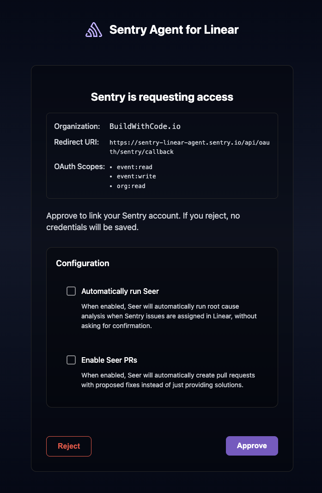
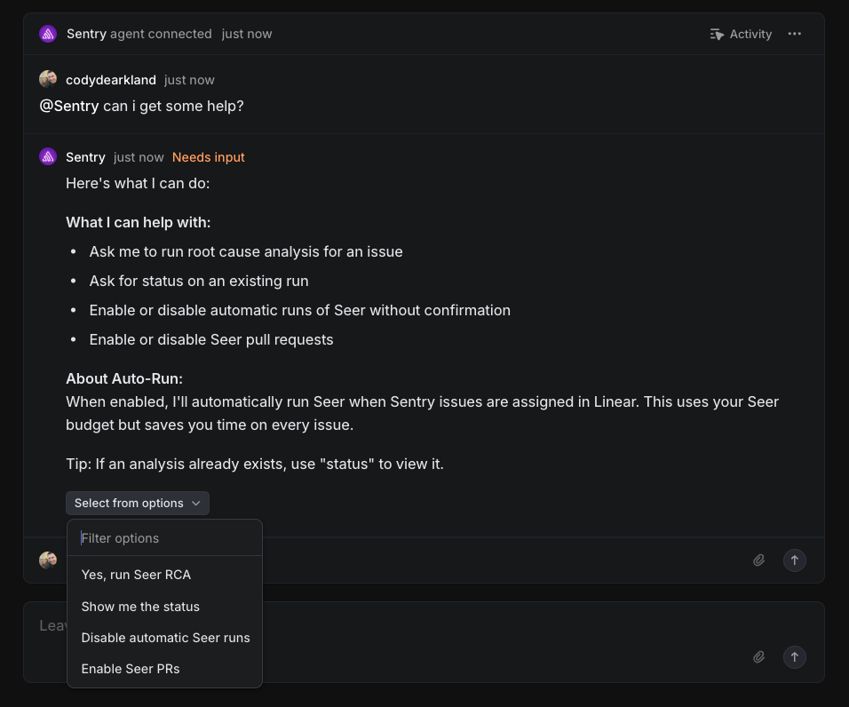
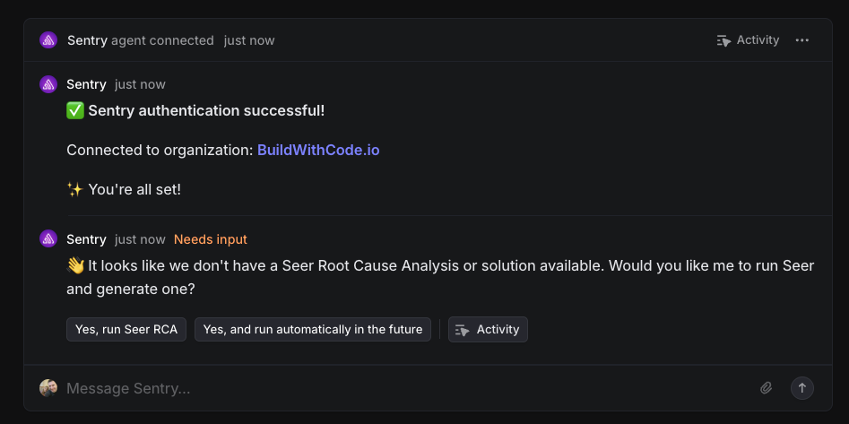
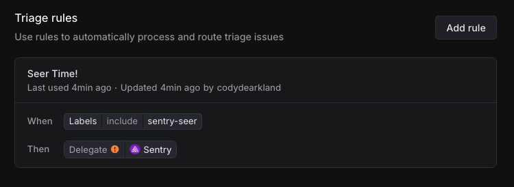
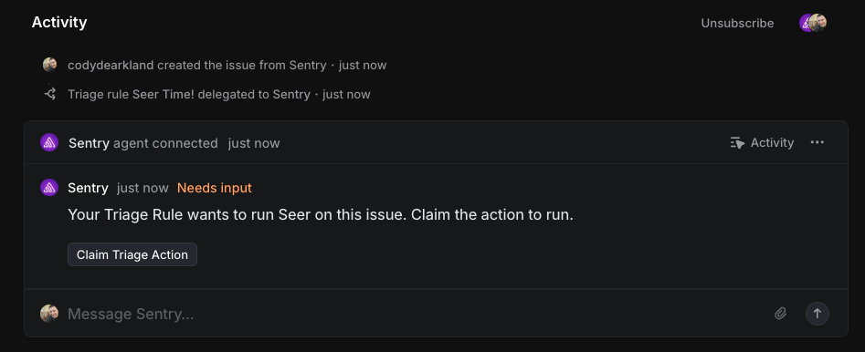

<Alert title="Beta">

**Sentry Agent for Linear** is in its beta phase. Changes to the UX and the agent functionality should be expected.

</Alert>

The Sentry Agent for Linear allows users to initiate Seer Issue Fix runs from within Linear. These results can then be used with other agents within Linear to trigger additional actions.

This integration highly benefits from having [automation configured within Seer](/product/ai-in-sentry/seer/#automation), to automatically create Root Cause Analysis and Solutions based on fixability scores from Seer.

## Install and Configure

<Alert>

Sentry owner, manager, or admin permissions are required to install this integration.

Linear **won't** work with self-hosted Sentry.
</Alert>

Navigate to **Settings > Integrations > Linear (Sentry Agent)**, accept and install.

   

## Interaction Model

The Sentry Agent can be used in 2 different ways:

1. Delegating the Linear issue to Sentry via the Linear assignment flow.
2. Commenting `@sentry` from within the Linear issue and making your request via natural language.

When the issue is delegated to the agent, the agent will automatically check for a complete Issue Fix run and display the result. If one doesn't exist, the agent will request to run one.

For comment based interactions, the integration accepts natural language. We attempt to parse the intent of the question and trigger the appropriate response. If it fails, we'll prompt the help command that will guide you through options.

Most actions are available via interactive buttons or natural language. Currently, the integration allows the user to run the following actions:

- Issue Fix - Runs a Seer Issue Fix for the application.
- Status - Updates the status of the issue.
- Help - Displays the help command that will guide you through options.
- Enable/Disable automatic Seer runs - Toggle whether Seer automatically runs (without confirmation) when issues are assigned in Linear.
- Enable/Disable Seer PRs - Allow Seer to open pull requests automatically when fixes are ready.

## Automation & Configuration

When an issue is assigned to the Sentry Agent in Linear, the user will be prompted to link their account with Sentry. This creates the relationship between your Linear user and your Sentry user, and exposes the projects and Sentry resources the user has access to. 

The OAuth consent screen shows what orgnaization is connecting to Linear as well as gives options that can be enabled to customize the Sentry Agent in Linear's behavior.

These options can also be managed within the agent interface after the account is linked through the `help` command and leveraging the select menu at the bottom.

These options can also be enabled interactively during agent sessions. These options present themselves in the following ways: 

- Via buttons after an issue is assigned:
  - `Yes, run Seer RCA` runs Seer Root Cause Analysis (RCA) for the current issue
  - `Yes, and run automatically in the future` enables automatic runs in the future for this workspace and starts Seer RCA for the current issue
- Natural language controls:
  - "enable automatic seer runs", "disable automatic seer runs"
  - "enable Seer PRs", "disable Seer PRs"

## Assigning Sentry Agent to an Issue

1. Navigate to an issue within Linear and select "Assign" from the dropdown menu in the right sidebar.

   

   

   

2. Select "Sentry" from the dropdown menu.

3. The task will be moved into in-progress and the Sentry agent session will be created. If it's your first time using the Agent, you'll be prompted to authenticate. Use the "Link" button to link your Linear user to your Sentry user.

   

4. If auto-run is disabled, you'll see a prompt with buttons:

   - `Yes, run Seer RCA`
   - `Yes, and run automatically in the future`
   

   
   

5. If auto-run is enabled, the Agent will start Seer automatically and confirm it's running. Use "status" to check progress or view results. If an analysis already exists, the Agent will post the latest status or Sentry issue details.

   

   

   

   
### Triage Rules 

The Sentry Agent supports Linear's triage rules allowing you to tag issues with a custom label in Linear, and have it execute the Sentry Agent. Examples are below.

#### Triage Configuration

#### Triage Action

## Uninstalling the Integration

The Sentry integration installs a Linear based application within your Linear environment, as well as configures the integration within Sentry. Fully cleaning it out requires removing both of these.

### Removing from Sentry

1. Navigate to Settings > Integrations > Linear (Sentry Agent)

2. Select "Uninstall"

   

### Removing from Linear

1. Navigate to Settings > Applications > Sentry

   

2. Select the "..." and select "Revoke Access"

   
