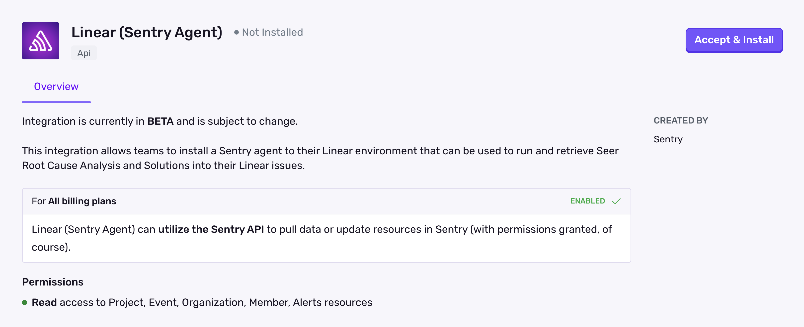
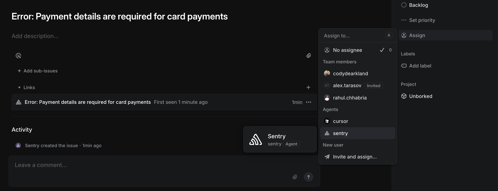
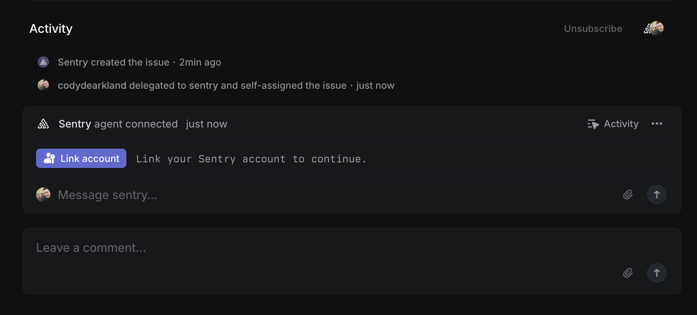
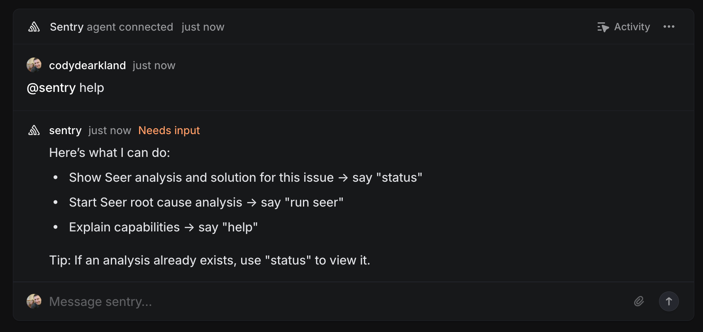
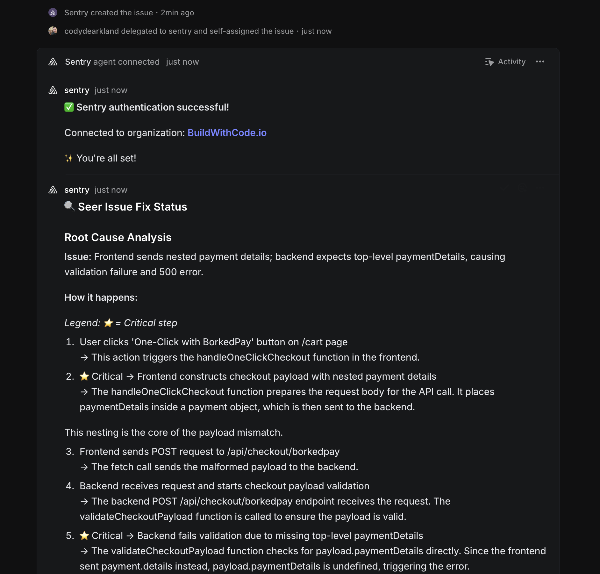
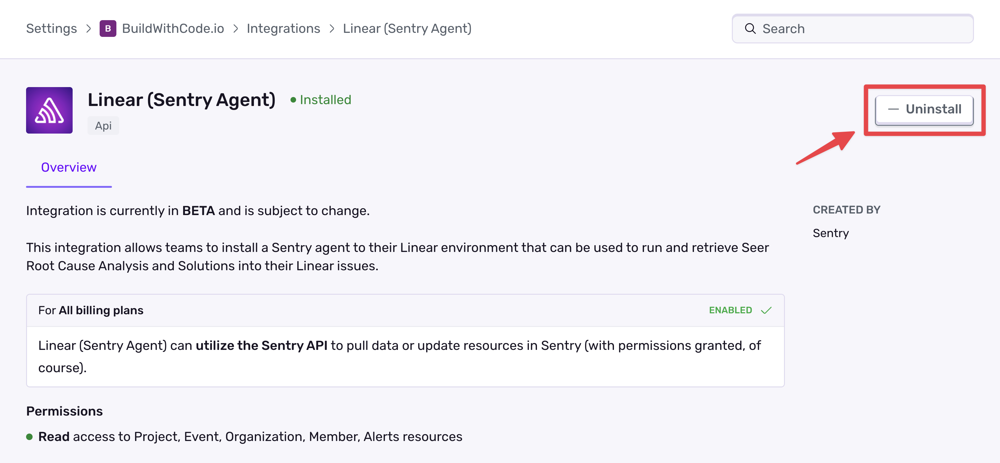
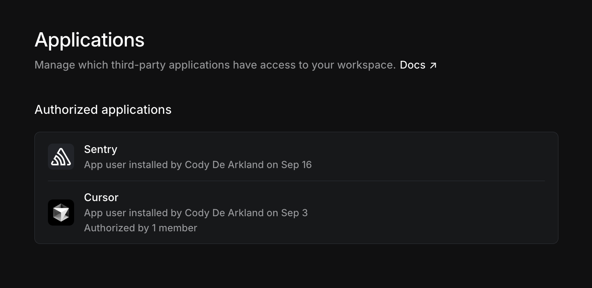
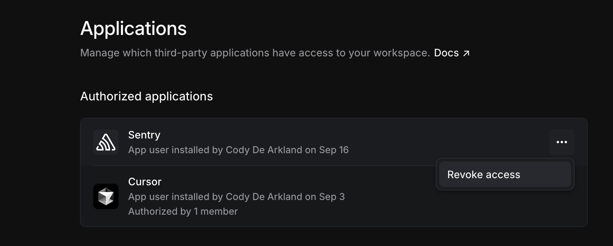

<Alert title="Beta">

**Sentry Agent for Linear** is in its beta phase. Changes to the UX and functionality should be expected.

</Alert>

The Sentry Agent for Linear allows users to initiate Seer Issue Fix runs from within Linear. These results can then be used with other agents within Linear to trigger additional actions.

This integration highly benefits from having [automation configured within Seer](/product/ai-in-sentry/seer/#automation), to automatically create Root Cause Analysis and Solutions based on fixability scores from Seer. 

## Install and Configure

<Alert>

Sentry owner, manager, or admin permissions are required to install this integration.

Linear **won't** work with self-hosted Sentry.

</Alert>

Navigate to **Settings > Integrations > Linear (Sentry Agent)**, accept and install.

   
   
## Interaction Model

The Sentry Agent can be used in 2 different ways: 

1. Delegating the Linear issue to Sentry via the Linear assignment flow.
2. Commenting `@sentry` from within the Linear issue and making your request via natural language. 

When the issue is delegated to the agent, the agent will automatically check for a complete Issue Fix run and display the result. If one doesn't exist, the agent will request to run one. 

For comment based interactions, the integration accepts natural language. We attempt to parse the intent of the question and trigger the appropriate response. If it fails, we'll prompt the help command that will guide you through options. 

Currently the integration allows the user to run the following actions:

- Issue Fix - Runs a Seer Issue Fix for the application.
- Status - Updates the status of the issue.
- Help - Displays the help command that will guide you through options.

## Assigning Sentry Agent to an Issue

1. Navigate to an issue within Linear and select "Assign" from the dropdown menu in the right sidebar.

   

2. Select "Sentry" from the dropdown menu. 

3. The task will be moved into in-progress and the Sentry agent session will be created. If it's your first time using the Agent, you'll be prompted to authenticate. Use the "Link" button to link your Linear user to your Sentry user.

   
   
4. Once linked, you'll be asked if you want to run a Seer Issue Fix for the application. You can answer "Yes", or ask for "Help" to see more options. 

   
   
5. If you answer "Yes", the Agent will run a Seer Issue Fix for the application. **Note**: You may need to prompt it for "Status" to see the results.

   
   
## Uninstalling the Integration

The Sentry integration installs a Linear based application within your Linear environment, as well as configures the integration within Sentry. Fully cleaning it out requires removing both of these. 

### Removing from Sentry 

1. Navigate to Settings > Integrations > Linear (Sentry Agent)

2. Select "Uninstall"

   
   
### Removing from Linear

1. Navigate to Settings > Applications > Sentry

   

2. Select the "..." and select "Revoke Access"

   

   
   
   