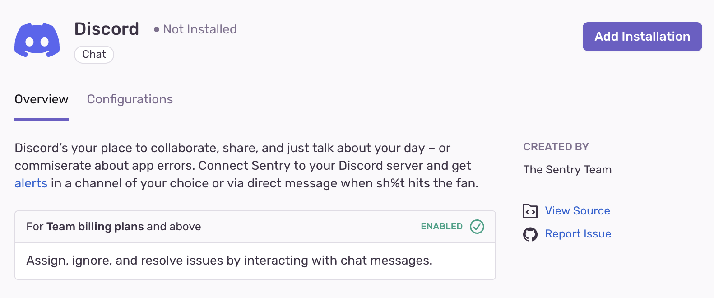
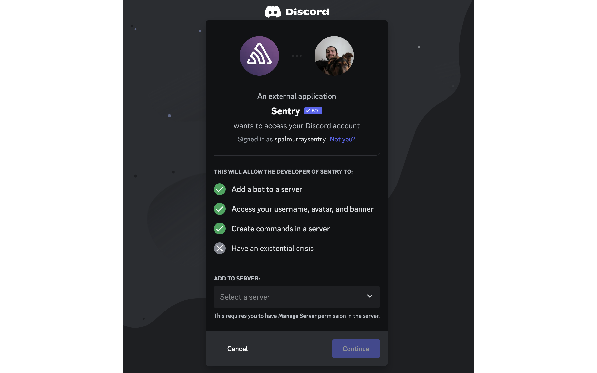
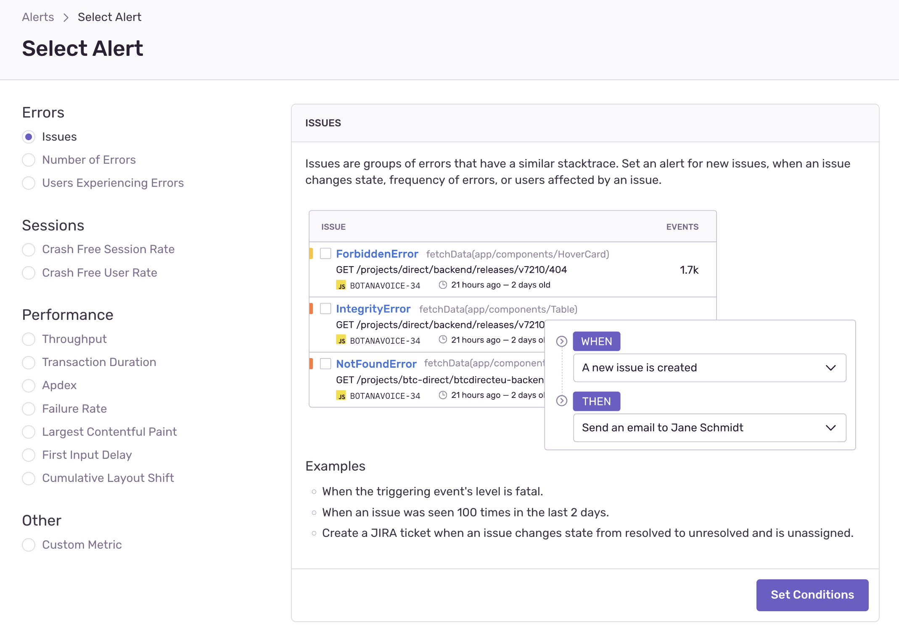
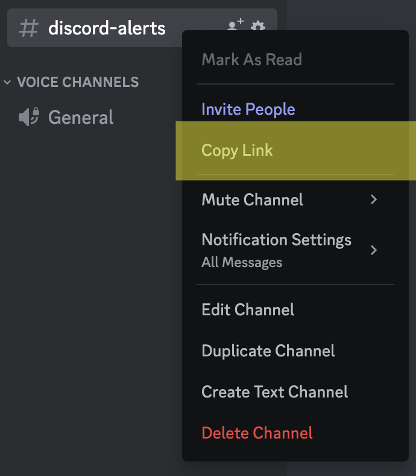
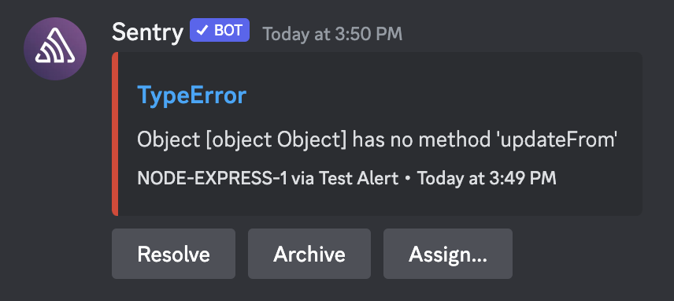
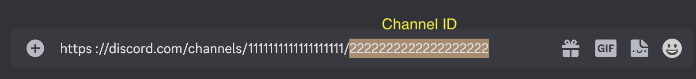
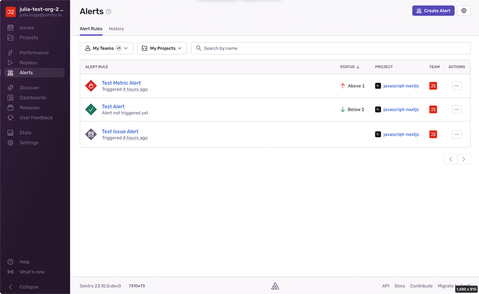
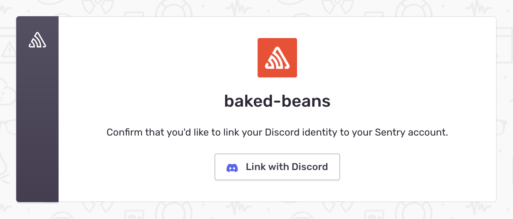

Set up a Discord integration so you can get notified about, then triage, resolve, and archive Sentry issues directly from Discord.

## Install

<Note>

Sentry owner, manager, or admin permissions are required to install this integration.

</Note>

1. Navigate to **Settings > Integrations > Discord** in [Sentry](https://sentry.io).

2. Click "Add Installation". You should see a pop up window.

   

3. Log in to your Discord account. If you're already logged in, this login step will not be displayed.

4. Use the dropdown menu to select the Discord server you'd like to add Sentry to and click "Continue".

   <Note>
     You'll need to have the "Manage Server" permission enabled for your Discord
     account in the server you're trying to add the bot to.
   </Note>

   

5. Once you've selected the server, click "Authorize" to create the integration and add the Sentry Discord bot.

Your Discord integration will now be available for all projects in your Sentry organization.

## Configure

Our Discord integration currently supports issue and metric alert rules. Support for personal notifications is planned for future updates.

### Issue Alerts

To create an issue alert that sends notifications to Discord, follow the steps below:

1. Go to the **Alerts** page in Sentry and click "Create Alert".

2. Select "Issues" and then click "Set Conditions".

   

3. Configure your issue alert conditions.

4. Select "Send a Discord notification" from the "THEN" actions dropdown.

5. Choose the Discord server and channel you'd like to send the alert to. You'll also have the option to specify any tags you'd like to include in the notification.

Note that the channel field must be filled in with a Discord channel ID or channel URL, **_not_** a channel name. To get the URL, right click on your channel, select "Copy Link".

6. Test your configuration by clicking "Send Test Notification". If the bot has access to the given channel, you should see an example notification there.

   

Check out the gif below for a walkthrough of how to create an alert that sends Discord notifications:

### Metric Alerts

To set up a metric alert that sends Discord notifications, follow the steps below.

1. Go to the **Alerts** page in Sentry and click "Create Alert".

2. Select "Number of Errors" or "Users Experiencing Errors", then "Set Conditions".

3. Configure your metric alert conditions as desired.

4. Click "Add Action", then select your Discord server from the second dropdown.

5. Add the channel ID you'd like to send the alert to.

Note that the channel field must be filled in with a Discord channel ID, **_not_** a channel name. To get it, right click on your channel, select "Copy Link", then highlight the string of numbers at the end.

    For example, if the URL is `https://discord.com/channels/server-id/channel-id`, the ID is `channel-id`.

6. Name and save your alert rule.

The gif below walks through how to create a metric alert that sends Discord notifications.

### Identity Linking

Having your Discord account linked to your Sentry account allows you to resolve, archive, and assign issues directly in Discord.

When a user installs the Discord bot to their server, their identity gets linked in the process. To verify which Sentry account a Discord account is linked to, use the `/link` command.

Any user on a Discord server with the Sentry bot can link their account. To do so, use the `/link` command. The bot will reply with a link to our identity linking page. When you open the link, be sure you're signed into the Sentry account you want to link to, then click "Link with Discord".

To unlink your accounts, use the `/unlink` command. Follow the link and click "Unlink from Discord"

### Troubleshooting

Here are some ideas to help with troubleshooting.

#### Your channel ID or URL isn't working in the alert creation wizard

If you're trying to create an alert with a Discord action and Sentry can't access the channel you've provided, please double-check the following:

- You're giving us a channel ID and not a channel name or something else. See [Configure](#configure) for more details.
- Your channel URL has no extra slashes.
- The channel you're trying to add is in the same server as the one selected in the alert action.
- The bot has access to the channel you're trying to use. A quick way to verify this is to check whether you can find the bot in the desired channel's member list. If you don't see the bot in the list of users, you may need to update your Discord role and/or channel permissions to allow the bot access. See [Install](#install) for more details.
