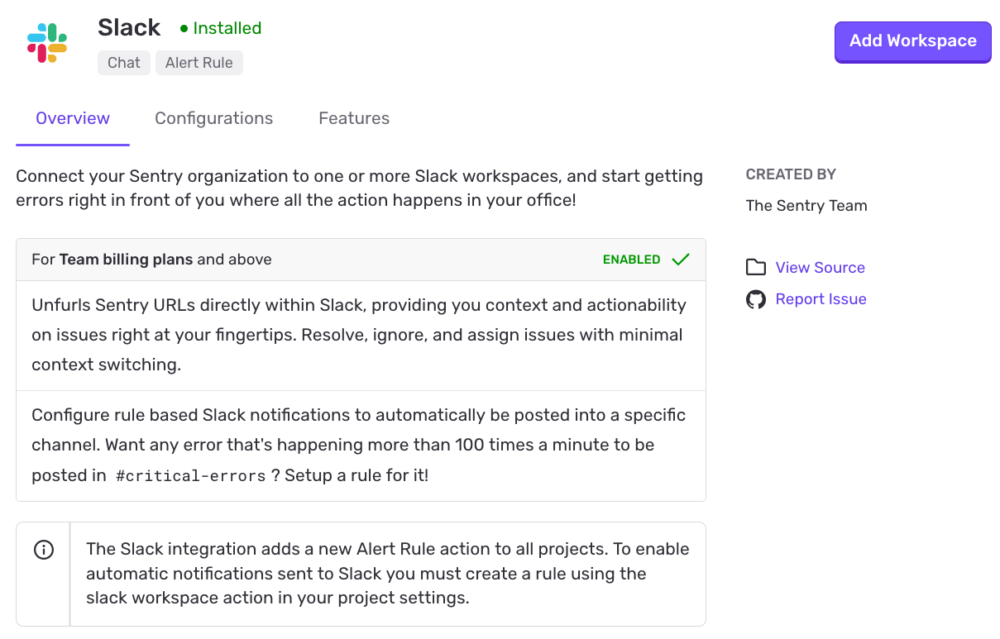
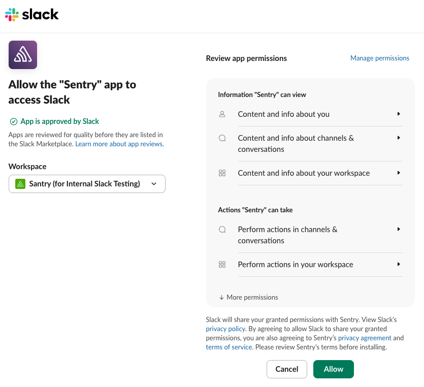
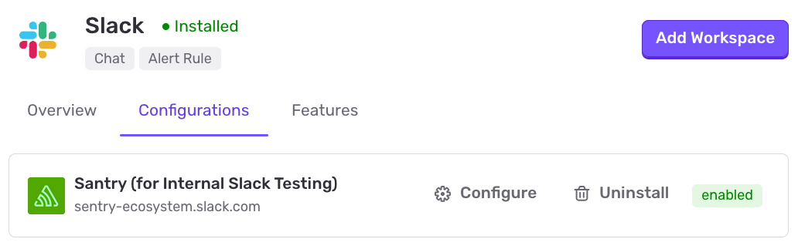
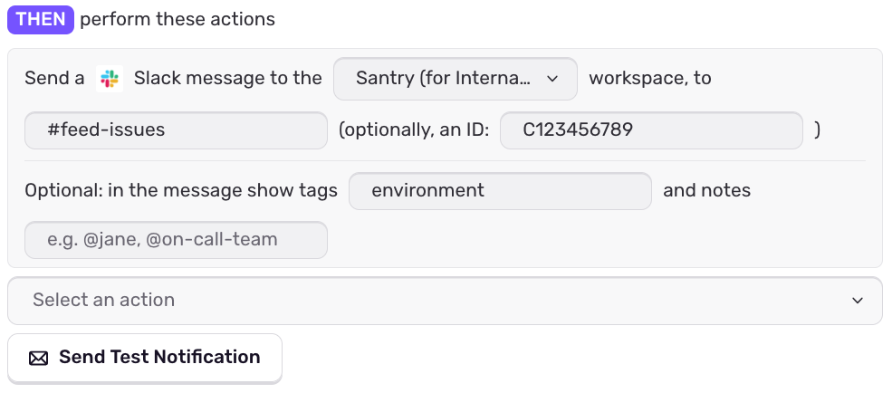
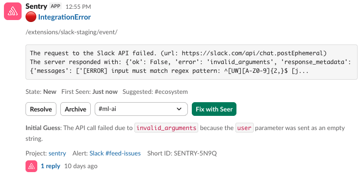
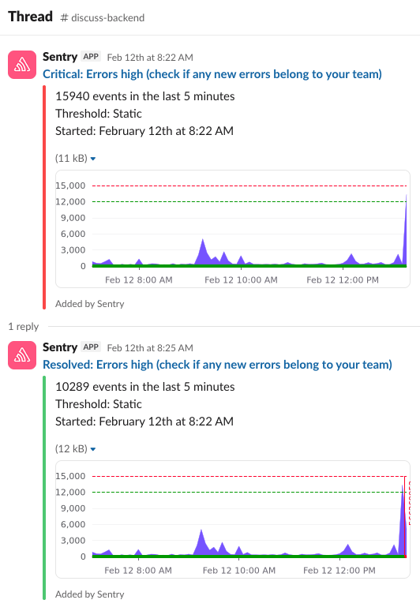
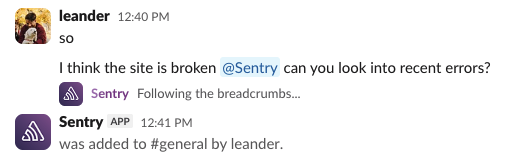
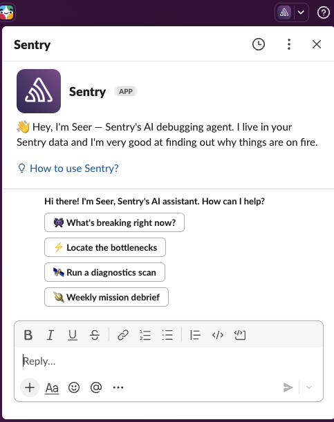

## Install

<Alert>

Sentry owner, manager, or admin permissions are required to install this integration.

</Alert>

Slack defaults to let any workspace member authorize apps, but they may have to request access. See this [Slack help article](https://get.slack.help/hc/en-us/articles/202035138-Add-an-app-to-your-workspace) for more details.

1.  In [sentry.io](https://sentry.io), navigate to **Settings > Integrations > Slack**.

2.  Click "Add Workspace".

    

3.  Toggle to the Slack workspace to which you want to connect using the dropdown menu in the upper right corner of the authentication window. Then select "Allow". Repeat this process if you are connecting to multiple workspaces.

    

Your integration details page will refresh and show the Slack workspace you just added.

Your Slack integration is now available to all projects in your Sentry organization. To enable Slack notification for private channels, add the Slack app to the channel. One quick method: use `@sentry` to invite the Sentry bot the Slack channel.

In the next section, we'll walk you through configuring your notification settings.

## Configure

Use Slack for notifications and [alerts](#alert-rules) regarding issues, environments, deployment, etc.

### Personal Notifications

You can receive personal workflow, deploy, and issue alert notifications from our Slack integration. Manage your [personal notification settings](/product/alerts/notifications/notification-settings/) by navigating to **User Settings > Notifications**.

#### Linking Your Slack and Sentry Accounts

In order to receive personal notifications from our Slack integration, your Slack identity must be linked with your Sentry account. This can be done by typing `/sentry link` in Slack.

### Team Notifications

You can receive [team alert notifications](/product/alerts/create-alerts/issue-alert-config/#then-conditions-actions) from our Slack integration. To enable this feature, type `/sentry link team [organization_slug]` in the desired Slack channel. To view a team's associated Slack channel in [sentry.io](https://sentry.io), navigate to **Settings > Teams > [Team] > Notifications**.

### Alerting

After installing the Slack integration, you'll have the option to select Slack as an action for your alerts.

Select the Slack workspace, and provide a channel or user you wish to notify. Optionally, you can specify any tags you'd like to include in the notification, as well as arbitrary text, like mentions or links to internal documentation.

Sentry will validate access when saving the alert, but you can also send a test notification to double check.

All issue types have their own appearance in Slack, and may differ slightly based on the alert, and available features.

For example, Error alerts will have tools to "Resolve", "Archive" and "Assignee" right from Slack, but with Seer access, you will get an initial guess at the root cause and the option to fix the issue right from Slack. These enhancements can be modified under **Settings > Seer > Advanced Settings > Enable Seer Context in Alerts**.

For metric issues, a chart of the metric's history will be included in the alert, with a follow-up alert appearing as a threaded reply for future status changes.

## Seer Agent

<Alert>
  This is a new feature which may not be available to all organizations just yet, but stay tuned!
</Alert>

If your organization has access to Seer Agent, you'll be able to prompt it directly from Slack to help you debug issues and incidents. To trigger it, just invite the bot to a channel, and @mention it with whatever you need. If you haven't already, any interaction with Seer Agent will prompt you to link your Sentry account to the Slack Workspace, so it can verify your identity. It'll take a moment to figure out how to help, and add a message to the thread with its findings.

It has all the capabilities of the web version, but also automatically gathers context from any linked issues, or conversations in the thread, but keep in mind, it'll only reply to direct mentions when in a channel.

If you're debugging solo, you can also open it as an Agent in Slack, using the dropdown in the top-right of your Slack window. This will open a new persistent panel in your Slack window for personal conversations with Seer Agent. In these conversations, you don't have to mention it every time and new chats will open with a few example prompts to get you started.

If you happen to have a single Slack Workspace connected to multiple Sentry organizations, Seer Agent will automatically try to infer the Sentry organization to search based on thread context (e.g. Sentry links). If this behaviour doesn't fit your needs, you can use `/sentry set org [organization_slug]` command to manually set your preference when interacting with Seer Agent. Your chats and mentions will fallback to this set organization if no organization could be inferred.

## Permissions

For a full list of OAuth scopes the Sentry Slack app requests and why each is needed, see the [Slack app development page](https://develop.sentry.dev/integrations/slack/#scopes).

## Troubleshooting

### Rate Limiting Error

If you're attempting to save a Slack alert rule and are receiving the following error: "Requests to slack were rate limited. Please try again later.", you may enter in the channel or user ID in addition to the channel name.

To find a channel's ID in Slack click the name of the channel at the top of the application and the channel ID will be shown at the bottom of the pop up. To find a user's ID click on their avatar >> "View full profile" >> ... >> "Copy member ID".

### Can't Add Alert Rule to Channel

If you receive an error “The slack resource `example-channel` does not exist or has not been granted access in the `example-workspace` Slack workspace” while trying to add an alert rule, we recommend checking whether our app is installed in the channel. In Slack, right click on your channel's name from the left bar and select "Open channel settings". Then click on the "Integrations" tab; the Sentry app should be listed under "Apps".
