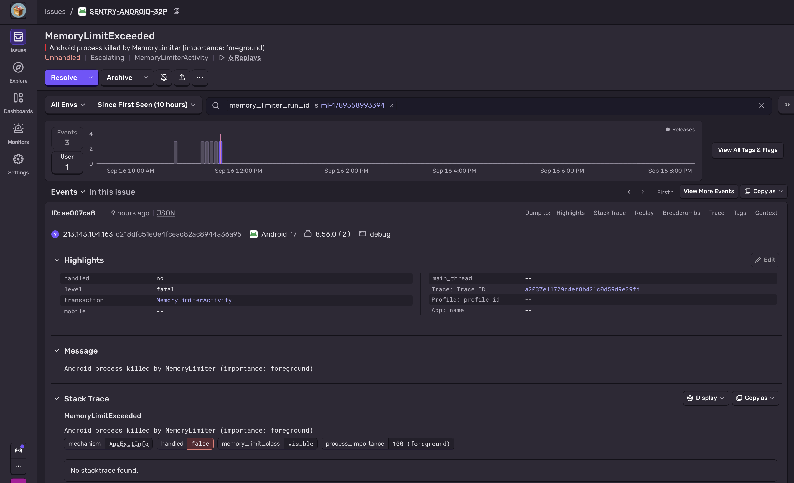
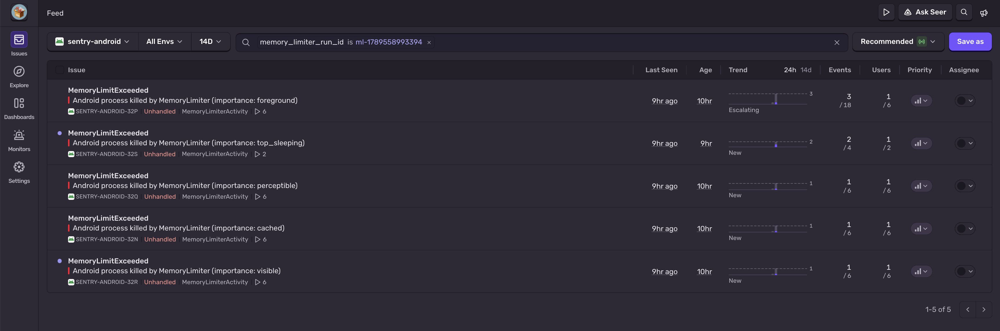

<Alert title="Experimental">

The Memory Limiter integration is experimental. It's available in Sentry Android SDK version ≥ `8.57.0`, and Android API level ≥ 37.

</Alert>

Android 17 introduced the Memory Limiter, a system service available on supported devices that's responsible for managing per-app memory budgets and slowing down or terminating apps that exceed them. Terminations don't produce a Java exception or a stack trace, which makes them easy to miss if you're only looking for traditional crashes.

Sentry's Memory Limiter integration generates fatal Sentry events for Memory Limiter terminations by scanning [ApplicationExitInfo](https://developer.android.com/reference/android/app/ApplicationExitInfo) records written by the Android OS.

To learn more about Memory Limiter, see [Google's documentation](https://source.android.com/docs/core/perf/memory-limiter) and the [Android Developers Blog](https://android-developers.googleblog.com/2026/08/app-broader-memory-limits.html).

## Prerequisites


- You're using Sentry Android SDK version `8.57.0` or later.
- The device is running Android 17 (API level 37) or later.
- The SDK has a cache directory available.
- You enable the integration explicitly. (It's disabled by default.)

## Enable the Memory Limiter Integration

You can enable the integration in your `AndroidManifest.xml`:

```xml {filename:AndroidManifest.xml}
<application>
    <meta-data android:name="io.sentry.memory-limiter.enable" android:value="true" />
</application>
```

Or when you initialize the SDK:

```kotlin {tabTitle:Kotlin}
SentryAndroid.init(this) { options ->
    options.isMemoryLimiterEnabled = true
}
```

```java {tabTitle:Java}
SentryAndroid.init(this, options -> {
    options.setMemoryLimiterEnabled(true);
});
```

## How It Works

When the Memory Limiter terminates a process, info about that process is recorded by the Android OS in the form of an `ApplicationExitInfo` entry, tracked by the `ActivityManager` system service.

On the next app start, the SDK searches all exit info records for Memory Limiter deaths. If it finds a match, the SDK creates a synthetic fatal event with the `MemoryLimitExceeded` exception type. For the latest matching exit, the SDK also backfills persisted context from the previous process when that data is available.

## Historical Memory Limiter Exits

By default, the SDK reports only the latest matching Memory Limiter exit. If you also want older retained exits from the same Android history, enable historical reporting:

```xml {filename:AndroidManifest.xml}
<application>
    <meta-data android:name="io.sentry.memory-limiter.enable" android:value="true" />
    <meta-data android:name="io.sentry.memory-limiter.report-historical" android:value="true" />
</application>
```

```kotlin {tabTitle:Kotlin}
SentryAndroid.init(this) { options ->
    options.isMemoryLimiterEnabled = true
    options.isReportHistoricalMemoryLimiterExits = true
}
```

```java {tabTitle:Java}
SentryAndroid.init(this, options -> {
    options.setMemoryLimiterEnabled(true);
    options.setReportHistoricalMemoryLimiterExits(true);
});
```

Historical exits are lighter-weight reports. Unlike the latest retained exit, they aren't enriched with persisted Sentry context from the previous process.

## What You'll See in Sentry

Memory Limiter reports appear as fatal events with:

- Exception type `MemoryLimitExceeded`
- Mechanism type `AppExitInfo` for the latest exit, or `HistoricalAppExitInfo` for older retained exits
- The original Android exit description stored on the event's `mechanism`
- Memory Limiter-specific mechanism data such as `memory_limit_class` and `process_importance`



The `memory_limit_class` value is a best-effort classification derived from `process_importance` and the table shown [here](https://source.android.com/docs/core/perf/memory-limiter#process-monitoring). It consists of three buckets:

- `visible`
- `not_visible`
- `cached`

These fields can help you approximate the memory capacity allocated to your process before it was killed and whether it was visible to users.

Values for `process_importance` are taken from [`ApplicationExitInfo.importance`](<https://developer.android.com/reference/android/app/ApplicationExitInfo#getImportance()>). Memory Limiter events are grouped by `process_importance` in Sentry's issues feed:



## Release Health and Sessions

If you're using <PlatformLink to="/configuration/releases/">Release Health</PlatformLink>, the latest recovered Memory Limiter exit also marks the previous session as `abnormal` on the next app launch.

That keeps release health closer to what users experienced instead of treating the terminated session as a healthy exit.

For more about session states, see <Link to="/product/releases/health/#session-status">Session Status</Link>.
