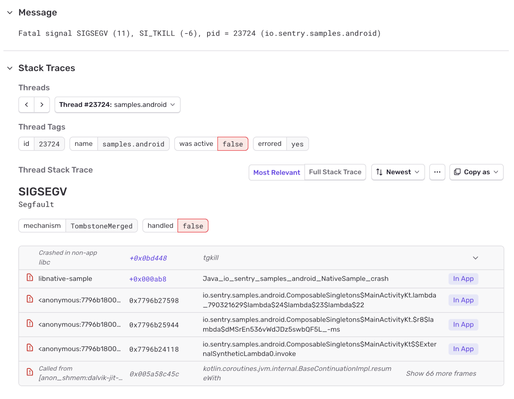

The Tombstone Integration generates events for native crashes based on data ("tombstones") that Android attaches to [`ApplicationExitInfo.REASON_CRASH_NATIVE`](https://developer.android.com/reference/android/app/ApplicationExitInfo#REASON_CRASH_NATIVE) starting with [Android 12+](https://developer.android.com/reference/android/app/ApplicationExitInfo#getTraceInputStream()).

This crash context is collected by the operating system during the app’s shutdown after a crash. Because part of the collection runs out of process, it can capture richer crash details than the [NDK integration](/platforms/android/configuration/using-ndk/) and also is safer.

In particular, you will get:

* stack-traces for each of the threads in your process (which on Android is often key to understanding crashes)
* improved stack traces through Android Runtime stack frames
* client-side symbolication of all system libraries (while still allowing for server-side symbolication of your binaries to keep app size small)
* safer crash context collection reduces crashes during crash handling
* potentially smaller artifacts since the Tombstone Integration is part of `android-core` (if you [don't need the NDK integration](/platforms/android/configuration/using-ndk/#using-the-sdk-without-the-ndk) as a fallback)

Keep in mind that the Tombstone Integration is not a full replacement for the NDK integration:

* it only works on devices running Android 12+
* if you instrument your native code with the NDK integration already, then Tombstones will only improve native crash reports, you still need the NDK integration for capturing native context

However, if you don't develop native code for your apps, but use packages that have native code and a significant portion of your users runs on Android 12+, then the Tombstone Integration can be a replacement.



#### Enabling the Tombstone Integration

The Tombstone Integration is disabled by default. You can enable the tombstone integration using:

```xml {filename:AndroidManifest.xml}
<application>
    <meta-data android:name="io.sentry.tombstone.enable" android:value="true" />
</application>
```

```kotlin
SentryAndroid.init(context) { options ->
  options.isTombstoneEnabled = true
}
```

```java
SentryAndroid.init(context, options -> {
  options.setTombstoneEnabled(true);
});
```

#### Merging Tombstone and NDK Crash Events

It generally makes sense run the [NDK integration](/platforms/android/configuration/using-ndk/) (`io.sentry.ndk.enable`) and the Tombstone integration at the same time:

* if you have users on devices < Android 12 (in which case the NDK integration will solely be reporting native crashes)
* if you use functions of the Native SDK from your native code and want your collected context to be reflected in the crash reports

The reports from both integrations will be merged on the client into a single report, which will later be enriched. This means that whenever the Android version allows it, you will get improved crash reporting from tombstones; otherwise, the SDK falls back to the best-effort implementation from the NDK integration. In both cases, the Native SDK context is preserved in the final report.

#### Tombstone Mechanisms

We introduced two new mechanisms to help identify the integration from which reports originate:

* A report originating only from a tombstone will be called `Tombstone`
* A report being a merged result from a tombstone and a Native SDK event will be called `TombstoneMerged`
* A report originating solely from the NDK integration (Native SDK) will continue to be called `signalhandler`

#### Symbolication

As mentioned above, Android infrastructure will try to symbolicate as much as possible on the client side. This is particularly important for system and framework symbols, since they can differ considerably across devices. If symbols cannot be resolved on the client - for instance, for your supplied binaries - the [backend symbolication](/platforms/android/configuration/using-ndk/#symbolicate-stack-traces) process follows the same rules as with the NDK integration.

#### Debug Images

In contrast to NDK integration, Tombstones retrieve module memory mappings at the time of the crash and are thus always up-to-date. If you use the NDK integration as a fallback for older Android versions, you still need to clear the module cache when dynamically loading libraries after app initialization.

#### Historical Tombstones

By default, the SDK only reports and enriches the latest Tombstones. However, there's also a `setReportHistoricalTombstones` option available in `SentryOptions`, which enables the SDK to report all Tombstones from the [getHistoricalExitReasons](<https://developer.android.com/reference/android/app/ActivityManager?hl=en#getHistoricalProcessExitReasons(java.lang.String,%20int,%20int)>) list:

```kotlin
SentryAndroid.init(context) { options ->
  options.isReportHistoricalTombstones = true
}
```

```java
SentryAndroid.init(context) { options ->
  options.setReportHistoricalTombstones(true)
}
```

This option is useful after upgrading to an SDK version that introduces the Tombstone integration, as it allows you to report any tombstones that occurred before the update.

It can also make sense if you get recurring reports of native crashes early during app start, or if your app regularly runs and restarts during longer offline periods.

Other than that, the SDK will always pick up the latest Tombstone from the historical exit reasons list on the next app restart, and there won’t be any historical Tombstones to report. Also keep in mind that historical Tombstones will receive only minimal updates, as the available data is likely out of sync.

#### Interaction with other Options

Similar to ANR, for Tombstone derived events the options `attachThreads` and `attachStacktrace` are currently without effect.
