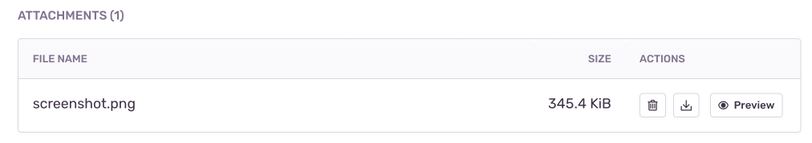

Sentry makes it possible to automatically take a screenshot and include it as an <PlatformLink to="/enriching-events/attachments/">attachment</PlatformLink> when a user experiences an error, an exception or a crash.

This feature is only available for SDKs with a user interface, like the ones for mobile and desktop applications. It's also limited by whether taking a screenshot is possible or not. For example, in some environments, like native iOS, taking a screenshot requires the UI thread, which often isn't available in the event of a crash. Another example where a screenshot might not be available is when the event happens before the screen starts to load. So inherently, this feature is a best effort solution.

## Enabling Screenshots

Because screenshots may contain <PlatformLink to="/data-management/sensitive-data/">PII</PlatformLink>, they are an opt-in feature. You can enable screenshots as shown below:

<PlatformContent includePath="enriching-events/attach-screenshots" />

## Screenshot Masking

Screenshot masking allows you to mask sensitive data in screenshots before they are captured. You can customize this behavior to fit your application's needs.

<Alert>

Screenshot masking requires the `sentry-android-replay` module at runtime. This module is included by default if you use the `sentry-android` dependency. If you only depend on `sentry-android-core`, add the replay module explicitly:

```groovy {filename:app/build.gradle}
dependencies {
  implementation 'io.sentry:sentry-android-replay:{{@inject packages.version('sentry.java.android', '8.34.0') }}'
}
```

```kotlin {filename:app/build.gradle.kts}
dependencies {
  implementation("io.sentry:sentry-android-replay:{{@inject packages.version('sentry.java.android', '8.34.0') }}")
}
```

If masking options are configured but the module is not available at runtime, the SDK will skip capturing screenshots entirely to avoid leaking sensitive data.

</Alert>

### Default Masking Behavior

Unlike Session Replay, screenshot masking is **disabled by default**. You can enable masking for all text and image content:

```java
import io.sentry.android.core.SentryAndroid;

SentryAndroid.init(this, options -> {
  options.getScreenshot().setMaskAllText(true);
  options.getScreenshot().setMaskAllImages(true);
});
```

```kotlin
import io.sentry.android.core.SentryAndroid

SentryAndroid.init(this) { options ->
  options.screenshot.setMaskAllText(true)
  options.screenshot.setMaskAllImages(true)
}
```

```xml {filename:AndroidManifest.xml}
<application>
  <meta-data android:name="io.sentry.screenshot.mask-all-text" android:value="true" />
  <meta-data android:name="io.sentry.screenshot.mask-all-images" android:value="true" />
</application>
```

<Alert>

When `setMaskAllImages(true)` is set, the SDK will also mask `WebView`, `VideoView`, CameraX `PreviewView`, ExoPlayer, and Media3 player views in addition to `ImageView`.

</Alert>

### Mask by View Class

You can choose which type of view to mask or unmask by using `addMaskViewClass` or `addUnmaskViewClass`. These accept fully-qualified class names and apply to all subclasses of the specified class as well.

```java
import io.sentry.android.core.SentryAndroid;

SentryAndroid.init(this, options -> {
  options.getScreenshot().addMaskViewClass("com.example.MyCustomView");
  options.getScreenshot().addUnmaskViewClass("com.example.PublicLabel");
});
```

```kotlin
import io.sentry.android.core.SentryAndroid

SentryAndroid.init(this) { options ->
  options.screenshot.addMaskViewClass("com.example.MyCustomView")
  options.screenshot.addUnmaskViewClass("com.example.PublicLabel")
}
```

<Alert>

If you use R8/ProGuard, make sure to keep the class names you reference in masking rules. Obfuscated class names will not match at runtime.

</Alert>

### Mask by View Instance

You can mask or unmask specific view instances using extension functions from the `sentry-android-replay` module:

```kotlin
import io.sentry.android.replay.sentryReplayMask
import io.sentry.android.replay.sentryReplayUnmask

myTextView.sentryReplayMask()
myImageView.sentryReplayUnmask()
```

In Kotlin and Java, you can also use view tags with the `sentry_privacy` resource ID:

```kotlin
import io.sentry.android.replay.R

view.setTag(R.id.sentry_privacy, "mask")
view.setTag(R.id.sentry_privacy, "unmask")
```

```java
import io.sentry.android.replay.R;

view.setTag(R.id.sentry_privacy, "mask");
view.setTag(R.id.sentry_privacy, "unmask");
```

You can also set masking via XML layout tags:

```xml
<TextView
  android:layout_width="wrap_content"
  android:layout_height="wrap_content"
  android:text="Sensitive data">
  <tag android:id="@id/sentry_privacy" android:value="mask" />
</TextView>
```

Alternatively, you can use the `android:tag` attribute with the `sentry-mask` or `sentry-unmask` string values:

```xml
<TextView
  android:layout_width="wrap_content"
  android:layout_height="wrap_content"
  android:tag="sentry-mask"
  android:text="Sensitive data" />
```

### Jetpack Compose

For Jetpack Compose, use the `sentryReplayMask()` and `sentryReplayUnmask()` modifiers:

```kotlin
import io.sentry.android.replay.sentryReplayMask
import io.sentry.android.replay.sentryReplayUnmask

@Composable
fun MyScreen() {
  Column {
    Text(
      text = "Sensitive info",
      modifier = Modifier.sentryReplayMask()
    )
    Text(
      text = "Public info",
      modifier = Modifier.sentryReplayUnmask()
    )
  }
}
```

## Viewing Screenshots

If one is available, you'll see a thumbnail of the screenshot when you click on a specific issue from the [**Issues**](https://demo.sentry.io/issues/) page.


Once you've clicked on the event ID of a specific issue, you'll be able to see an overview of all the attachments as well as associated events in the "Attachments" tab.


