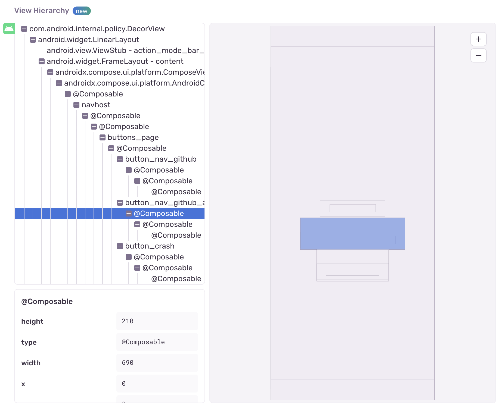

Sentry makes it possible to render a JSON representation of the view hierarchy of an error and includes it as an <PlatformLink to="/enriching-events/attachments/">attachment</PlatformLink>.

This feature only applies to SDKs with a user interface, such as the ones for mobile and desktop applications. In some environments like native iOS, rendering the view hierarchy requires the UI thread and in the event of a crash, that might not be available. Another example where the view hierarchy might not be available is when the event happens before the screen starts to load. So inherently, this feature is a best effort solution.

<Note>

Deobfuscation for view hierarchies is fully supported for native SDKs, and React Native, but is currently not supported for Flutter.

</Note>

## Enabling View Hierarchy Attachments

View hierarchy debugging is an opt-in feature. You can enable it as shown below:

```xml {filename:AndroidManifest.xml}
<application>
  <meta-data android:name="io.sentry.attach-view-hierarchy" android:value="true" />
</application>
```

### Customize View Hierarchy Capturing

<Note>

Requires SDK version `6.24.0` or higher.

</Note>

Because capturing view hierarchy can be a resource-intensive operation on Android, it's limited to one view hierarchy every 2 seconds using a debouncing mechanism. This behavior can be overruled if you supply a `BeforeCaptureCallback` for view hierarchies in the `SentryAndroidOptions`.

The `BeforeCaptureCallback` also allows you to customize behavior based on event data so you can decide when to capture view hierarchy and when not to. For example, you can decide to only capture view hierarchy for crashed and fatal events:

```java
import io.sentry.SentryLevel;
import io.sentry.android.core.SentryAndroid;

SentryAndroid.init(this, options -> {
    options.setBeforeViewHierarchyCaptureCallback((event, hint, debounce) -> {
        // always capture crashed events
        if (event.isCrashed()) {
            return true;
        }

        // if debounce is active, skip capturing
        if (debounce) {
            return false;
        } else {
            // also capture fatal events
            return event.getLevel() == SentryLevel.FATAL;
        }
    });
});
```

```kotlin
import io.sentry.SentryLevel
import io.sentry.android.core.SentryAndroid

SentryAndroid.init(this) { options ->
    options.setBeforeViewHierarchyCaptureCallback { event, hint, debounce ->
        // always capture crashed events
        if (event.isCrashed) {
            return@setBeforeScreenshotCaptureCallback true
        }

        // if debounce is active, skip capturing
        if (debounce) {
            return@setBeforeScreenshotCaptureCallback false
        } else {
            // also capture fatal events
            return@setBeforeScreenshotCaptureCallback event.level == SentryLevel.FATAL
        }
    }
}
```

### Jetpack Compose Support using the Sentry Kotlin Compiler Plugin

<Note>

The Sentry Kotlin Compiler plugin is considered _experimental_. Give it a try and provide early feedback [on GitHub](https://github.com/getsentry/sentry-android-gradle-plugin).

</Note>

If your application uses Jetpack Compose, you can use the <PlatformLink to="/enhance-errors/kotlin-compiler-plugin/">Sentry Kotlin Compiler Plugin</PlatformLink> to see the function names of your `@Composable` elements. You must add the plugin to all modules that contain `@Composable` elements.

```groovy {filename:app/build.gradle}
plugins {
  id "io.sentry.kotlin.compiler.gradle" version "{{@inject packages.version('sentry.kotlin.compiler-plugin', '3.7.0') }}"
}
```

```kotlin {filename:app/build.gradle.kts}
plugins {
  id("io.sentry.kotlin.compiler.gradle") version "{{@inject packages.version('sentry.kotlin.compiler-plugin', '3.7.0') }}"
}
```

## Viewing View Hierarchy Attachments

View hierarchies appear in the "Attachments" tab, where you can view all attachments, as well as associated events. Click the event ID to open the [Issue Details](/product/issues/issue-details) page of that specific event.


On the **Issue Details** page, you can interact with the view hierarchy attachment in a section called "View Hierarchy". This section represents the state of your application at the time of an error event. There are three displays: a tree view, wireframe, and detailed view for a selected node. You can select nodes in either the tree or the wireframe to view the properties collected by the SDK. The SDK will report on the following keys for each node in the view: `alpha`, `visible`, `x`, `y`, `width`, `height`, `type`, and `identifier` if applicable, but there may be additional values specific to the SDK. This feature can be used as an exploratory tool to debug layout issues, visualize unnecessarily rendered content, or gain a better understanding of the relationship between views.


