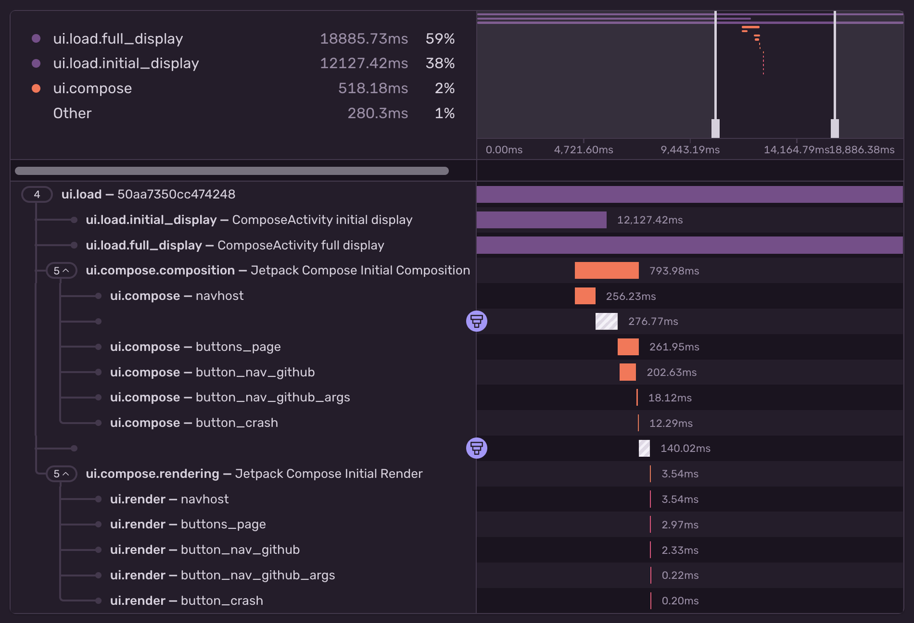
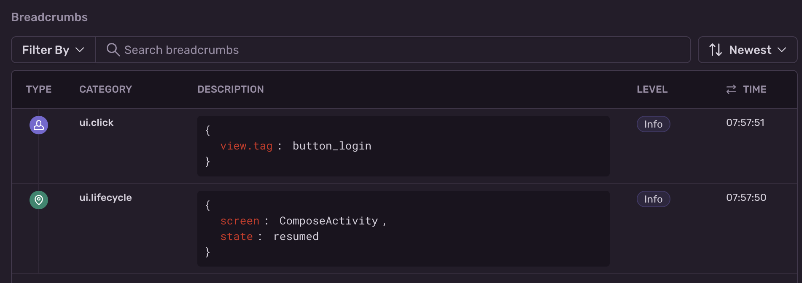

The `sentry-compose-android` and `sentry-android-navigation3` libraries provide [Jetpack Compose](https://developer.android.com/compose) support in the following areas:

- `@Composable` performance metrics
- Support for user interactions (clicks, swipes and scroll gestures)
- Support for <PlatformLink to="/configuration/integrations/navigation/">navigation</PlatformLink>
- Support for <PlatformLink to="/enriching-events/viewhierarchy/">debugging view hierarchies</PlatformLink>

## Performance Metrics

_(New in version 6.16.0)_

With Jetpack Compose performance metrics the Sentry Android SDK can automatically measure the initial `composition` and `rendering` time as performance spans of your `@Composable` UI elements.



<Alert>

This feature requires an underlying transaction to attach it's spans to. Transactions can be created manually or automatically by configuring

- <PlatformLink to="/tracing/instrumentation/automatic-instrumentation/">
    Activity instrumentation
  </PlatformLink>
- <PlatformLink to="/configuration/integrations/navigation/">
    Navigation instrumentation
  </PlatformLink>
- [User Interactions](#user-interactions)

</Alert>

Once performance metrics have been enabled, you'll see two spans inside your transactions:

- `ui.compose.composition`, describing the time it took to execute your `@Composable`
- `ui.compose.rendering`, describing the time it took to render your `@Composable` to the canvas

The `SentryTraced` function also provides an `enableUserInteractionTracing` argument, which automatically applies a `Modifier.sentryTag()` and enables the _User Interactions_ feature mentioned below.

### Installation

To add the Jetpack Compose integration, install the [Android SDK](/platforms/android/), then add the `sentry-compose-android` dependency using Gradle:

```groovy
implementation 'io.sentry:sentry-android:{{@inject packages.version('sentry.java.android', '6.2.0') }}'
implementation 'io.sentry:sentry-compose-android:{{@inject packages.version('sentry.java.compose', '6.2.0') }}'
```

Once installed, you need to wrap your `@Composable` body with the `SentryTraced` function.

```kotlin
import io.sentry.compose.SentryTraced

@Composable
fun LoginScreen() {
  SentryTraced("login_screen") {
    Column {
      // ...
      Button(
          onClick = { TODO() }) {
          Text(text = "Login")
      }
    }
  }
}
```

## User Interactions

_(New in version 6.10.0)_

The Sentry User Interactions feature for Jetpack Compose can detect click, scroll, and swipe gestures. For every gesture, the SDK can automatically collect breadcrumbs and launch transactions.



### Installation

To add the Jetpack Compose integration, install the [Android SDK](/platforms/android/), then add the `sentry-compose-android` dependency using Gradle:

```groovy
implementation 'io.sentry:sentry-android:{{@inject packages.version('sentry.java.android', '6.2.0') }}'
implementation 'io.sentry:sentry-compose-android:{{@inject packages.version('sentry.java.compose', '6.2.0') }}'
```

### Configuration

This feature is disabled by default, but you can enable it the following ways.

#### Using `AndroidManifest.xml`

```xml {filename:AndroidManifest.xml}
<application>
    <meta-data android:name="io.sentry.traces.user-interaction.enable" android:value="true" />
    <meta-data android:name="io.sentry.breadcrumbs.user-interaction" android:value="true" />
</application>
```

#### Using `SentryOptions`

If you initialize the SDK [manually as mentioned here](/platforms/android/manual-setup/#configuration-via-sentryoptions), you can enable user interactions like this:

```kotlin {filename:MyApplication.kt}
SentryAndroid.init(this) { options ->
    // ...
    options.isEnableUserInteractionTracing = true
    options.isEnableUserInteractionBreadcrumbs = true
}
```

#### Capture Composables

The Sentry SDK requires you to have either `Modifier.sentryTag("<tag>")` or `Modifier.testTag("<tag>")` applied on each `@Composable` you want to capture to determine its identifier.
Here's an example:

```kotlin
import io.sentry.compose.sentryTag

@Composable
fun LoginScreen() {
  Column {
    // ...
    Button(
        modifier = Modifier.sentryTag("button_login"),
        onClick = { TODO() }) {
        Text(text = "Login")
    }
  }
}
```

#### Customize the Recorded Breadcrumb/Transaction

User interaction instrumentation uses the `sentryTag` or `testTag` value to identify the composable in the recorded breadcrumb and transaction. Keep these tags stable and free of PII or other sensitive data.

If needed, you can filter sensitive data from breadcrumbs and transactions before they're sent to Sentry via the `SentryOptions.BeforeBreadcrumbCallback` and `SentryOptions.BeforeSendTransactionCallback`, respectively.

<Alert>

If a `@Composable` doesn't have a `.sentryTag` or a `.testTag` modifier applied, both breadcrumbs and transactions won't be captured because they can't be uniquely identified.
To automatically generate tags, refer to the docs about our <PlatformLink to="/enhance-errors/kotlin-compiler-plugin/">Sentry Kotlin Compiler Plugin</PlatformLink>.

</Alert>

## Custom Telemetry in Compose

Composable functions can run many times during recomposition. Don't send custom Sentry spans, messages,
breadcrumbs, or other telemetry directly from a composable body, as it can duplicate telemetry or attach it
to the wrong UI lifecycle moment.

Instead, send telemetry from:

- `LaunchedEffect`, `DisposableEffect`, or `SideEffect` (more info in [Google's developer docs](https://developer.android.com/develop/ui/compose/side-effects))
- Event callbacks such as `onClick` when the telemetry corresponds to a user action
- APIs that run after composition, such as draw-time or layout-time lambdas, when that timing is what you want to measure

For example, avoid capturing a message directly from the body:

```kotlin
@Composable
fun LoginScreen() {
  Sentry.captureMessage("Login screen shown")
  // ...
}
```

Instead, capture state in the body as needed but send it from an Effect API:

```kotlin
@Composable
fun LoginScreen() {
  val firstComposedAt = remember { Instant.now() }

  LaunchedEffect(Unit) {
    Sentry.captureMessage("Login screen shown: $firstComposedAt")
  }
  // ...
}
```
