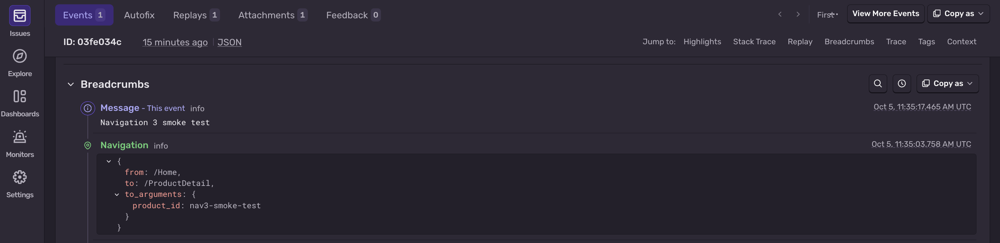
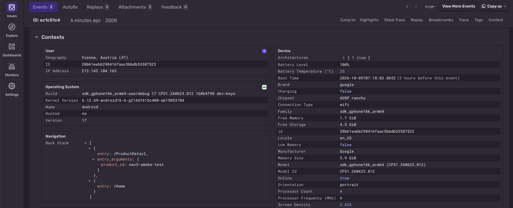
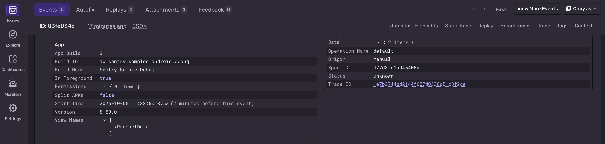
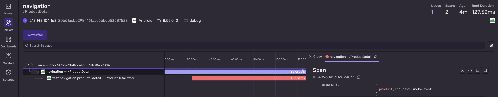

The `sentry-android-navigation` and `sentry-android-navigation3` libraries provide support for Sentry's Android navigation instrumentation. Use them to automatically add breadcrumbs, track screen names, and start navigation transactions whenever users navigate around your app.

This page covers both:

- **Navigation 2** (`androidx.navigation`) via `SentryNavigationListener`
- **Navigation 3** (`androidx.navigation3`) via `SentryNavEffect`

If you're still using `NavController`, follow the Navigation 2 setup below. If you've moved to `NavDisplay`, skip to [Navigation 3](#navigation-3).

## Navigation 2

<Alert>

If you're using Navigation 2 with Jetpack Compose, see <PlatformLink to="/configuration/integrations/jetpack-compose/#jetpack-compose-navigation">Jetpack Compose Navigation</PlatformLink> instead.

</Alert>

### Install

Sentry captures data by adding a `NavController.OnDestinationChangedListener`. To add the Navigation integration, install the [Android SDK](/platforms/android/), then add the `sentry-android-navigation` dependency using Gradle:

```groovy {filename:build.gradle}
implementation 'io.sentry:sentry-android:{{@inject packages.version('sentry.java.android', '6.2.0') }}'
implementation 'io.sentry:sentry-android-navigation:{{@inject packages.version('sentry.java.android.navigation', '6.2.0') }}'
```

```kotlin {filename:build.gradle.kts}
implementation("io.sentry:sentry-android:{{@inject packages.version('sentry.java.android', '6.2.0') }}")
implementation("io.sentry:sentry-android-navigation:{{@inject packages.version('sentry.java.android.navigation', '6.2.0') }}")
```

### Configure

Configuration should happen in the respective lifecycle callbacks, once you retrieve your `NavController` instance:

```kotlin
import androidx.navigation.NavController
import io.sentry.android.navigation.SentryNavigationListener

private val navController = findNavController(R.id.nav_host)
private val sentryNavListener = SentryNavigationListener(
  enableNavigationBreadcrumbs = true, // enabled by default
  enableNavigationTracing = true  // enabled by default
)

override fun onResume() {
  super.onResume()
  navController.addOnDestinationChangedListener(sentryNavListener)
}

override fun onPause() {
  super.onPause()
  navController.removeOnDestinationChangedListener(sentryNavListener)
}
```

```java
import androidx.navigation.NavController;
import androidx.navigation.Navigation;
import io.sentry.android.navigation.SentryNavigationListener;

private final NavController navController = Navigation.findNavController(this, R.id.nav_host);
private final SentryNavigationListener navListener = new SentryNavigationListener(
  /* enableNavigationBreadcrumbs = */ true,
  /* enableNavigationTracing = */ true
);

@Override
protected void onResume() {
  super.onResume();
  navController.addOnDestinationChangedListener(sentryNavListener);
}

@Override
protected void onPause() {
  super.onPause();
  navController.removeOnDestinationChangedListener(sentryNavListener);
}
```

By default, the navigation transaction finishes automatically after it reaches the specified [idleTimeout](/platforms/android/configuration/options/#idleTimeout) and all of its child spans are finished. You can customize the timeout to your needs.

### Verify

The snippet below includes a sample `Fragment` with a couple of navigation events and captures an intentional message, so you can test that everything is working as soon as you set it up:

```kotlin
import android.os.Bundle
import android.view.LayoutInflater
import android.view.View
import android.view.ViewGroup
import androidx.fragment.app.Fragment
import androidx.navigation.NavController
import io.sentry.android.navigation.SentryNavigationListener
import io.sentry.Sentry

class HomeFragment : Fragment() {

  private val sentryNavListener = SentryNavigationListener()

  override fun onCreateView(
    inflater: LayoutInflater,
    container: ViewGroup?,
    savedInstanceState: Bundle?
  ): View {
    // generated databinding
    return FragmentHomeBinding.inflate(inflater).apply {
        this.sendMessage.setOnClickListener {
            Sentry.captureMessage("Some message.")
        }
        this.openFirstFragment.setOnClickListener {
          findNavController().navigate(R.id.fragment_a)
        }
        this.openSecondFragment.setOnClickListener {
          findNavController().navigate(R.id.fragment_b)
        }
    }.root
  }

  override fun onResume() {
    super.onResume()
    findNavController().addOnDestinationChangedListener(sentryNavListener)
  }

  override fun onPause() {
    super.onPause()
    findNavController().removeOnDestinationChangedListener(sentryNavListener)
  }
}
```

### Customize the Recorded Breadcrumb/Transaction

By default, the Navigation integration captures route arguments as additional data on breadcrumbs and transactions. In case the arguments contain any PII data, you can strip it out by way of `BeforeBreadcrumbCallback` and `EventProcessor` respectively. To do that, [manually initialize](/platforms/android/manual-setup/#configuration-via-sentryoptions) the SDK and add the following snippet:

```kotlin
import io.sentry.EventProcessor
import io.sentry.android.core.SentryAndroid
import io.sentry.SentryOptions.BeforeBreadcrumbCallback
import io.sentry.android.navigation.SentryNavigationListener

SentryAndroid.init(this) { options ->
  options.beforeBreadcrumb = BeforeBreadcrumbCallback { breadcrumb, hint ->
    if (SentryNavigationListener.NAVIGATION_OP == breadcrumb.category) {
      breadcrumb.data.remove("from_arguments")
      breadcrumb.data.remove("to_arguments")
    }
    breadcrumb
  }
  options.addEventProcessor(object : EventProcessor {
    override fun process(transaction: SentryTransaction, hint: Hint): SentryTransaction? {
      if (SentryNavigationListener.NAVIGATION_OP == transaction.contexts.trace.operation) {
        transaction.removeExtra("arguments")
      }
      return transaction
    }
  })
}
```

## Navigation 3

<Alert>

Navigation 3 support is available in `sentry-android-navigation3` `8.60.0` and later.

See the [Limitations](#limitations) section below for additional restrictions.

</Alert>

Android's [Navigation 3 library](https://developer.android.com/guide/navigation/navigation-3) expects apps to manage their own back stack and to push and pop entries in order to navigate. Apps pass their back stack to a `NavDisplay` and define corresponding composables. `NavDisplay` renders those composables to screen as the back stack entries change.

`SentryNavEffect` instruments the back stack passed to `NavDisplay`. By default, every time the top of the back stack changes, `SentryNavEffect` will:

- start a new navigation transaction (and finish any prior navigation transaction)
- emit a breadcrumb
- update the currently tracked screen name
- record the latest 10 entries from the back stack as event context

See [Customize Nav3 Options](#customize-nav3-options) to learn how to modify those defaults.

### Install

Install the Android SDK and add Sentry's Navigation 3 library:

```groovy {filename:build.gradle}
dependencies {
  implementation 'io.sentry:sentry-android:{{@inject packages.version('sentry.java.android', '8.60.0') }}'
  implementation 'io.sentry:sentry-android-navigation3:{{@inject packages.version('sentry.java.android.navigation', '8.60.0') }}'
}
```

```kotlin {filename:build.gradle.kts}
dependencies {
  implementation("io.sentry:sentry-android:{{@inject packages.version('sentry.java.android', '8.60.0') }}")
  implementation("io.sentry:sentry-android-navigation3:{{@inject packages.version('sentry.java.android.navigation', '8.60.0') }}")
}
```

### Configure

To use `SentryNavEffect`, add it to the composable that owns your `NavDisplay` and pass your back stack to both:

```kotlin
import androidx.navigation3.runtime.NavKey
import androidx.navigation3.runtime.rememberNavBackStack
import androidx.navigation3.ui.NavDisplay
import io.sentry.compose.navigation3.SentryNavEffect
import kotlinx.serialization.Serializable

@Composable
fun AppNavigation() {
  // Create your back stack like usual.
  val backStack = rememberNavBackStack(Route.Home)

  // Place SentryNavEffect in the same composable as your NavDisplay and call the
  // effect first. Provide a BackStackEntryMapper with the values you want to
  // show up in Sentry. Be sure to omit PII and other sensitive info.
  SentryNavEffect(
    backStack = backStack,
    backStackEntryMapper = { entry ->
      when (entry) {
        is Home -> SentryBackStackEntry("Home")
        is ProductDetail ->
          SentryBackStackEntry("ProductDetail", mapOf("product_id" to entry.productId))
        ...
      }
    }
  )

  // Configure your NavDisplay like usual.
  NavDisplay(
    backStack = backStack,
    ...
  )
}
```

**Note:** Be sure to call `SentryNavEffect` before `NavDisplay` so the effect's transaction-creating machinery can be set up before any spans are produced by the initial nav destination. Otherwise, initial destination spans may be lost or parented under the wrong transaction.

Provide a `BackStackEntryMapper` that maps each entry in your back stack to the name and optional arguments you want displayed in Sentry. Keep names stable and arguments lightweight and performant. Avoid using `::class.simpleName` or anything else that R8 will obfuscate.

<Alert>

Values returned from `BackStackEntryMapper` are **not** scrubbed by the Sentry SDK of PII or other potentially sensitive information before being sent to Sentry. Only return names and arguments known to be safe, or sanitize them yourself in your `BackStackEntryMapper`.

</Alert>


<Alert>

 Multiple, simultaneously active `SentryNavEffect` instances writing to the same [Sentry scope](https://docs.sentry.io/platforms/android/enriching-events/scopes/) are ***not*** supported. Violating this restriction can result in duplicated or interleaved data and undefined transaction behavior.

</Alert>

### Customize Nav3 Options

Use `SentryNavOptions` to disable breadcrumbs or transactions, or to limit how much of the back stack Sentry stores with captured events.

```kotlin
import io.sentry.compose.navigation3.SentryNavEffect
import io.sentry.compose.navigation3.SentryNavOptions

SentryNavEffect(
  backStack = backStack,
  ...
  options = SentryNavOptions {
    enableNavigationBreadcrumbs = true
    enableNavigationTransactions = true
    captureBackStack = true
    maxCapturedBackStackEntries = 5
  },
)
```

If you want to turn screen names on or off, configure the main SDK options when you initialize the Sentry SDK:

```kotlin
import io.sentry.android.core.SentryAndroid

SentryAndroid.init(this) { options ->
  options.isEnableScreenTracking = true
}
```

### Verify

The snippet below defines `Home` and `ProductDetail` routes and a composable for displaying them. It adds both routes to an in-memory back stack and captures a message from the `ProductDetail` destination so you can verify the navigation data the Sentry SDK emits.

The snippet assumes the default `SentryNavOptions`. Screen names additionally require screen tracking to be enabled.

```kotlin
import androidx.compose.material3.Button
import androidx.compose.material3.Text
import androidx.compose.runtime.Composable
import androidx.compose.runtime.LaunchedEffect
import androidx.compose.runtime.mutableStateListOf
import androidx.compose.runtime.remember
import androidx.navigation3.runtime.NavKey
import androidx.navigation3.runtime.entryProvider
import androidx.navigation3.ui.NavDisplay
import io.sentry.Sentry
import io.sentry.compose.navigation3.SentryBackStackEntry
import io.sentry.compose.navigation3.SentryNavEffect
import kotlinx.coroutines.delay

data object Home : NavKey

data class ProductDetail(val productId: String) : NavKey

@Composable
fun AppNavigation() {
  val backStack = remember { mutableStateListOf<NavKey>(Home) }

  SentryNavEffect(
    backStack = backStack,
    backStackEntryMapper = { entry ->
      when (entry) {
        is Home -> SentryBackStackEntry("Home")
        is ProductDetail -> SentryBackStackEntry(
          name = "ProductDetail",
          arguments = mapOf("product_id" to entry.productId),
        )
        else -> null
      }
    },
  )

  NavDisplay(
    backStack = backStack,
    onBack = { backStack.removeLastOrNull() },
    entryProvider = entryProvider {
      entry<Home> {
        Button(
          onClick = {
            backStack.add(ProductDetail(productId = "nav3-smoke-test"))
          },
        ) {
          Text("Open product detail")
        }
      }
      entry<ProductDetail> {
        val parentSpan = Sentry.getSpan()

        // Generate a fake span so that the nav transaction isn't dropped after its idle timeout
        // expires.
        LaunchedEffect(parentSpan) {
          val span =
            parentSpan?.startChild(
              "test.navigation.product_detail",
              "ProductDetail work",
            )
          try {
            delay(100)
          } finally {
            span?.finish()
          }
        }

        Button(onClick = { Sentry.captureMessage("Navigation 3 smoke test") }) {
          Text("Send test message")
        }
      }
    },
  )
}
```

Tap **Open product detail**, then **Send test message**. In Sentry, open the event for `Navigation 3 smoke test` and verify the following:

- In **Breadcrumbs**, look for a navigation breadcrumb whose destination is `ProductDetail`. It should include `product_id` under `to_arguments`.



- In **Contexts**, check the Navigation context for a back stack containing `/ProductDetail` followed by `/Home`, with `product_id` under `entry_arguments`. Also check the App context for View Names containing `/ProductDetail`.




- If tracing is enabled and the transaction is sampled, open the [Traces](https://sentry.io/orgredirect/organizations/:orgslug/traces/) view after the [idle timeout](/platforms/android/configuration/options/#idleTimeout) and inspect the `ProductDetail` transaction. Emitted nav data should appear under **Attributes → Arguments**, **Contexts → Navigation**, and **Breadcrumbs**.



### Using kotlinx.serialization

If your Nav3 back stack uses `@Serializable` keys, you can use [Kotlin serialization](https://kotlinlang.org/docs/serialization.html) to produce stable entry names. For performance reasons, don't serialize keys in their entirety as `arguments` if they might be large, deeply nested, or contain PII or other sensitive information.

```kotlin
import androidx.navigation3.runtime.NavKey
import io.sentry.compose.navigation3.BackStackEntryMapper
import io.sentry.compose.navigation3.SentryBackStackEntry
import kotlinx.serialization.SerialName
import kotlinx.serialization.Serializable

@Serializable
@SerialName("Home")
data class Home(userName: String) : NavKey

@Serializable
@SerialName("ProductDetail")
data class ProductDetail(userName: String, productId: String) : NavKey

val backStackItemMapper = BackStackEntryMapper<NavKey> { entry ->
  when (entry) {
    is Home -> SentryBackStackEntry(Home.serializer().descriptor.serialName)
    is ProductDetail -> SentryBackStackEntry(
      name = ProductDetail.serializer().descriptor.serialName,
      arguments = mapOf("product_id" to entry.productId)
    )
    ...
  }
}
```

### Limitations

`SentryNavEffect` treats the top entry in your back stack as the current screen. That works well for most Nav3 setups, but it means that `SentryNavEffect` does ***not***:

- understand the concept of Nav3 [Scenes](https://developer.android.com/guide/navigation/navigation-3/scenes) or multi-pane layouts
- track multiple back stacks
- permit multiple, simultaneously active `SentryNavEffect` instances
- make special accommodations for [predictive back](https://developer.android.com/guide/navigation/custom-back/predictive-back-gesture) gestures (e.g., spans produced by predictively rendered composables may appear under the current destination's transaction)
