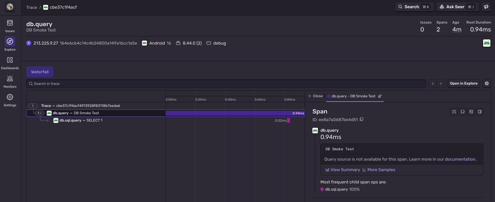

The `sentry-android-sqlite` library generates spans for your SQLite queries, whether you use [Room](https://developer.android.com/training/data-storage/room/), [SQLDelight](https://sqldelight.github.io/sqldelight/), or another persistence library. It does so by wrapping your existing `SQLiteDriver` or `SupportSQLiteOpenHelper`.

If you're using the Sentry Android Gradle Plugin, wrapping is performed automatically. (See [Auto-Instrumentation](#auto-instrumentation) for more details.)

Room users can also take advantage of our [auto-instrumentation of DAO methods](#room-dao-methods).

<Alert>

Check out our [migration advice](#migrating-from-supportsqliteopenhelper-to-sqlitedriver) if you're migrating from `SupportSQLiteOpenHelper` to `SQLiteDriver`.

Spans require [tracing to be enabled](/platforms/android/tracing/#configure-the-sample-rate).

</Alert>

## Auto-Instrumentation

### Install

The [Sentry Android Gradle Plugin](/platforms/android/configuration/gradle/) (SAGP) uses bytecode manipulation to automatically wrap your driver and/or open helper.<sup>†</sup>

To use the SAGP, follow the [plugin installation instructions](/platforms/android/configuration/gradle/). The SAGP [auto-installs](/platforms/android/configuration/gradle/#auto-installation) the Sentry Android SDK by default.

<small>
  † For now, the SAGP only auto-wraps uses of `SQLiteDriver` with Room. Any
  non-Room uses of the driver must be wrapped manually. SAGP auto-wraps open
  helpers in all contexts.
</small>

The type or call site wrapped depends on the SAGP version:

| API                       | Minimum SAGP version | Coverage                                                                   |
| ------------------------- | -------------------- | -------------------------------------------------------------------------- |
| `SQLiteDriver`            | `≥6.13.0`            | `Room.databaseBuilder().setDriver(...)` call sites                         |
| `SupportSQLiteOpenHelper` | `≥3.0.0`             | `FrameworkSQLiteOpenHelperFactory`                                 |
| `SupportSQLiteOpenHelper` | `≥3.11.0`            | Any `SupportSQLiteOpenHelper.Factory` (SQLDelight, custom factories, etc.) |

### Configure

No additional configuration is required, as database auto-instrumentation is enabled by default. To disable it, use the `DATABASE` instrumentation feature:

```groovy {filename:build.gradle}
import io.sentry.android.gradle.extensions.InstrumentationFeature

sentry {
  tracingInstrumentation {
    enabled = true
    features = EnumSet.allOf(InstrumentationFeature) - InstrumentationFeature.DATABASE
  }
}
```

```kotlin {filename:build.gradle.kts}
import java.util.EnumSet
import io.sentry.android.gradle.extensions.InstrumentationFeature

sentry {
  tracingInstrumentation {
    enabled.set(true)
    features.set(EnumSet.allOf(InstrumentationFeature::class.java) - InstrumentationFeature.DATABASE)
  }
}
```

Disabling `DATABASE` instrumentation disables `SQLiteDriver` wrapping, `SupportSQLiteOpenHelper` wrapping, and Room DAO spans.

See our [Gradle](/platforms/android/configuration/gradle/) page for other SAGP configuration options.

## Manual Instrumentation

### Install

If you don't use the SAGP, you can always wrap your driver or open helper explicitly. Add the Sentry Android SDK and the `sentry-android-sqlite` artifact:

```groovy {filename:build.gradle}
dependencies {
  implementation 'io.sentry:sentry-android:{{@inject packages.version('sentry.java.android', '8.45.0') }}'
  implementation 'io.sentry:sentry-android-sqlite:{{@inject packages.version('sentry.java.android.sqlite', '8.45.0') }}'
}
```

```kotlin {filename:build.gradle.kts}
dependencies {
  implementation("io.sentry:sentry-android:{{@inject packages.version('sentry.java.android', '8.45.0') }}")
  implementation("io.sentry:sentry-android-sqlite:{{@inject packages.version('sentry.java.android.sqlite', '8.45.0') }}")
}
```

The `sentry-android-sqlite` artifact ships both wrappers; the minimum version depends on which API you need to wrap:

| API                       | Minimum `sentry-android-sqlite` version |
| ------------------------- | --------------------------------------- |
| `SQLiteDriver`            | `≥8.45.0`                               |
| `SupportSQLiteOpenHelper` | `≥6.21.0`                               |

### Configure

Wrap your driver or open helper directly with `SentrySQLiteDriver.create(...)` or `SentrySupportSQLiteOpenHelper.create(...)`. Use the wrapped instance wherever you would have used the unwrapped one. For most teams, that means wiring it into Room or SQLDelight:

#### Room

```kotlin {tabTitle:SQLiteDriver} {mdExpandTabs}
import androidx.room.Room
import androidx.sqlite.driver.AndroidSQLiteDriver
import io.sentry.sqlite.SentrySQLiteDriver

val database = Room.databaseBuilder(context, MyDatabase::class.java, "dbName")
    .setDriver(SentrySQLiteDriver.create(AndroidSQLiteDriver()))
    .build()
```

```kotlin {tabTitle:SupportSQLiteOpenHelper}
import androidx.room.Room
import androidx.sqlite.db.framework.FrameworkSQLiteOpenHelperFactory
import io.sentry.android.sqlite.SentrySupportSQLiteOpenHelper

val database = Room.databaseBuilder(context, MyDatabase::class.java, "dbName")
    .openHelperFactory { configuration ->
        SentrySupportSQLiteOpenHelper.create(FrameworkSQLiteOpenHelperFactory().create(configuration))
    }
    .build()
```

**Note**: If you're using the AndroidX [`SupportSQLiteDriver`](https://developer.android.com/reference/kotlin/androidx/sqlite/driver/SupportSQLiteDriver), you'll want to make sure you're wrapping the open helper but ***not*** the support driver itself. See the alert under the [migration section](#migrating-from-supportsqliteopenhelper-to-sqlitedriver) for more details.

#### SQLDelight

```kotlin
import androidx.sqlite.db.SupportSQLiteOpenHelper
import androidx.sqlite.db.framework.FrameworkSQLiteOpenHelperFactory
import app.cash.sqldelight.driver.android.AndroidSqliteDriver
import io.sentry.android.sqlite.SentrySupportSQLiteOpenHelper

val driver = AndroidSqliteDriver(
    schema = MyDatabase.Schema,
    context = context,
    name = "myapp.db",
    factory = SupportSQLiteOpenHelper.Factory { configuration ->
        SentrySupportSQLiteOpenHelper.create(FrameworkSQLiteOpenHelperFactory().create(configuration))
    },
)
```

```java
import androidx.sqlite.db.SupportSQLiteOpenHelper;
import androidx.sqlite.db.framework.FrameworkSQLiteOpenHelperFactory;
import app.cash.sqldelight.driver.android.AndroidSqliteDriver;
import io.sentry.android.sqlite.SentrySupportSQLiteOpenHelper;

SupportSQLiteOpenHelper.Factory factory = configuration ->
    SentrySupportSQLiteOpenHelper.create(new FrameworkSQLiteOpenHelperFactory().create(configuration));

AndroidSqliteDriver driver = new AndroidSqliteDriver(
    MyDatabase.Companion.getSchema(),
    context,
    "myapp.db",
    factory
);
```

**Note**: SQLDelight doesn't currently support `SQLiteDriver`.

## Migrating from SupportSQLiteOpenHelper to SQLiteDriver

<Alert>

This section doesn't apply to migrations to AndroidX's [`SupportSQLiteDriver`](https://developer.android.com/reference/kotlin/androidx/sqlite/driver/SupportSQLiteDriver) (the bridge adapter for Room `[2.7, 3.0)`).

The support driver consumes your existing `SupportSQLiteOpenHelper`, so continue to use `SentrySupportSQLiteOpenHelper` to wrap your helper as before.

</Alert>

If you're switching your app's SQLite API from `SupportSQLiteOpenHelper` to `SQLiteDriver`, you may need to update your Sentry dependencies:

| Path                             | Previous minimum                     | New minimum                           |
| -------------------------------- | ------------------------------------ | ------------------------------------- |
| Manual instrumentation           | `sentry-android-sqlite` `6.21.0`     | `sentry-android-sqlite` `8.45.0`      |
| Auto-instrumentation<sup>†</sup> | Sentry Android Gradle Plugin `3.11.0` | Sentry Android Gradle Plugin `6.13.0` |

<small>
  † SAGP installs `sentry-android-sqlite` transitively when your project depends
  on `androidx.sqlite:sqlite`, so you typically don't need to add it. But if your
  project explicitly pins `sentry-android-sqlite`, bump it to `≥8.45.0`.
</small>

Replace `SentrySupportSQLiteOpenHelper.create(openHelper)` with `SentrySQLiteDriver.create(driver)`, and you're all set! (See [Manual Instrumentation → Room](#room) for the full call-site context.)

**Note on span attributes**: `SentrySQLiteDriver` derives the `db.name` span attribute from the base name of the file path passed to `open()` (for example, `/data/.../my.db` → `my.db`), while `SentrySupportSQLiteOpenHelper` uses AndroidX's `databaseName` verbatim.

**Note on span durations**: Due to underlying API differences, `SQLiteDriver` and `SupportSQLiteOpenHelper` span durations may differ. Driver spans are limited to work performed by the database during statement execution, while open helpers may also track time spent on statement preparation or work the owning app performs consuming native SQLite output.

## Verify

To confirm that your wrapped driver or open helper is producing spans, execute a query inside a Sentry transaction and check for the SQL span in [sentry.io](https://sentry.io).

```kotlin {tabTitle:SQLiteDriver} {mdExpandTabs}
import io.sentry.Sentry
import io.sentry.SpanStatus
import io.sentry.TransactionOptions

// `driver` is your SentrySQLiteDriver-wrapped instance (see Configure section above).
val transaction = Sentry.startTransaction(
    "DB Smoke Test",
    "db.query",
    TransactionOptions().apply { isBindToScope = true },
)

driver.open(":memory:").use { connection ->
    connection.prepare("SELECT 1").use { it.step() }
}

transaction.finish(SpanStatus.OK)
```

```kotlin {tabTitle:SupportSQLiteOpenHelper}
import io.sentry.Sentry
import io.sentry.SpanStatus
import io.sentry.TransactionOptions

// `openHelper` is your SentrySupportSQLiteOpenHelper-wrapped instance (see Configure section above).
val transaction = Sentry.startTransaction(
    "DB Smoke Test",
    "db.query",
    TransactionOptions().apply { isBindToScope = true },
)

openHelper.writableDatabase.query("SELECT 1").use { it.moveToFirst() }

transaction.finish(SpanStatus.OK)
```

To view the recorded transaction, log into [sentry.io](https://sentry.io) and open the [Traces](https://sentry.io/orgredirect/organizations/:orgslug/traces/) page. Filter by your transaction name (for example, `transaction:"DB Smoke Test"`), then open the trace. You should see a SQL-level span emitted by the Sentry wrapper around your driver or open helper, with the executed query as its description:



<Alert>

Sentry captures SQL strings as span descriptions. If you execute SQL with values interpolated directly into the query string (for example, `db.query("SELECT * FROM users WHERE id = $id")`), those values will be sent to Sentry. Prefer parameterized queries – `query(sql, bindArgs)`, `execSQL(sql, bindArgs)`, or Room `@Query` placeholders – so only the SQL skeleton is captured. See [Scrubbing Sensitive Data](/platforms/android/data-management/sensitive-data/) for additional controls.

</Alert>

## Room DAO Methods

For users of Room, the SAGP will also auto-instrument your DAO classes, adding a span around each DAO method invocation. This gives you a higher-level span for the DAO operation on top of the SQL-level spans produced by the underlying driver or open helper wrapper, making it easier to attribute queries back to the code that issued them.

DAO methods are instrumented via bytecode manipulation. We don't currently support manual instrumentation.

<Alert>

**Known limitation:** DAO auto-instrumentation doesn't work on Room `≥2.7.0` (including Room `≥3.0.0`) due to internal API changes, although you'll still see SQL-level spans from the underlying `SQLiteDriver` or `SupportSQLiteOpenHelper` wrapper. (See [#1304](https://github.com/getsentry/sentry-android-gradle-plugin/issues/1304).)

</Alert>
