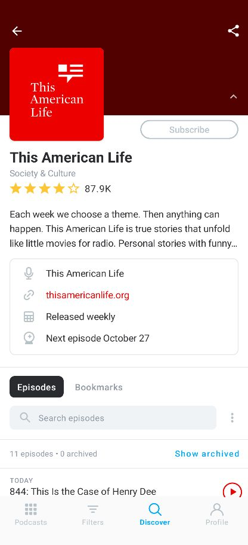
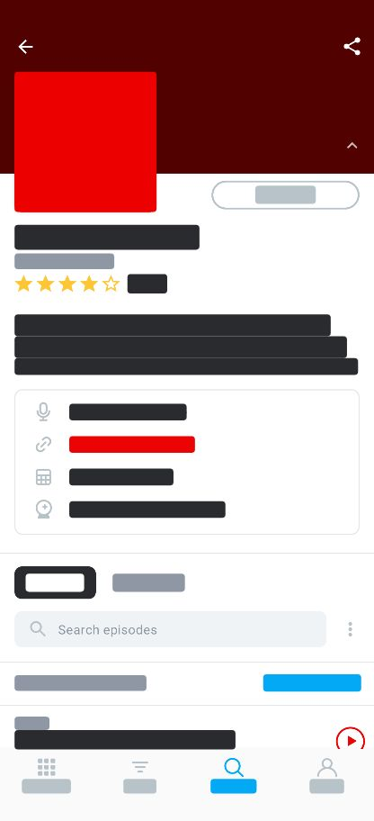

<Alert>

Using custom masking in your Session Replays may accidentally expose sensitive customer data. Before publishing an App with Session Replay enabled, make sure to test it thoroughly to ensure that no sensitive data is exposed.


</Alert>

By default, our Session Replay SDK masks all text content, images, webviews, and user input. This helps ensure that no sensitive data is exposed. You can also manually choose which parts of your app's data you want to mask by using the different options listed below.

To disable the default masking behavior (not to be used on applications with sensitive data):

```kotlin
options.sessionReplay.maskAllText = false
options.sessionReplay.maskAllImages = false
```

```XML {filename:AndroidManifest.xml}
<meta-data android:name="io.sentry.session-replay.mask-all-text" android:value="false" />
<meta-data android:name="io.sentry.session-replay.mask-all-images" android:value="false" />
```

|Session Replay Unmasked        |  Session Replay Masked                   |
|:-----------------------------:|:---------------------------------------: |
|  | |


_Make sure your Sentry Android SDK version is at least 7.20.0._

## Mask by View Class

You can choose which type of view you want to mask or unmask by using the `addMaskViewClass` or `addUnmaskViewClass` options.

Let's say you have:
- A custom view that you want to mask
- A `TextView` subclass (which normally would be masked) that you don't want to mask

You can set the options like this:

```kotlin
options.sessionReplay.addMaskViewClass("com.example.MyCustomView")
options.sessionReplay.addUnmaskViewClass("com.example.MyCustomTextView")
```

<Alert>

If you're using a code obfuscation tool (R8/ProGuard), adjust your proguard rules accordingly so your custom view class names don't get minified.

</Alert>

### Class Hierarchy

The masking behavior applies to classes and their subclasses. This means if you add a view via `addMaskViewClass` (for example, `TextView`, which is the default behavior), its respective subclasses (`RadioButton`, `CheckBox`, `EditText`, and so on) will also be masked. For example, you can do the following:

```kotlin
options.sessionReplay.addMaskViewClass("android.widget.TextView") // mask TextView and all its subclasses
options.sessionReplay.addUnmaskViewClass("android.widget.RadioButton") // but unmask RadioButton and all its subclasses
```

## Mask by View Instance

You can also choose to mask or unmask a specific view instance by using tags like this:

```xml
<View
  android:id="@+id/my_view"
  android:layout_width="wrap_content"
  android:layout_height="wrap_content"
  android:tag="sentry-mask|sentry-unmask"
/>
```

```kotlin
view.tag = "sentry-mask|sentry-unmask"
```

If your view already has a tag assigned, you can set the masking tag by a sentry-specific id:

```xml
<View
  android:id="@+id/my_view"
  android:layout_width="wrap_content"
  android:layout_height="wrap_content">

  <tag android:id="@id/sentry_privacy" android:value="mask|unmask"/>
</View>
```

```kotlin
  view.setTag(io.sentry.android.replay.R.id.sentry_privacy, "mask|unmask")
```

We also provide convenient extension functions for Kotlin:

```kotlin
view.sentryReplayMask()
// or
view.sentryReplayUnmask()
```

## Jetpack Compose

We only support masking specific composables in Jetpack Compose. Since composables are functions, not classes, masking by view class isn't possible.

In the example below, we want the "Hello" message to be captured in the replay, but not the custom composable. (By default, all text composables are masked.)

```kotlin
import io.sentry.android.replay.sentryReplayMask
import io.sentry.android.replay.sentryReplayUnmask

Column(
  verticalArrangement = Arrangement.Center,
  horizontalAlignment = Alignment.CenterHorizontally,
  modifier = Modifier.fillMaxSize()
) {
  MyCustomComposable(
    modifier = Modifier.fillMaxWidth().sentryReplayMask()
    ...
  )
  Text("Hello", modifier = Modifier.sentryReplayUnmask())
}
```

Currently, we don't support masking anything within embedded Android views (`AndroidView`), but you can still mask the entire view as follows:

```kotlin
import io.sentry.android.replay.sentryReplayMask

AndroidView(
  modifier = Modifier.sentryReplayMask(),
  factory = { context -> ... }
)
```

## General Masking Rules


### View Groups

- If a `ViewGroup` is marked as masked, **all its child views will also be masked**, even if some views would normally not be masked. This prioritizes safety and ensures no sensitive information is unintentionally exposed.

- If a `ViewGroup` is marked as unmasked, **its child views don't automatically inherit this behavior**. You'll need to explicitly mark each child view as unmasked if you want them to appear in the replay.

### Masking Priority

Masking and unmasking rules are applied in the following order:

  1. Check if a view is marked as `unmasked` via a tag/extension or function/modifier.
  2. Check if a view is marked as `masked` via a tag/extension or function/modifier.
  3. Check if a view's class is marked as unmasked via `addUnmaskViewClass`.
  4. Check if a view's class is marked as masked via `addMaskViewClass`.
