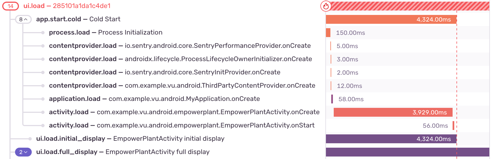
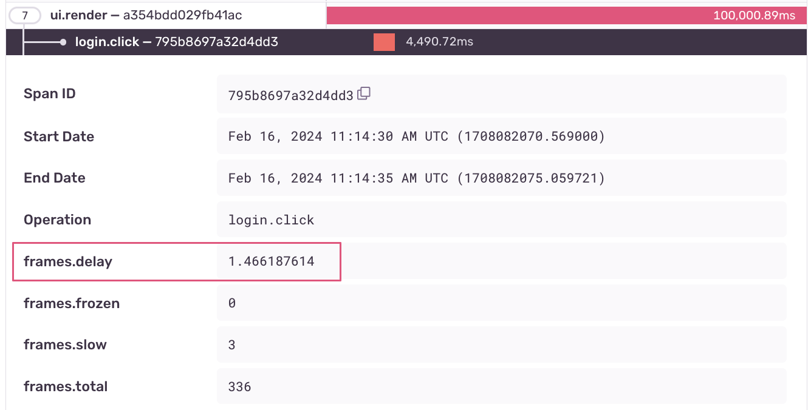

<Note>

This feature is marked as _experimental_.
Supported in Sentry's Android SDK version `7.4.0` and above.

</Note>

Performance V2 is a set of features which enrich your existing instrumentation, giving you more insights into potential performance bottlenecks. These features tightly integrate with [Mobile Vitals](/product/performance/mobile-vitals/).

### Enabling Performance V2

```java {filename:MyApplication.java}
import io.sentry.android.core.SentryAndroid;

SentryAndroid.init(this, options -> {
  options.setEnablePerformanceV2(true);
});
```

```kotlin {filename:MyApplication.kt}
import io.sentry.android.core.SentryAndroid

SentryAndroid.init(this) { options ->
  options.enablePerformanceV2 = true
}
```

```xml {filename:AndroidManifest.xml}
<manifest>
    <application>
        <meta-data android:name="io.sentry.performance-v2.enable" android:value="true" />
    </application>
</manifest>
```

### App Start

Besides enabling performance-v2, this feature requires the <PlatformLink to="/configuration/gradle/">Sentry Android Gradle Plugin</PlatformLink> (version `4.2.0` or above) to be applied to your app module.

Once enabled, your App Start transaction will show a detailed span breakdown of various components:
* `process.load`: The process initialization time
* `contentprovider.load`: `ContentProvider.onCreate()` execution time
* `application.load`: `Application.onCreate()` execution time
* `activity.load`: The execution time of your `Activity` lifecycle prior to the first frame being drawn




### Frames Delay

Frames Delay is the user-perceived delayed duration of rendered frames. The Android SDK automatically attaches this information to every span, giving useful insights and showcasing which spans correlate the most to an impaired user experience. For more technical details about frame delay, head over to our [develop docs](https://develop.sentry.dev/sdk/performance/frames-delay/).


