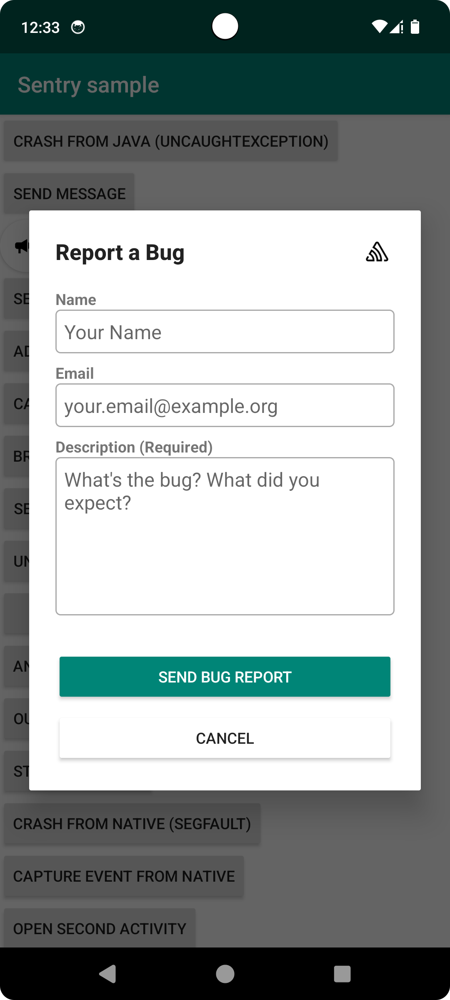

The User Feedback feature allows you to collect user feedback from anywhere inside your application at any time, without needing an error event to occur first.

<Alert>
If you're using a self-hosted Sentry instance, you'll need to be on version 24.4.2 or higher in order to use the full functionality of the User Feedback feature. Lower versions may have limited functionality.
Ensure you are using the Android SDK version 8.14.0 or above of the SDK to access the latest features.
</Alert>



## User Feedback Form

The User Feedback form allows users to submit feedback from anywhere inside your application.
For the configuration options, please refer to the <PlatformLink to="/user-feedback/configuration/">User Feedback Form Configuration</PlatformLink>.

```kotlin
import io.sentry.Sentry

val sentryId = Sentry.captureMessage("My message") // You can optionally associate an event using its id
Sentry.feedback().show(sentryId) { options ->
  // The options set here will be applied to the current form only
  options.formTitle = "We want to hear from you!"
}
```
```java
import io.sentry.Sentry;

SentryId sentryId = Sentry.captureMessage("My message"); // You can optionally associate an event using its id
Sentry.feedback().show(sentryId, options -> {
  // The options set here will be applied to the current form only
  options.setFormTitle("We want to hear from you!");
});
```

### Custom Form

For more control over the form instance (custom theme, per-form configuration, etc.), use the Builder:

```kotlin
import io.sentry.Sentry
import io.sentry.android.core.SentryUserFeedbackForm

val sentryId = Sentry.captureMessage("My message")
val form = SentryUserFeedbackForm.Builder(activity)
    .associatedEventId(sentryId)
    .configurator { options ->
      options.formTitle = "We want to hear from you!"
    }
    .create()
form.show()
```
```java
import io.sentry.Sentry;
import io.sentry.android.core.SentryUserFeedbackForm;

SentryId sentryId = Sentry.captureMessage("My message");
SentryUserFeedbackForm form = new SentryUserFeedbackForm.Builder(activity)
    .associatedEventId(sentryId)
    .configurator(options -> {
      options.setFormTitle("We want to hear from you!");
    })
    .create();
form.show();
```

### Session Replay

The User Feedback form integrates seamlessly with Session Replay. When the form is opened, the SDK buffers up to 30 seconds of the user's session. If feedback is submitted, this replay is sent along with the feedback, allowing you to view both the feedback and the user's actions leading up to the feedback submission.

## Shake to Report

You can enable shake-to-report so that shaking the device opens the User Feedback form. This uses the device's accelerometer and does not require any additional permissions.

```kotlin
SentryAndroid.init(this) { options ->
    options.feedbackOptions.isUseShakeGesture = true
}
```
```java
SentryAndroid.init(context, options -> {
    options.getFeedbackOptions().setUseShakeGesture(true);
});
```
```xml {filename:AndroidManifest.xml}
<application>
    <meta-data android:name="io.sentry.feedback.use-shake-gesture" android:value="true" />
</application>
```

### Per-Form Shake

If you only want shake-to-show for specific screens instead of globally, you can enable it on individual form instances using the Builder. This only works when global shake is disabled (the default).

```kotlin
import io.sentry.android.core.SentryUserFeedbackForm

val form = SentryUserFeedbackForm.Builder(activity)
    .configurator { it.isUseShakeGesture = true }
    .create()
```
```java
import io.sentry.android.core.SentryUserFeedbackForm;

SentryUserFeedbackForm form = new SentryUserFeedbackForm.Builder(activity)
    .configurator(options -> {
      options.setUseShakeGesture(true);
    })
    .create();
```

The form will automatically start and stop shake detection based on the activity lifecycle.

## User Feedback API

The User Feedback API allows you to collect user feedback while using your own UI components. You can submit feedback directly using the `Sentry.feedback().capture(Feedback)` method.

Sentry can optionally pair this feedback with an event, giving you additional insight into issues. Sentry needs the `eventId` to be able to associate the user feedback to the corresponding event. For example, to get the `eventId`, you can use <PlatformLink to="/configuration/options/#beforeSend">beforeSend</PlatformLink>, or the return value of the method capturing an event.


```kotlin
import io.sentry.Sentry
import io.sentry.protocol.Feedback

val feedback = Feedback("I encountered a bug while using the app.")
feedback.name = "John Doe"
feedback.contactEmail = "john.doe@example.com"
// Optionally associate the feedback with an event
val sentryId = Sentry.captureMessage("My message")
feedback.associatedEventId = sentryId
Sentry.feedback().capture(feedback)
```
```java
import io.sentry.Sentry;
import io.sentry.protocol.Feedback;

Feedback feedback = new Feedback("I encountered a bug while using the app.");
feedback.setName("John Doe");
feedback.setContactEmail("john.doe@example.com");
// Optionally associate the feedback with an event
SentryId sentryId = Sentry.captureMessage("My message");
feedback.setAssociatedEventId(sentryId);
Sentry.feedback().capture(feedback);
```
