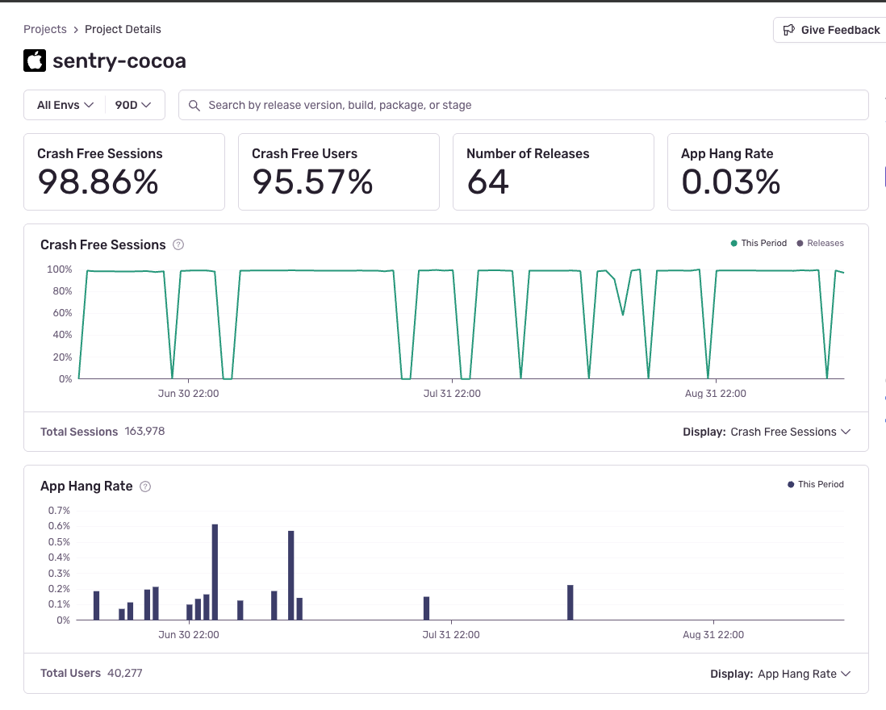

<Alert>

We recommend disabling this feature for Widgets and Live Activities because it might detect false positives.

Furthermore, the Cocoa SDK might report app hangs when the OS opens a system dialog asking for specific permissions,
such as whether the user wants to allow your app to paste from the clipboard. As we can't reliably detect these scenarios,
we advise you to [pause and resume tracking app hangs](#pause-and-resume-app-hang-tracking) to circumvent this problem.

</Alert>

This integration tracks app hangs. This feature is available on iOS, tvOS, and macOS.

Trying to use an unresponsive app is extremely frustrating for users. There are many reasons why an app may become unresponsive, such as long- running code, infinite loop bugs, and so on. With app hang tracking you can detect and fix them.

The app hang detection integration has a default timeout of two (2) seconds, but with version 7.24.0, we’ve improved the algorithm to detect app hangs sooner, decreasing from `appHangTimeoutInterval * 2` to `appHangTimeoutInterval * 1.2`.

To detect app hangs, the SDK launches a dedicated watchdog thread called `io.sentry.AppHangTracker`, which periodically enqueues work items on the main thread, and checks if the main thread is executing them within the timeout. If the app is unresponsive for two seconds or more, it creates an error event. This thread is also used by <PlatformLink to="/configuration/watchdog-terminations/">Watchdog Terminations</PlatformLink> and will be launched even if `enableAppHangTracking` is disabled.

Recording the stack trace precisely when the app hang occurs works reliably if the app is completely stuck, but if the main thread is extremely busy with different code spots, the app hang detection might fire a bit too late. If this happens, the SDK may record a stack trace that isn’t 100% related to the code, causing the app to hang. Each event has a stack trace of all running threads so you can easily detect where the problem occurred.

The SDK reports an app hang immediately, but doesn’t report the exact duration because the [watchdog](https://developer.apple.com/documentation/xcode/addressing-watchdog-terminations) could kill the app anytime if it's blocking the main thread.

Because the app hang detection integration uses SentryCrashIntegration to capture the stack trace when creating app hang events, SentryCrashIntegration has to be enabled for the integration to work.

You can filter and modify app hang events in `beforeSend` by checking the event exception type:


```swift {tabTitle:Swift}
import Sentry

SentrySDK.start { options in
    options.dsn = "___PUBLIC_DSN___"
    options.beforeSend = { event in
        if (event.exceptions?.first?.type == "App Hanging") {
          // modify event here or return nil to discard the event
        }
        return event
    }
}
```

```objc {tabTitle:Objective-C}
@import Sentry;

[SentrySDK startWithConfigureOptions:^(SentryOptions *options) {
    options.dsn = @"___PUBLIC_DSN___";
    options.beforeSend = ^SentryEvent * _Nullable(SentryEvent * _Nonnull event) {
        if ([self.exceptions.count == 1 && event.exceptions.firstObject.type isEqualToString:@"App Hanging"]) {
          // modify event here or return nil to discard the event
        }
        return event;
    }
}];
```

Starting with version 8.0.0, this feature has been enabled by default. To disable it:


```swift {tabTitle:Swift}
import Sentry

SentrySDK.start { options in
    options.dsn = "___PUBLIC_DSN___"
    options.enableAppHangTracking = false
}
```

```objc {tabTitle:Objective-C}
@import Sentry;

[SentrySDK startWithConfigureOptions:^(SentryOptions *options) {
    options.dsn = @"___PUBLIC_DSN___";
    options.enableAppHangTracking = NO;
}];

```

You can change the timeout by changing the `appHangTimeoutInterval` option:


```swift {tabTitle:Swift}
import Sentry

SentrySDK.start { options in
    options.dsn = "___PUBLIC_DSN___"
    options.appHangTimeoutInterval = 1
}
```

```objc {tabTitle:Objective-C}
@import Sentry;

[SentrySDK startWithConfigureOptions:^(SentryOptions *options) {
    options.dsn = @"___PUBLIC_DSN___";
    options.appHangTimeoutInterval = 1;
}];

```

### Pause and Resume App Hang Tracking

Starting with version 8.30.0, you can pause and resume app hang tracking at runtime with `SentrySDK.pauseAppHangTracking()` and `SentrySDK.resumeAppHangTracking()`.
These methods don't stop the <PlatformLink to="/configuration/metric-kit">MetricKit</PlatformLink> integration from reporting [MXHangDiagnostic](https://developer.apple.com/documentation/metrickit/mxhangdiagnostic).

```swift {tabTitle:Swift}
import Sentry

SentrySDK.pauseAppHangTracking()

// Do something that might cause the app to hang,
// and you don't want the Cocoa SDK to report it.

SentrySDK.resumeAppHangTracking()
```

```objc {tabTitle:Objective-C}
@import Sentry;

[SentrySDK pauseAppHangTracking];

// Do something that might cause the app to hang,
// and you don't want the Cocoa SDK to report it.

[SentrySDK resumeAppHangTracking];

```

### App Hangs V2

As of version 8.50.0, you can enable AppHangsV2, which is available on iOS and tvOS. The main difference is that AppHangsV2 differentiates between fully-blocking and non-fully-blocking app hangs, which you might choose to ignore, and measures the duration of app hangs. A fully-blocking app hang is when the main thread is stuck completely, and the app can't render a single frame. A non-fully-blocking app hang is when the app appears stuck to the user, but can still render a few frames. Fully-blocking app hangs are more actionable because the stacktrace shows the exact blocking location on the main thread. Non-fully-blocking app hangs can have a stacktrace that doesn't highlight the exact blocking location, since the main thread isn't completely blocked.

The SDK sets the `exception.type` to `App Hang Fully Blocked` or `App Hang Non Fully Blocked`, so you can filter for App Hangs via `error.type` in Sentry.

To enable the feature:

```swift {tabTitle:Swift}
import Sentry

SentrySDK.start { options in
    options.dsn = "___PUBLIC_DSN___"
    options.enableAppHangTrackingV2 = true
}
```

```objc {tabTitle:Objective-C}
@import Sentry;

[SentrySDK startWithConfigureOptions:^(SentryOptions *options) {
    options.dsn = @"___PUBLIC_DSN___";
    options.enableAppHangTrackingV2 = YES;
}];
```

#### Fatal App Hangs

Starting with version 8.50.0, the SDK automatically detects and reports fatal app hangs. If the user or the [system watchdog](https://developer.apple.com/documentation/xcode/addressing-watchdog-terminations) terminates your app during an app hang, the SDK reports it as a fatal app hang on the next startup.

The SDK sets the `exception.type` to `Fatal App Hang Fully Blocked` or `Fatal App Hang Non Fully Blocked`, so you can filter for Fatal App Hangs via `error.type` in Sentry.

#### Non-Fully Blocking App Hangs

As stacktraces might not be 100% accurate for non-fully-blocking app hangs, you can disable them with the option `enableReportNonFullyBlockingAppHangs`:

```swift {tabTitle:Swift}
import Sentry

SentrySDK.start { options in
    options.dsn = "___PUBLIC_DSN___"
    options.enableReportNonFullyBlockingAppHangs = false
}
```

```objc {tabTitle:Objective-C}
@import Sentry;

[SentrySDK startWithConfigureOptions:^(SentryOptions *options) {
    options.dsn = @"___PUBLIC_DSN___";
    options.enableReportNonFullyBlockingAppHangs = NO;
}];
```

## App Hang Rate

<Alert level="info">

The SDK supports App Hang Rate calculation starting with version 8.50.0. Additionally, you have to enable App Hangs V2 via `options.enableAppHangTrackingV2 = true` in your SDK configuration.

</Alert>

App hangs occur when the main UI thread of an application becomes unresponsive. When configured, Sentry's Apple SDK reports app hang events, and Sentry calculates an App Hang Rate based on these events and user sessions.

App Hang Rate is the percentage of unique users who have experienced a **Fatal App Hang** during the specified time period.

<Alert level="info">

The App Hang Rate in Sentry only accounts for **Fatal App Hangs** - app hangs that lead to your app being terminated, either by the user or the OS watchdog. Non-fatal app hangs are captured as events but do not contribute to the App Hang Rate calculation.

</Alert>

### Fatal App Hangs

Fatal app hangs are the most critical type of app hang because they result in app termination and directly impact user experience. These occur when:

- The user manually force-quits the app during a hang
- The system watchdog terminates the app due to unresponsiveness

Fatal app hangs are distinguished by their `exception.type`:

- `Fatal App Hang Fully Blocked`: A completely blocking app hang that leads to termination
- `Fatal App Hang Non Fully Blocked`: A partially blocking app hang that leads to termination

### Viewing Your App Hang Rate

To see your App Hang Rate in Sentry:

1. Go to the **Projects** page
2. Click on your Apple project
3. Look for the "App Hang Rate" card in the "Project Details" section
4. Click "View Issues" to see a list of app hang issues that were created in the selected timeframe and environment

The App Hang Rate card displays the percentage of users affected by fatal app hangs, helping you understand the impact on your user base and prioritize performance improvements.



Since App Hang Rate only includes fatal app hangs, it represents the most severe hangs that directly affect user retention and app store ratings.
