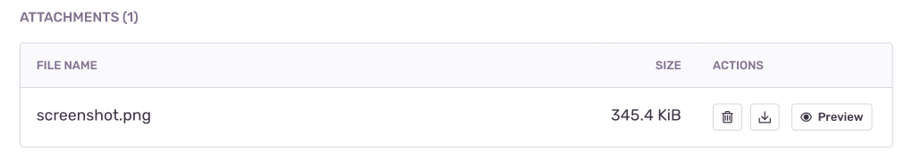

Sentry makes it possible to automatically take a screenshot and include it as an <PlatformLink to="/enriching-events/attachments/">attachment</PlatformLink> when a user experiences an error, an exception or a crash. When a crash occurs on Apple operating systems, there is no guarantee that the Cocoa SDK can still capture a screenshot since you're technically not allowed to call any async unsafe code. While it still works in most cases, we can't guarantee screenshots for all types of crashes.

This feature is only available for SDKs with a user interface, like the ones for mobile and desktop applications. It's also limited by whether taking a screenshot is possible or not. For example, in some environments, like native iOS, taking a screenshot requires the UI thread, which often isn't available in the event of a crash. Another example where a screenshot might not be available is when the event happens before the screen starts to load. So inherently, this feature is a best effort solution.

<Alert>
App hang events won't have a screenshot because the main thread is blocked and Sentry can't interact with UI elements in a background view.
</Alert>

## Enabling Screenshots

<Alert level="warning">

Before enabling screenshots in production, verify your masking configuration to ensure no sensitive data is captured. Our default settings aggressively mask potentially sensitive data, but if you modify these settings or update UI frameworks or system SDKs, you must thoroughly test your application. If you find any masking issues or sensitive data that should be masked but isn't, please [create a GitHub issue](https://github.com/getsentry/sentry-cocoa/issues/new/choose) and avoid deploying to production with screenshots enabled until the issue is resolved.

</Alert>

Because screenshots may contain <PlatformLink to="/data-management/sensitive-data/">PII</PlatformLink>, they are an opt-in feature. You can enable screenshots as shown below:

<PlatformContent includePath="enriching-events/attach-screenshots" />

## Screenshot Masking

By default, screenshot masking aggressively masks potentially sensitive data to help ensure no sensitive information is captured. You can customize this behavior to fit your application's needs.

<Alert>

Screenshot masking shares the same runtime APIs as <PlatformLink to="/session-replay/">Session Replay</PlatformLink> masking (like `SentrySDK.replay.maskView()` and SwiftUI modifiers), but screenshot masking uses separate configuration options via `options.screenshot.*` rather than `options.sessionReplay.*`.

</Alert>

### Default Masking Behavior

By default, screenshots mask all text content and non-bundled images by drawing a black rectangle over them. You can disable this default masking behavior (not recommended for applications with sensitive data):

```swift
options.screenshot.maskAllText = false
options.screenshot.maskAllImages = false
```

### Mask by View Class

You can choose which type of view you want to mask or unmask by using the `maskedViewClasses` or `unmaskedViewClasses` options.

By default, Sentry already masks text and image elements from UIKit. Every child of a view that is redacted will also be redacted. The `unmaskedViewClasses` property has precedence over `maskedViewClasses`, meaning if a view class appears in both lists, it will be unmasked.

Let's say you have a custom view that you want to mask and a `UILabel` subclass (which normally would be masked) that you don't want to mask. You can set the options like this:

```swift
options.screenshot.maskedViewClasses = [MyCustomView.self]
options.screenshot.unmaskedViewClasses = [MyCustomLabel.self]
```

Note that views of classes in `unmaskedViewClasses` will not be redacted, but their children may still be masked.

### Mask by View Instance

You can also choose to mask or unmask a specific view instance by using the replay API (`SentrySDK.replay`) or view extensions like this:

```swift
SentrySDK.replay.maskView(view: view)
SentrySDK.replay.unmaskView(view: label)
```

or

```swift
view.sentryReplayMask()
label.sentryReplayUnmask()
```

<Alert>

The runtime masking API for individual view instances may not be available in all Sentry SDK versions. Check your SDK documentation for the latest masking capabilities.

</Alert>

### SwiftUI Considerations

Because of the way SwiftUI is transformed into UIKit, it will often be over-masked. A modifier like `background` uses the same element as an `Image`.
In order to control the SwiftUI masking process, you need to use the `sentryReplayUnmask` and/or `sentryReplayMask` modifiers.

In this example we want to show the message, but not the user name.

```swift
@Binding var user: String

var body: some View {
  VStack {
    Text("Hello")
      .sentryReplayUnmask()
    Text("\(user)")
  }
}
```

In this example, we need to unmask the VStack because its background element will be masked by default.
To hide the username, we need to mask it.

```swift
@Binding var user: String

var body: some View {
  VStack {
    Text("Hello")
    Text("\(user)")
      .sentryReplayMask()
  }
  .background(.blue)
  .sentryReplayUnmask()
}
```

## Debugging Screenshot Masking

To see how elements are being masked, enable the masking preview from anywhere in your app. It will display an overlay on top of the masked elements. This works on the simulator and on device, as well as within Xcode Preview.

```swift
SentrySDK.replay.showMaskPreview()
```

By default, the overlay will be opaque. To configure the opacity, pass the desired opacity as a parameter:

```swift
SentrySDK.replay.showMaskPreview(0.5) // 0.5 opacity to render the preview semi-transparent
```

Make sure not accidentally include this in your release build by e.g. wrapping it in a `#if DEBUG` block.

```swift
#if DEBUG
  SentrySDK.replay.showMaskPreview()
#endif
```

To preview masking during the design phase of your SwiftUI views, use the `sentryReplayPreviewMask` modifier.

This view modifier works on the simulator and on device, as well as within Xcode Preview. Therefore we recommend to apply the modifier only in your preview code, to ensure proper masking without affecting the final release build.

Note that when you apply this modifier to a view, it will show the masking preview for the entire window containing that view, not just the view itself.

```swift
struct ContentView_Previews: PreviewProvider {
  static var previews: some View {
    ContentView()
      .sentryReplayPreviewMask()
  }
}
```

## Rendering Options

Screenshot rendering can be configured to improve performance. These options control how views are rendered when capturing screenshots.

### Enable View Renderer V2

Starting with SDK v8.50.0, the up-to-5x-faster view renderer V2 is used by default, reducing the impact of screenshot capture on the main thread and potential frame drops. This reduces the amount of time it takes to render the screenshot on the main thread, reducing interruptions and visual lag. Benchmarks have shown significant improvement of up to 4-5x faster rendering (reducing ~160ms to ~36ms) on older devices.

While we recommend the view renderer V2, if you are experiencing issues, you can opt out of using it:

```swift
options.screenshot.enableViewRendererV2 = false // Defaults to true
```

### Enable Fast View Rendering

Enables up to 5x faster but incomplete view rendering. This flag controls the way the view hierarchy is drawn into a graphics context. By default, the view hierarchy is drawn using `UIView.drawHierarchy(in:afterScreenUpdates:)`, which is the most complete way to render. Enabling this flag switches to render the underlying `CALayer` instead, which is faster but may lead to rendering issues with custom views.

Benchmarks have shown up to 5x faster render times (reducing ~160ms to ~30ms) on older devices.

<Alert level="warning">

Rendering the view hierarchy using the `CALayer.render(in:)` method can lead to rendering issues, especially when using custom views. For complete rendering, it is recommended to set this option to `false`. Only enable this if you prefer performance over completeness.

</Alert>

<Alert>

This flag can only be used together with `enableViewRendererV2` for up to 20% faster render times.

</Alert>

<Alert>

This is an experimental feature and is disabled by default. If you notice issues with the experimental view renderer, please report them on [GitHub](https://github.com/getsentry/sentry-cocoa). Eventually, we will mark this feature as stable and remove the experimental flag, but will keep it disabled by default.

</Alert>

```swift
options.screenshot.enableFastViewRendering = false // Disabled by default
```

## Viewing Screenshots

If one is available, you'll see a thumbnail of the screenshot when you click on a specific issue from the [**Issues**](https://demo.sentry.io/issues/) page.


Once you've clicked on the event ID of a specific issue, you'll be able to see an overview of all the attachments as well as associated events in the "Attachments" tab.


