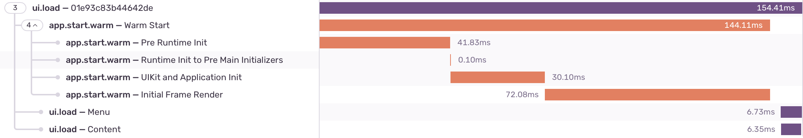

<Alert>
This feature is stable since version 8.17.0.
</Alert>

You can monitor the performance of your views in a SwiftUI project with the SentrySwiftUI library, which you can install via <PlatformLink to="/install/swift-package-manager/">SPM (Swift Package Manager)</PlatformLink>.

> If you plan to add _SentrySwiftUI_, you don't need to also add _Sentry_ library since the former depends on the latter.

In order to start monitoring the performance of your views, you need to wrap it with `SentryTracedView`, like this:

```swift {tabTitle:Swift}

import SentrySwiftUI

var body: some View {
    SentryTracedView("<Name of your view>"){
        List {
            // Your SwiftUI code ...
        }
    }
}
```

You may omit the transaction name, Sentry will use the root view type as name, in the previous example the transaction name would be `List`.

Alternatively, you can use a modifier like this:

```swift {tabTitle:Swift}

import SentrySwiftUI

var body: some View {
    List {
        // Your SwiftUI code ...
    }.sentryTrace("<Name of your view>")
}
```

It is possible to use nested `SentryTracedView` to have a more granular transaction.

```swift {tabTitle:Swift}

import SentrySwiftUI

var body: some View {
    SentryTracedView("My Awesome Screen"){
        HStack {
            SentryTracedView("Menu") {
                List{
                    // Your SwiftUI code ...
                }
            }
            SentryTracedView("Content") {
                VStack{
                    // Your SwiftUI code ...
                }
            }
        }
    }
}
```

This is the result



## Time to Initial Display and Time to Full Display

<Alert>

This feature is available since version 8.44.0 and only works for iOS and tvOS.

</Alert>

You can track time to initial display (TTID) and time to full display (TTFD) for your SwiftUI views to measure how long it takes for screens to render their first frame and then fully load all content.

- **Time to initial display (TTID)**: Automatically tracked when the view appears on screen (triggered by the [`onAppear`](https://developer.apple.com/documentation/SwiftUI/View/onAppear(perform:)) modifier). The SDK sets the span operation to `ui.load.initial-display` and the span description to the view name followed by `initial display` - for example, `Content View Body initial display`.

- **Time to full display (TTFD)**: Requires enabling with the `waitForFullDisplay` parameter and manually calling `SentrySDK.reportFullyDisplayed()` when your view has finished loading all content. The SDK sets the span operation to `ui.load.full-display` and the span description to the view name followed by `full display` - for example, `Content View Body full display`. This must be done manually because the SDK cannot automatically detect when a view has finished loading all content, and the definition of "fully loaded" varies by application.

### Enabling Time to Full Display

To enable TTFD tracking, set `waitForFullDisplay: true` when creating a `SentryTracedView`:

```swift {tabTitle:Swift}

import SentrySwiftUI
import Sentry

var body: some View {
    SentryTracedView("Content View Body", waitForFullDisplay: true) {
        VStack {
            // Your SwiftUI content
        }
        .onAppear {
            // Load async content, then call:
            SentrySDK.reportFullyDisplayed()
        }
    }
}
```

Alternatively, you can use the `sentryTrace` modifier with `waitForFullDisplay: true`:

```swift {tabTitle:Swift}

import SentrySwiftUI
import Sentry

var body: some View {
    VStack {
        // Your SwiftUI content
    }
    .sentryTrace("Content View Body", waitForFullDisplay: true)
    .onAppear {
        // Load async content, then call:
        SentrySDK.reportFullyDisplayed()
    }
}
```

If you don't specify `waitForFullDisplay`, the SDK will use the value from the `enableTimeToFullDisplayTracing` option. You can enable TTFD globally for all views by setting this option:

```swift {tabTitle:Swift}

import Sentry

SentrySDK.start { options in
    options.dsn = "___PUBLIC_DSN___"
    options.enableTimeToFullDisplayTracing = true
}
```

### When to Call reportFullyDisplayed()

Call `SentrySDK.reportFullyDisplayed()` when your view has finished loading all of its content, including any asynchronous operations like:

- Network requests to fetch data
- Image loading
- Database queries
- Any other async operations that affect the view's content

Typically, you'll call this in the `onAppear` modifier after your async content has loaded:

```swift {tabTitle:Swift}

import SentrySwiftUI
import Sentry

struct ContentView: View {
    @State private var data: [Item] = []

    var body: some View {
        SentryTracedView("Content View", waitForFullDisplay: true) {
            List(data) { item in
                Text(item.title)
            }
            .onAppear {
                Task {
                    // Load data asynchronously
                    data = await loadData()
                    // Report when fully displayed
                    SentrySDK.reportFullyDisplayed()
                }
            }
        }
    }
}
```

### Important Notes

- **Nested views**: The `waitForFullDisplay` parameter is ignored for nested `SentryTracedView` instances. Only the root transaction (the outermost `SentryTracedView`) will track TTID and TTFD spans.

- **30-second timeout**: If `reportFullyDisplayed()` is not called within 30 seconds, the TTFD span will automatically finish with `SpanStatus.DEADLINE_EXCEEDED`. The duration will match the TTID span duration, and the description will contain a `Deadline Exceeded` suffix.

- **Early calls**: If `reportFullyDisplayed()` is called before the view appears, the reported time will be shifted to match the TTID measured time.

For more information about TTID and TTFD metrics, see the [Mobile Vitals documentation](/product/insights/mobile/mobile-vitals/#time-to-initial-display-and-time-to-full-display).
