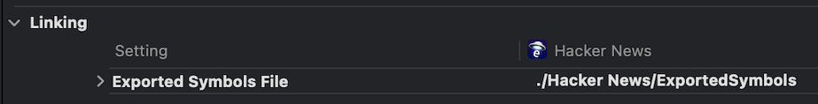

TODO: ADD SOME PICS

Size Analysis Insights point out how iOS app can reduce its size. They spot patterns like duplicate files, oversized media, or unneeded assets, and list exactly what to fix along with the estimated size savings.

## iOS Insights

Below are a list of available insights for iOS builds.

| Insight                                                     | What it catches                                                                                 |
| ----------------------------------------------------------- | ----------------------------------------------------------------------------------------------- |
| [Strip debug symbols](#strip-debug-symbols)                 | Binaries that include removable debug sections or symbols.                                      |
| [Duplicate files](#duplicate-files)                         | Identical files where the extras can be removed.                                                |
| [Image optimization](#image-optimization)                   | Oversized PNG/JPEG/HEIC assets and recommends minifying or converting to HEIC.                  |
| [Alternate icon optimization](#alternate-icon-optimization) | Alternate app icons that can be downscaled and recompressed.                                    |
| [Loose images](#loose-images)                               | Scaled @1x/@2x/@3x images that should be moved into asset catalogs to qualify for app thinning. |
| [Small files](#small-files)                                 | Tiny files wasting space because of the 4KB filesystem block size.                              |
| [Unnecessary files](#unnecessary-files)                     | Docs, scripts, configs, or other build leftovers in the bundle.                                 |
| [Large videos](#large-videos)                               | Video files that are a good candidate for on-demand delivery.                                   |
| [Localized strings](#localized-strings)                     | Localized strings that can use a more efficient format.                                         |
| [Minify localized strings](#minify-localized-strings)       | Localized string files that contain removable whitespace and comments.                          |
| [Main binary export metadata](#main-binary-export-metadata) | Binaries that include removable export tries.                                                   |
| [Hermes debug info (RN only)](#hermes-debug-info-rn-only)   | Hermes bytecode files that include removable debug info.                                        |

### Strip debug symbols

**What it is**: Debug info and symbols are only used during development and should not be shipped to users.

**How to fix**: Strip symbols from release builds and instead use debug symbols in separate dSYM files for crash reporters.

<Alert type="warning">
  Stripping symbols before creating a dSYM breaks crash symbolication. Confirm
  your release build still produces and uploads dSYMs (or another crash reporter
  has them) before stripping.
</Alert>

In Xcode ensure your release configuration sets the `Debug Information Format` build setting to `DWARF with dSYM`.

The `strip` command can then remove the extra information:

```bash
strip -rSTx AppBinary -o AppBinaryStripped
```

To automate stripping in your project after building, add a Run Script phase that skips non-release builds and leaves Apple-signed frameworks untouched:

<Alert type="warning">
  This script will strip the main app binary along with any binaries in the
  `Frameworks/` directory. This is a sample script that **may require
  adjustments** for your project.
</Alert>

```bash
#!/bin/bash
set -e

if [ "Release" != "${CONFIGURATION}" ]; then
  echo "Skipping symbol stripping for ${CONFIGURATION} build."
  exit 0
fi

APP_DIR_PATH="${BUILT_PRODUCTS_DIR}/${EXECUTABLE_FOLDER_PATH}"
echo "Stripping main binary: ${APP_DIR_PATH}/${EXECUTABLE_NAME}"
strip -rSTx "${APP_DIR_PATH}/${EXECUTABLE_NAME}"

APP_FRAMEWORKS_DIR="${APP_DIR_PATH}/Frameworks"
if [ -d "${APP_FRAMEWORKS_DIR}" ]; then
  find "${APP_FRAMEWORKS_DIR}" -maxdepth 2 -mindepth 2 -type f -perm -111 -exec bash -c '
    codesign -v -R="anchor apple" "$1" &> /dev/null || strip -rSTx "$1"
  ' _ {} \;
fi
```

Because Xcode generates dSYMs from the unstripped binary, list the dSYM as an Input File so the script runs after Xcode finishes generating it:

```
${DWARF_DSYM_FOLDER_PATH}/${EXECUTABLE_NAME}.app.dSYM/\
Contents/Resources/DWARF/${EXECUTABLE_NAME}
```

### Duplicate files

**What it is**: Finds identical files bundled more than once.

**How to fix**: Use dynamic frameworks to share assets between multiple targets. Here's an [example a post](https://www.emergetools.com/blog/posts/make-your-ios-app-smaller-with-dynamic-frameworks) walking through how to do this for an SPM project.

### Image optimization

**What it is**: Surfaces PNG, JPEG, or HEIC assets that can be minified or converted.

**How to fix**: Pick one of these workflows, then replace the source asset with the optimized version. If you convert to HEIC, update the asset catalog reference.

#### Option 1: Use Imagemin (CLI)

```bash
# Install imagemin-cli
npm install -g imagemin-cli

# Optimize PNG with quality 85
imagemin input.png --plugin=pngquant --plugin.quality=[0.85,0.85] > output.png

# Optimize JPEG with quality 85
imagemin input.jpg --plugin=mozjpeg --plugin.quality=85 > output.jpg
```

#### Option 2: Use ImageOptim (GUI)

Download ImageOptim for macOS, drag your images into the window, and let it recompress them with lossy settings.

#### Option 3: Convert to HEIC

Open the image in Preview, choose `File → Export`, pick `HEIC`, and save. Replace the original file and update any references.

### Alternate icon optimization

**What it is**: Alternate app icons are only ever shown on the home screen which requires 180x180 pixels. These images can be downsized to 180x180 and then upsampled back to 1024x1024 to reduce size.

**How to fix**: Run one of the scripts below to resize to homescreen quality and save an optimized copy. Then update the alternate icon entry in your `.xcassets` catalog (and Info.plist if you change the filename).

1. Save the script as `optimize.sh`.
2. Run `source optimize.sh`.
3. Call `optimize_icon YourIcon.png`.

#### Option: Convert to HEIC

```bash
#!/bin/bash
optimize_icon() {
    local input="$1"
    local output="$(basename "$input" | sed 's/\.[^.]*$//')_optimized.heic"

    [ ! -f "$input" ] && echo "❌ File not found: $input" && return 1

    echo "🔄 Optimizing $(basename "$input")..."

    sips --resampleWidth 180 "$input" \
      --out /tmp/icon.png >/dev/null 2>&1 || return 1
    sips --resampleWidth 1024 /tmp/icon.png \
      -s format heic -s formatOptions 85 \
      --out "$output" >/dev/null 2>&1

    rm /tmp/icon.png

    if [ -f "$output" ]; then
        local saved=$(( ($(stat -f%z "$input") - $(stat -f%z "$output")) / 1024 ))
        echo "✅ Saved ${saved}KB → $output"
    else
        echo "❌ Optimization failed"
        return 1
    fi
}
```

Update the Info.plist alternate icon entry to point at the new `.heic` file.

#### Option: Keep PNG

```bash
#!/bin/bash
optimize_icon() {
    local input="$1"
    local output="$(basename "$input" | sed 's/\.[^.]*$//')_optimized.png"

    [ ! -f "$input" ] && echo "❌ File not found: $input" && return 1

    echo "🔄 Optimizing $(basename "$input")..."

    sips --resampleWidth 180 "$input" \
      --out /tmp/icon.png >/dev/null 2>&1 || return 1
    sips --resampleWidth 1024 /tmp/icon.png \
      --out "$output" >/dev/null 2>&1

    rm /tmp/icon.png

    if [ -f "$output" ]; then
        local saved=$(( ($(stat -f%z "$input") - $(stat -f%z "$output")) / 1024 ))
        echo "✅ Saved ${saved}KB → $output"
    else
        echo "❌ Optimization failed"
        return 1
    fi
}
```

### Loose images

**What it is**: Finds scaled @1x/@2x/@3x images stored outside of asset catalogs. This prevents app thinning from removing variants not needed for the user's device.

**How to fix**: Move each image set into an asset catalog in Xcode.

### Small files

**What it is**: Each file on iOS takes up a minimum of 4KB due to the filesystem's block size. Files smaller than this limit will take up more storage on disk than expected. Every file inside the app also has code signature overhead which can add up with many files.

**How to fix**: Group small files into asset catalogs, archives, or databases so multiple entries share the same file on disk.

### Unnecessary files

**What it is**: Files such as READMEs, docs, scripts, configs, and similar build leftovers do not need to be included in the app bundle.

**How to fix**: Drop these files from the Copy Bundle Resources phase or exclude them with `EXCLUDED_SOURCE_FILE_NAMES` before archiving.

### Large videos

**What it is**: Video assets larger than 10 MB are not recommended to be bundled in your app. Often times videos are only shown to a subset of users and could instead be shown on-demand.

**How to fix**: host and stream the content instead of bundling it, or re-encode them with H.264 or HEVC at a lower bitrate or resolution.

### Localized strings

**What it is**: Xcode localized strings files use a verbose dictionary format by default.

**How to fix**: Sentry's SmallStrings helper library is a more efficient method of encoding translations.

### Minify localized strings

**What it is**: Xcode localized strings files often include translator comments, whitespace, binary encodings, and other non-runtime text that can be safely stripped.

**How to fix**: Start with low-effort cleanup, then automate comment stripping if you still ship large payloads.

#### Option 1: Keep the format lean

- Encode localized strings as plain text (`"key" = "value";`), not binary plists. Set **Strings File Output Encoding** (`STRINGS_FILE_OUTPUT_ENCODING`) to **UTF-8** in Xcode.
- Remove translator comments that ship with the bundle. They help during translation but take space in production. A typical comment looks like:

  ```text
  /* Title for the expired code alert. */
  "code_expired" = "Code Expired";
  ```

#### Option 2: Strip comments automatically

Add a Run Script build phase that converts each `.strings` file to JSON, rewrites it without comments, and leaves a compact UTF-8 file behind:

1. In Xcode, open **Build Phases → + → New Run Script Phase** and place it after the localized resources build step.
2. Set the shell to your Python 3 binary (for Homebrew on Apple Silicon: `/opt/homebrew/bin/python3`).
3. Paste the script below.

```python
#!/usr/bin/env python3
import json
import os
import subprocess

def minify(file_path: str) -> None:
    subprocess.run(["plutil", "-convert", "json", file_path], check=True)

    with open(file_path, "r", encoding="utf-8") as source:
        data = json.load(source)

    with open(file_path, "w", encoding="utf-8") as target:
        for key, value in data.items():
            target.write(f'"{key}" = "{value}";\n')

for root, _, files in os.walk(os.environ["BUILT_PRODUCTS_DIR"], followlinks=True):
    for filename in files:
        if filename.endswith(".strings"):
            path = os.path.join(root, filename)
            print(f"Minifying {path}")
            minify(path)
```

This script strips comments and blank lines after the files are generated, so keep the original annotated copies under version control for translators.

### Main binary export metadata

**What it is**: Binaries that act as entrypoints for your app, such as your main app binary or watchOS app binary, are not linked against by other binaries. This means the export trie information is unnecessary and can be removed.

**How to fix**: Maintain a minimal allowlist so only required entry points stay exported.

1. Create a text file in your project, for example `Config/ExportedSymbols.txt`.
2. Add `_main` on its own line. Add `__mh_execute_header` if you use Crashlytics or other tooling that finds symbols dynamically with `dlsym`.
3. If you rely on other dynamic lookups, list those symbols too.
4. In Xcode, set **Build Settings → Linking → Exported Symbols File** to the new file’s path.



Xcode now limits the export trie to just that allowlist.

### Hermes debug info (React Native)

**What it is**: Debug information is only needed during development and should not be shipped to users.

**How to fix**: Enable [Source maps](https://reactnative.dev/docs/debugging-release-builds) when building your release app.

<Alert type="warning">
  Stripping debug information breaks crash symbolication. Source maps need to be
  uploaded separately to your crash reporter.
</Alert>
