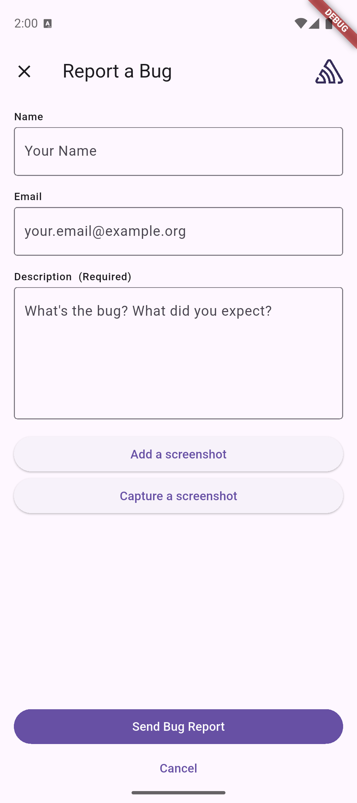

When a user experiences an error, Sentry provides the ability to collect additional feedback. You can collect feedback according to the method supported by the SDK.

## User Feedback API

The user feedback API allows you to collect user feedback while utilizing your own UI. Sentry pairs the feedback with the original event, giving you additional insight into issues. Sentry needs the `associatedEventId` to be able to associate the user feedback to the corresponding event. There are several ways to get the `associatedEventId`:

- use {<PlatformLink to="/configuration/options/#before-send"><PlatformIdentifier name="before-send" /></PlatformLink>}
- use the return value of any method capturing an event.
- use `Sentry.lastEventId` to get the ID of the last event sent.

<PlatformContent includePath="user-feedback/sdk-api-example/" />

## SentryFeedbackWidget

Use the `SentryFeedbackWidget` to let users send feedback data to Sentry.

The widget requests and collects the user's name, email address, and a description of what occurred. When an event identifier is provided, Sentry pairs the feedback with the original event, giving you additional insights into issues. 

Users can also pick a screenshot from their device's gallery or take a screenshot of their app's UI. Additionally, you can provide a screenshot in code. Learn more about how to enable screenshots in our <PlatformLink to="/enriching-events/screenshots/">Screenshots documentation</PlatformLink>.

The image below provides an example of the widget, though yours may differ depending on your customization:



### Integration

One possible use for the `SentryFeedbackWidget` is to listen for specific Sentry events in the `beforeSend` callback and show the widget to users. Users also can take a screenshot from their app's UI if the `SentryWidget` is wrapped around the main app widget.

```dart
// The example uses the `NavigatorState` to present the widget. Adapt as needed to your navigation stack.
final GlobalKey<NavigatorState> navigatorKey = GlobalKey<NavigatorState>();

...

Future<void> main() async {
  await SentryFlutter.init(
    (options) {
      options.navigatorKey = navigatorKey; // Needed so the widget can be presented.
      options.beforeSend = (event, hint) async {
        // Filter here what kind of events you want users to give you feedback.
        
        final screenshot = await SentryFlutter.captureScreenshot();

        final context = navigatorKey.currentContext;
        if (context != null && context.mounted) {
          SentryFeedbackWidget.show(
            context,
            associatedEventId: event.eventId,
            screenshot: screenshot,
          );
        }
      };
    },
    appRunner: () => runApp(
      SentryWidget(
        child: MyApp(),
      ),
    ),
  );
}
```

### Customization

You can customize the `SentryFeedbackWidget` to your needs by modifying the `SentryFeedbackOptions` class, which is provided by the `SentryFlutter.init` options.

```dart
SentryFlutter.init((options) {
  options.feedback.title = 'Report a Bug';
  options.feedback.isNameRequired = false;
  options.feedback.showName = true;
  options.feedback.isEmailRequired = false;
  options.feedback.showEmail = true;
  options.feedback.useSentryUser = true;
  options.feedback.showBranding = true;
});
```

The following table lists all the options you can customize to change behavior of the `SentryFeedbackWidget`.

| Option | Type | Default | Description |
| - | - | - | - |
| title | String | 'Report a Bug' | The title of the feedback form. |
| isNameRequired | Bool | false | Requires the name field on the feedback form to be filled in. |
| showName | Bool | true | Displays the name field on the feedback form. Ignored if isNameRequired is true. |
| isEmailRequired | Bool | false | Requires the email field on the feedback form to be filled in. |
| showEmail | Bool | true | Displays the email field on the feedback form. Ignored if isEmailRequired is true. |
| useSentryUser | Bool | true | Sets the email and name fields to the corresponding Sentry SDK user fields that were called with SentrySDK.setUser. |
| showBranding | Bool | true | Displays the Sentry logo inside the form. |
| showAddScreenshot | Bool | true | Displays the add screenshot button on the feedback form. |
| showCaptureScreenshot | Bool | true | Displays the capture screenshot button on the feedback form. |

You can also provide differnt labels or localization for the feedback widget:

| Option | Type | Default | Description |
| - | - | - | - |
| formTitle | String | 'Report a Bug' | The title of the feedback form. |
| messageLabel | String | 'Description' | The label of the feedback description input field. |
| messagePlaceholder | String | 'What's the bug? What did you expect?' | The placeholder in the feedback description input field. |
| isRequiredLabel | String | ' (Required)' | The text to attach to the title label for a required field. |
| successMessageText | String | 'Thank you for your report!' | The message displayed after a successful feedback submission. |
| nameLabel | String | 'Name' | The label next to the name input field. |
| namePlaceholder | String | 'Your Name' | The placeholder in the name input field. |
| emailLabel | String | 'Email' | The label next to the email input field. |
| emailPlaceholder | String | 'your.email@example.org' | The placeholder in the email input field. |
| submitButtonLabel | String | 'Send Bug Report' | The label of the submit button. |
| cancelButtonLabel | String | 'Cancel' | The label of the cancel button. |
| validationErrorLabel | String | 'Can't be empty' | The label of the validation error message. |
| addScreenshotButtonLabel | String | 'Add a screenshot' | The label of the add screenshot button. |
| captureScreenshotButtonLabel | String | 'Capture a screenshot' | The label of the capture screenshot button. |
| removeScreenshotButtonLabel | String | 'Remove screenshot' | The label of the remove screenshot button. |
| takeScreenshotButtonLabel | String | 'Take Screenshot' | The label of the take screenshot button shown outside of the feedback widget. |
