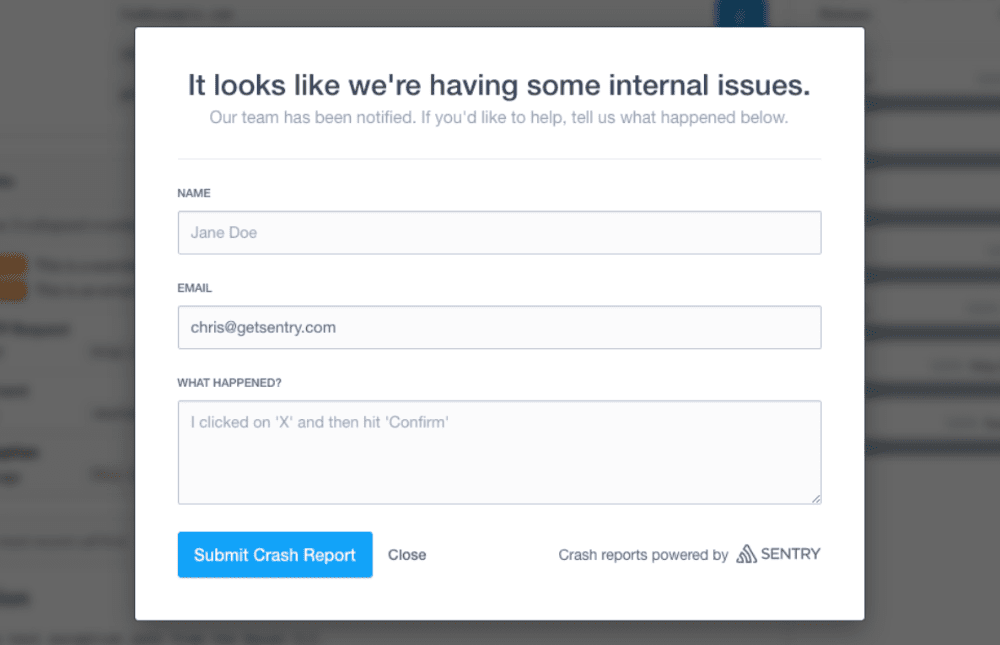

When a user experiences an error, Sentry provides the ability to collect additional feedback. You can collect feedback according to the method supported by the SDK.

## Use the .NET SDK

<Note>

User Feedback for **[ASP.NET](/platforms/dotnet/guides/aspnet/user-feedback/#integration)** or **[ASP.NET Core](/platforms/dotnet/guides/aspnetcore/user-feedback/#integration)** supply integrations specific to supporting those SDKs.

</Note>

You can create a form to collect the user input in your preferred framework, and use the SDK's API to send the information to Sentry. You can also use the widget, as described below. If you'd prefer an alternative to the widget or do not have a JavaScript frontend, you can use this API or a [Web API](/api/projects/submit-user-feedback/).

```csharp {tabTitle:C#}
using Sentry;

var eventId = SentrySdk.CaptureMessage("An event that will receive user feedback.");

SentrySdk.CaptureUserFeedback(eventId, "user@example.com", "It broke.", "The User");
```

```fsharp {tabTitle:F#}
open Sentry

let eventId = SentrySdk.CaptureMessage("An event that will receive user feedback.")

SentrySdk.CaptureUserFeedback(eventId, "user@example.com", "It broke.", "The User")
```

## Crash-Report Modal

Our embeddable, JavaScript-based, Crash-Report modal is useful when you would typically render a plain error page (the classic `500.html`) on your website.

To collect feedback, the Crash-Report modal requests and collects the user's name, email address, and a description of what occurred. When feedback is provided, Sentry pairs the feedback with the original event, giving you additional insights into issues.

The screenshot below provides an example of the Crash-Report modal, though yours may differ depending on your customization:



### Integration

The modal authenticates with your public DSN, then passes in the Event ID that was generated on your backend.

<PlatformContent includePath="user-feedback/example-widget/" />
