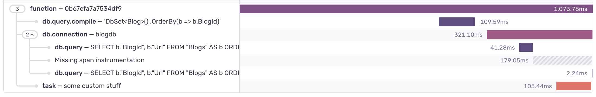

## Tracing Instrumentation Issues

### Spans generated for `db.connection` and `db.query` are disconnected

The SDK keeps automatically generated spans for `db.connection` and `db.query` under the same parent by design. Consider the following snippet:

```csharp
var transaction = SentrySdk.StartTransaction("Program Main", "function");

await db.Blogs.OrderBy(b => b.BlogId).ToListAsync();

var span = transaction.StartChild("task", "some custom stuff");
await Task.Delay(100);
span.Finish();

await db.Blogs.OrderBy(b => b.BlogId).ToListAsync();

transaction.Finish();
```

This would lead to the following waterfall graph



where an unrelated task would attempt to be nested within the `db.connection` span. Since the task does not have `db.connection` set as parent it gets appended at the bottom. But because it happened while the connection was open it would get interpreted as a missing instrumentation.

It makes sense also from the perspective of the parent/child spans having any sort of causal relationship. The `db.query.compile`, `db.connection`, `db.query`, and the custom `task` were all things that were caused by the function implementation. The queries weren't caused by the connection, they just used the connection.
