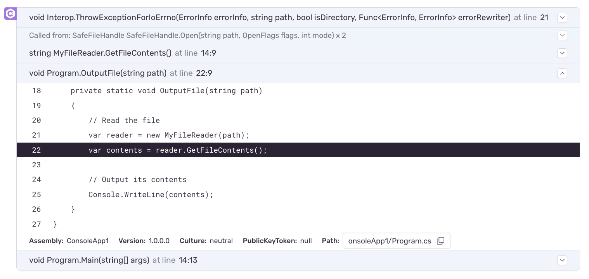

If Sentry has access to your application's source code, it can show snippets of code (_source context_) around the location of stack frames, which helps to quickly pinpoint problematic code.

For example, here's a stack trace from a .NET application. The source context contains
the original C# source code of the application, with the location of the frame highlighted.

### Source Bundles

Certain SDKs, such as the Python SDK, can resolve this source context automatically,
because they have access to unobfuscated source code at runtime.
By contrast, to get source context for compiled applications, the source code
needs to be uploaded alongside the debug information files.
The recommended way to do this is by using `sentry-cli`.
See [Creating Source Bundles](/product/cli/dif/#creating-source-bundles) for more information.

<Note>

For Flutter Android, iOS, and macOS, follow the instructions in the [Debug Symbols](/platforms/flutter/upload-debug/#uploading-source-code-context-for-flutter-android-ios-and-macos) guide.

</Note>

After they've been uploaded you can review and manage source bundles the same as
any other debug information file. See [Managing Debug Information Files](../#managing-debug-information-files).
Source bundles will be tagged with `sources`, and will carry the same filename as the
respective debug information file they were created from.
