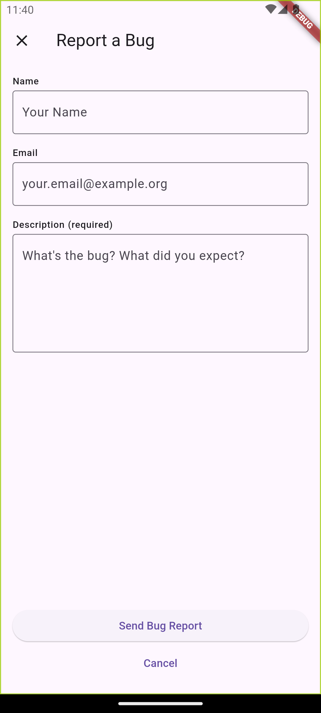

When a user experiences an error, Sentry provides the ability to collect additional feedback. You can collect feedback according to the method supported by the SDK.

## User Feedback API

The user feedback API allows you to collect user feedback while utilizing your own UI. Sentry pairs the feedback with the original event, giving you additional insight into issues. Sentry needs the `associatedEventId` to be able to associate the user feedback to the corresponding event. There are several ways to get the `associatedEventId`:

- use {<PlatformLink to="/configuration/options/#before-send"><PlatformIdentifier name="before-send" /></PlatformLink>}
- use the return value of any method capturing an event.
- use `Sentry.lastEventId` to get the ID of the last event sent.

<PlatformContent includePath="user-feedback/sdk-api-example/" />

## SentryFeedbackWidget

Use the `SentryFeedbackWidget` to let users send feedback data to Sentry.

The widget requests and collects the user's name, email address, and a description of what occurred. When an event identifier is provided, Sentry pairs the feedback with the original event, giving you additional insights into issues. Additionally, you can provide a screenshot that will be sent to Sentry. Learn more about how to enable screenshots in our <PlatformLink to="/enriching-events/screenshots/">Screenshots documentation</PlatformLink>.

The image below provides an example of the widget, though yours may differ depending on your customization:



### Integration

One possible use for the `SentryFeedbackWidget` is to listen for specific Sentry events in the `beforeSend` callback and show the widget to users.

```dart
// The example uses the `NavigatorState` to present the widget. Adapt as needed to your navigation stack.
final GlobalKey<NavigatorState> navigatorKey = GlobalKey<NavigatorState>();

...

await SentryFlutter.init((options) {
  options.beforeSend = (event, hint) async {
    // Filter here what kind of events you want users to give you feedback.
    
    final screenshot = await SentryFlutter.captureScreenshot();

    final context = navigatorKey.currentContext;
    if (context == null) return;
    if (context.mounted) {
      Navigator.push(
        context,
        MaterialPageRoute(
          builder: (context) => SentryFeedbackWidget(
            associatedEventId: event.eventId,
            screenshot: screenshot,
          ),
          fullscreenDialog: true,
        ),
      );
    }
  };
});
```
