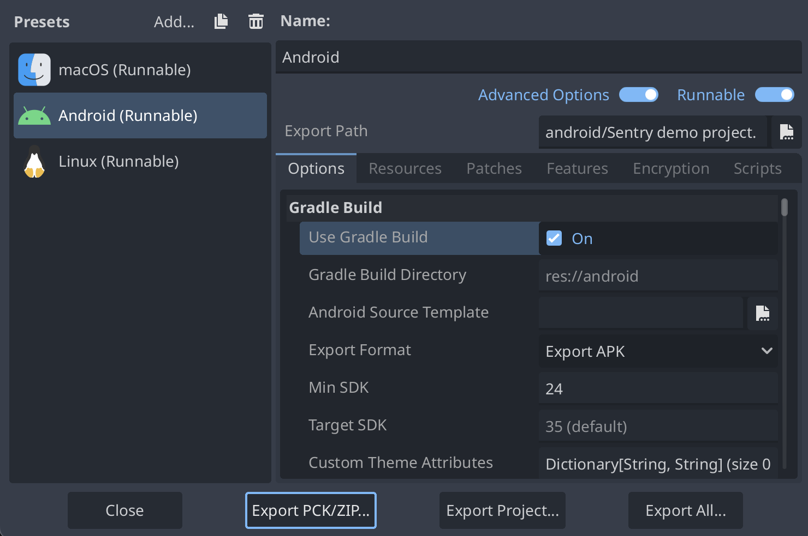

The Sentry SDK for Godot provides comprehensive support for reporting script errors, native crashes, and custom events on Android platform.

## What We Support

The Sentry Godot SDK supports most essential features when running on Android:

- **Script Errors**: Capture and report GDScript runtime errors with full stack traces.
- **Native Crashes**: Detect and report native C++ crashes that occur in the Godot engine or native extensions.
- **Custom Events**: Track custom events and gameplay interactions.
- **Scene Tree**: Include the current state of scene tree hierarchy in error reports.
- **Tags**: Add custom tags to categorize and filter events.
- **Breadcrumbs**: Automatic and manual breadcrumbs, including Android-specific device events.
- **Contexts**: Device, OS, and application context information, as well as Godot-specific context and custom contexts added by developers.
- **Attachments**: Include additional files and data with error reports.

## Getting Started

Setting up Sentry for Android exports requires using Godot's Gradle build system. The Sentry SDK automatically integrates with your Gradle project, but you need to set up the Android build template first.

### Prerequisites

Before you can export to Android with Sentry support, you must:

1. **Set up Android SDK**: Follow the [Godot Android export setup](https://docs.godotengine.org/en/stable/tutorials/export/exporting_for_android.html) to configure your Android SDK and Java SDK paths in Godot's Editor Settings.

2. **Download Export Templates**: Make sure export templates are downloaded for your Godot version. Go to `Project -> Export...` and download templates if needed.

### Install Gradle Build Template

Go to `Project -> Install Android Build Template...` in the Godot editor and click "Install" in the confirmation dialog. This creates a Gradle-based Android project under `res://android/build/` in your project directory. The Sentry SDK will automatically integrate with this Gradle project.

### Configure Android Export

1. **Create Export Preset**: Go to `Project -> Export...` and add a new Android export preset.
2. **Enable Gradle Build**: In the export preset, go to `Options -> Gradle Build` and enable the `Use Gradle Build` option.
3. **Configure Other Settings**: Set up your package name, icons, permissions, and other Android-specific settings as needed.

### Export Your Project

When you export your project (or use one-click deploy), Godot will:
- Call the Gradle build system to generate fresh templates.
- The Sentry SDK automatically adds its dependencies to the Gradle configuration.
- Build your APK/AAB with Sentry integration included.

## Known Limitations

While the Android support is comprehensive, there are some current limitations:

- Automatic screenshots on crashes are not yet supported on Android.
- Local variable values in GDScript stack traces are not currently captured.

These limitations will be addressed in future versions of the SDK.
