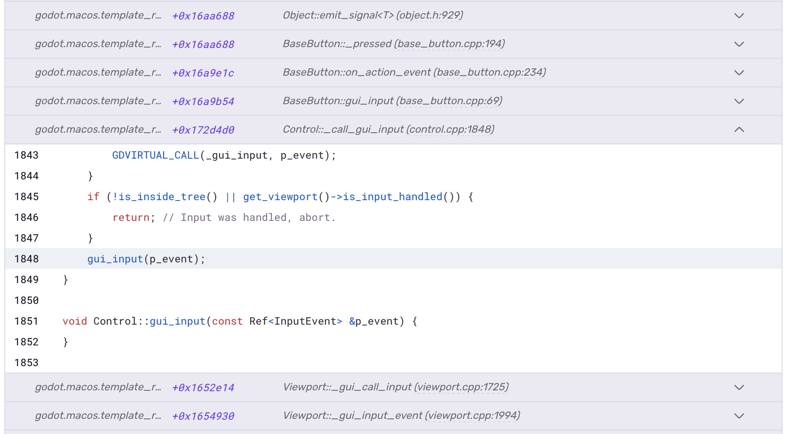

[The official Godot Engine builds only provide templates without debug information files](https://github.com/godotengine/godot-proposals/issues/1342). This guide covers how to create such templates and use them to export your project with full debug information available in Sentry.

Debug information files allow Sentry to extract stack traces and provide additional information from crash reports. In order to get stack traces that contain function names, line numbers and file paths, Sentry needs to have these debug information files available when processing the crash dumps. For that, you need to export your Godot project using an export template that contains debug information.

## Prerequisites

To get debug information, we need to compile export templates with debug symbols produced. You'll need Git, SCons build tool, Python, and a C++ compiler for your target platform installed.

For Android, you'll also need the Android SDK (command-line tools are enough). On macOS, don't use the Android SDK provided by Homebrew as it will not be installed in a unified location.

Ensure you have a compatible C++ compiler. On Windows, for instance, you can use [Visual Studio Community 2022](https://visualstudio.microsoft.com/) with the C++ workload installed, GCC on Linux and Clang on macOS.

Here are a few ways to install the **SCons** build tool:

```PowerShell {tabTitle:Windows}
# If you have `scoop` installed:
scoop install scons
```

```bash {tabTitle:macOS}
# If you have Homebrew installed:
brew install scons
```

```bash {tabTitle:Arch Linux}
pacman -S scons
```

```bash {tabTitle:Ubuntu/Debian}
sudo apt install scons
```

```bash {tabTitle:Using Python}
# Install with existing Python installation:
python -m pip install scons

# Upgrade:
python -m pip install --upgrade scons
```

For compiling on macOS you also need to install [Vulkan SDK](https://sdk.lunarg.com/sdk/download/latest/mac/vulkan-sdk.dmg).

<Alert>

For more information, refer to [Building from Source](https://docs.godotengine.org/en/stable/engine_details/development/compiling/index.html) in the official Godot documentation. It provides detailed instructions for compiling Godot on different platforms and with different tools. This guide offers streamlined instructions tailored for our use case, and may omit some details you require.

</Alert>

## Getting Godot Source

Start in a terminal with Git available. Clone Godot Engine repository and switch to your [preferred version tag](https://github.com/godotengine/godot/releases) (or branch):
```bash
git clone https://github.com/godotengine/godot
cd godot
git checkout 4.5-stable
```

<Expandable title="Additional Setup for Android">

For Android compilation, Godot requires the Swappy frame pacing library. Download the pre-built library from [https://github.com/godotengine/godot-swappy/releases](https://github.com/godotengine/godot-swappy/releases) and extract the archive contents to the `thirdparty/swappy-frame-pacing/` directory within your cloned Godot source tree.

</Expandable>

## Compiling Templates

To compile the Godot export templates with debug symbols, run the following commands:

```bash {tabTitle:Windows/Linux}
scons target=template_release production=yes debug_symbols=yes separate_debug_symbols=yes
```

```bash {tabTitle:macOS}
scons target=template_release platform=macos arch=x86_64 production=yes debug_symbols=yes separate_debug_symbols=yes
scons target=template_release platform=macos arch=arm64 production=yes debug_symbols=yes separate_debug_symbols=yes generate_bundle=yes
```

```bash {tabTitle:iOS}
scons target=template_debug platform=ios production=yes debug_symbols=yes separate_debug_symbols=yes
scons target=template_release platform=ios production=yes debug_symbols=yes separate_debug_symbols=yes generate_bundle=yes
```

```bash {tabTitle:Android}
scons target=template_debug platform=android arch=arm32 production=yes debug_symbols=yes separate_debug_symbols=yes
scons target=template_debug platform=android arch=arm64 production=yes debug_symbols=yes separate_debug_symbols=yes
scons target=template_release platform=android arch=arm32 production=yes debug_symbols=yes separate_debug_symbols=yes
scons target=template_release platform=android arch=arm64 production=yes debug_symbols=yes separate_debug_symbols=yes generate_android_binaries=yes
```

<Expandable title="Options explained">

- `target`: compilation target (e.g., "editor" or "template_release")
- `arch`: architecture to compile for (e.g., "x86_64" or "arm64")
- `production`: set build defaults for production use
- `debug_symbols`: include debugging symbols in the build
- `separate_debug_symbols`: extract symbols into a separate file
- `generate_bundle`: generate application bundle archive (`godot_macos.zip` for macOS or `godot_ios.zip` for iOS)
- `generate_android_binaries`: generate Android template AARs and Gradle template project after build is complete (`android_source.zip`)

For more information, run: `scons --help`

</Expandable>

After a successful build, the export template files will be generated in the `bin/` directory within the Godot source tree:

**Windows (MSVC):** You'll find `.exe` executable files alongside corresponding `.pdb` files containing the debug information.

**macOS:** The build generates `godot_macos.zip` containing a universal binary that supports both x86_64 and ARM64 architectures. Additionally, you'll see two separate `.dSYM` folders (debug symbol bundles) for each architecture.

**iOS:** The build generates `godot_ios.zip` containing universal frameworks with static libraries and Xcode project files for both release and debug export configurations.

**Android:** The build produces `android_source.zip`, which contains the Gradle build template with the compiled export template libraries. Additionally, the build generates `android-template-release-native-symbols.zip` and `android-template-debug-native-symbols.zip` archives containing the corresponding debug symbols for each template variant.

<Alert>

Learn more about debug formats in [Debug Information Files](/platforms/native/data-management/debug-files/).

</Alert>

## Exporting Project

With your custom templates compiled, you can now export your project with debug symbols. Open the Godot **Export** dialog and configure it as follows:

1. Select or add an export preset for your target platform.

2. Enable **Advanced Options** in the top-right corner of the dialog.

3. Configure the custom template in the **Options** tab:

   **For Windows/macOS/Linux:**
   - Find the **Custom Template** section
   - Under **Release**, browse and select your compiled template executable from the `bin/` directory

   **For Android:**
   - Enable **Gradle Build** in the **Gradle** section
   - Set **Android Source Template** to point to the `android_source.zip` file generated during compilation
   - Install the Android build template by navigating to **Project > Install Android Build Template...** in the editor menu

   **For iOS:**
   - Find the **Custom Template** section
   - Under both **Release** and **Debug**, browse and select the same `godot_ios.zip` bundle from the `bin/` directory

Once configured, your export preset will use the custom template containing the debug information needed for readable stack traces in Sentry.


You should now be able to export your project using this template. Just make sure to uncheck `Export with Debug` in the **Export Project...** dialog, as you will need to compile and use the `template_debug` for that option.

<Alert>

If you need to `Export with Debug`, you can compile a debug template using the `target=template_debug` option. Debug templates enable debugging features in your export, such as breakpoints and debugger support but perform slower than a release build, therefore these are not advised when shipping the game for end users.

</Alert>

## Uploading Debug Symbols

In order to get readable stack traces in Sentry, you also need to upload your debug symbols. The easiest way to do it is by using [Sentry CLI](/cli/). This tool allows you to upload the necessary debug information, making the stack traces useful for debugging.

<Expandable title="Installing Sentry CLI">

```PowerShell {tabTitle:Windows}
# On Windows, if you have `scoop` installed:
scoop install sentry-cli
```

```bash {tabTitle:macOS}
# On macOS, if you have Homebrew installed:
brew install getsentry/tools/sentry-cli
```

```bash {tabTitle:Arch Linux}
pacman -S sentry-cli
```

```npm {tabTitle:npm}
npm install @sentry/cli
```

For other methods, refer to [Sentry CLI Installation](/cli/installation/).

</Expandable>

Log in to Sentry via the CLI by running the following command:

```bash
sentry-cli login
```

It will prompt you to create an auth token in your web browser. Follow the instructions, generate the token, and then paste it into the command-line prompt when asked.

To show inline source context in Sentry, `sentry-cli` can scan debug files for source references, resolves them locally, and creates an archive of all referenced source files called _source bundle_. The source bundle can be created by `sentry-cli` during the upload of debug information files.

To upload the debug information files to Sentry with sources included, run the following command:

```bash {tabTitle:Bash/PowerShell}
sentry-cli debug-files upload --include-sources --org ___ORG_SLUG___ --project ___PROJECT_SLUG___ bin
```

This uploads debug information files from the `bin` directory to Sentry, creating the source bundles on the fly.

<Alert title="Important note for iOS">

For iOS projects, you must export your project to a directory first, then run the `sentry-cli debug-files upload` command on that exported directory rather than the `bin/` directory. This is necessary because Godot uses an Xcode project with static libraries for iOS exports, and the debug symbols are only available after the export compilation process is complete.

</Alert>

<Expandable title="Generating source bundle archives separately">

You can also create the source bundles separately from the upload step by running:

```PowerShell {tabTitle:Windows}
sentry-cli debug-files bundle-sources bin\godot.windows.template_release.x86_64.pdb
sentry-cli debug-files bundle-sources bin\godot.windows.template_release.x86_64.console.pdb
```

```bash {tabTitle:macOS}
sentry-cli debug-files bundle-sources bin/godot.macos.template_release.x86_64.dSYM
mv bin/godot.macos.template_release.src.zip bin/godot.macos.template_release.x86_64.src.zip
sentry-cli debug-files bundle-sources bin/godot.macos.template_release.arm64.dSYM
mv bin/godot.macos.template_release.src.zip bin/godot.macos.template_release.arm64.src.zip
```

```bash {tabTitle:Linux}
sentry-cli debug-files bundle-sources bin/godot.linuxbsd.template_release.x86_64.debugsymbols
```

</Expandable>

Example output:

```PowerShell
$ sentry-cli debug-files upload --include-sources --org my-sentry-org --project my-game bin
> Found 4 debug information files
  WARN    2025-05-12 12:03:13.130458600 -07:00 Source exceeded maximum item size limit (1572415). C:\Program Files (x86)\Windows Kits\10\include\10.0.22621.0\shared\winerror.h
  WARN    2025-05-12 12:03:14.535023400 -07:00 Source exceeded maximum item size limit (1572415). C:\Program Files (x86)\Windows Kits\10\include\10.0.22621.0\shared\winerror.h
  WARN    2025-05-12 12:03:15.349655900 -07:00 Source exceeded maximum item size limit (1152425). C:\Program Files (x86)\Windows Kits\10\include\10.0.22621.0\um\shobjidl_core.h
  WARN    2025-05-12 12:03:15.947910200 -07:00 Source exceeded maximum item size limit (1145069). C:\Users\user\Projects\godot\4.4.1-stable\thirdparty\ufbx\ufbx.c
> Resolved source code for 2 debug information files
> Prepared debug information files for upload
> Uploading completed in 10.049s
> Uploaded 6 missing debug information files
> File upload complete:

  UPLOADED efc658cd-7481-4a15-93a5-9f8fa2b6c8a3-1 (godot.windows.template_release.x86_64.pdb; x86_64 sources)
  UPLOADED efc658cd-7481-4a15-93a5-9f8fa2b6c8a3-1 (godot.windows.template_release.x86_64.pdb; x86_64 debug companion)
  UPLOADED 050f8915-6eae-4054-8062-b90d75593f3a-1 (godot.windows.template_release.x86_64.console.pdb; x86_64 sources)
  UPLOADED efc658cd-7481-4a15-93a5-9f8fa2b6c8a3-1 (godot.windows.template_release.x86_64.exe; x86_64 executable)
  UPLOADED 050f8915-6eae-4054-8062-b90d75593f3a-1 (godot.windows.template_release.x86_64.console.exe; x86_64 executable)
  UPLOADED 050f8915-6eae-4054-8062-b90d75593f3a-1 (godot.windows.template_release.x86_64.console.pdb; x86_64 debug companion)
```

<Alert>

A handful of Godot engine source files over 10 MiB may be excluded from the bundle. You’ll see warnings about them in the console output. While this isn’t an issue, stack frames pointing to those files won’t show inline source context.

For more information, refer to [Sentry CLI](/cli/) documentation.

</Alert>

You can also upload debug files for the Sentry SDK itself by running the following command from your project directory:

```bash {tabTitle:Bash/PowerShell}
sentry-cli debug-files upload --org ___ORG_SLUG___ --project ___PROJECT_SLUG___ addons/sentry/
```

This uploads the SDK's debug files to Sentry. You can repeat this step for any other native extension used in your Godot project.

Congratulations! You're all set up. Your exported project should now produce symbolicated stack traces in Sentry.


