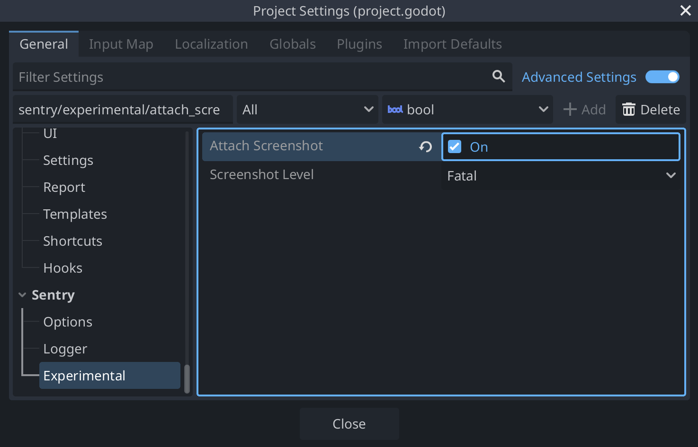

Sentry makes it possible to automatically take a screenshot and include it as an attachment when a user experiences an error, an exception or a crash.

This feature is only available for SDKs with a user interface, like the ones for mobile and desktop applications. It's also limited by whether taking a screenshot is possible or not. For example, in some environments, like native iOS, taking a screenshot requires the UI thread, which often isn't available in the event of a crash. Another example where a screenshot might not be available is when the event happens before the screen starts to load. So inherently, this feature is a best effort solution.

## Enabling Screenshots

<Alert level="warning" title="Important">

Screenshots are currently experimental in Sentry for Godot and are not recommended for production environments. This feature is under development and will be improved in future releases.

</Alert>

Because screenshots may contain <PlatformLink to="/data-management/sensitive-data/">PII</PlatformLink>, they are an opt-in feature. To attach screenshots to your events, navigate to **Project Settings > Sentry > Experimental** and enable the **Attach Screenshot** option:



Or, like so, if you're <PlatformLink to="/configuration/options/">configuring things programatically</PlatformLink>:

```GDScript
SentrySDK.init(func(options: SentryOptions) -> void:
	options.attach_screenshot = true
)
```

## Viewing Screenshots

If one is available, you'll see a thumbnail of the screenshot when you click on a specific issue from the [**Issues**](https://demo.sentry.io/issues/) page.


You can see an overview of all the screenshots for the issue as well as associated events by pressing the "View All" button.


