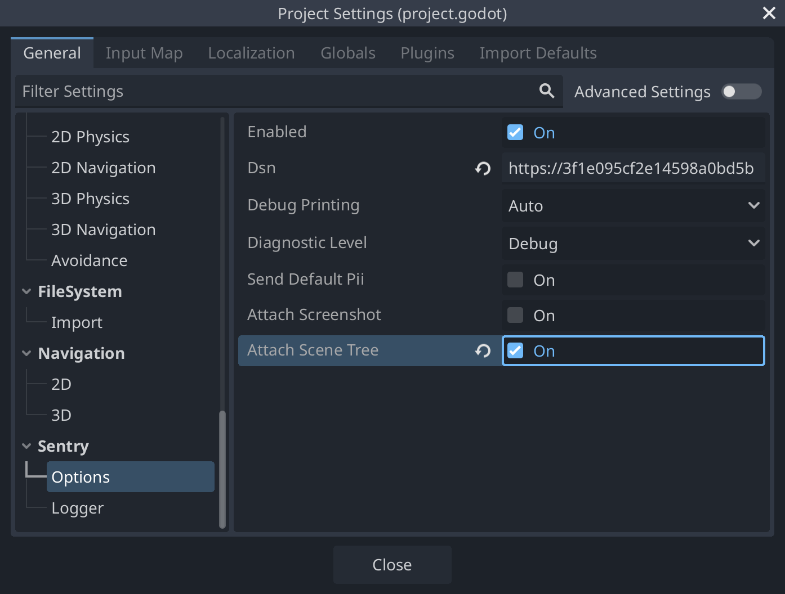
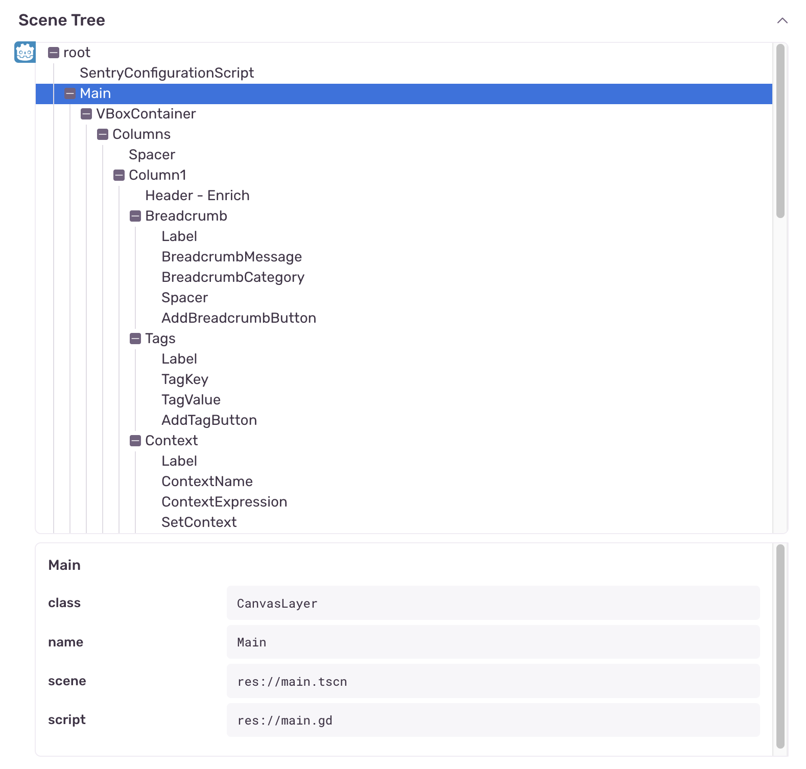

Sentry captures a JSON representation of engine's scene tree during errors and crashes, adding it to the event as an attachment. This feature is also known as View Hierarchy in Sentry.

<Alert title="Note">

This process can only be performed on the main thread, which means it may not be available during events that happen on threads other than the main thread. Additionally, if an error occurs before the scene tree is initialized, this information cannot be captured. Inherently, this feature should be considered a best-effort solution.

</Alert>

## Enabling Scene Tree Attachments

Scene tree capturing is an opt-in feature. To attach scene tree information to your events, navigate to **Project Settings > Sentry > Options** and enable the **Attach Scene Tree** option:



Or, like so, if you're <PlatformLink to="/configuration/options/">configuring things programmatically</PlatformLink>:

```GDScript
SentrySDK.init(func(options: SentryOptions) -> void:
	options.attach_scene_tree = true
)
```

## Viewing Scene Tree Attachments

Scene tree information is attached as `view-hierarchy.json` file. You can find it in the "Attachments" tab, where you can view all attachments, as well as associated events. Click the event ID to open the [Issue Details](/product/issues/issue-details) page of that specific event.

<Include name="common-imgs/viewhierarchy-list-example" />

On the **Issue Details** page, you can interact with the scene tree attachment in a section called "Scene Tree". This section represents the state of your scene tree at the time of an error event. There are two displays: a tree view, and detailed view for a selected node. You can select nodes in the tree to view the properties collected by the SDK. The SDK will report on the following keys for each node in the view:

- `name`: The name of the node.
- `class`: Built-in class of the node.
- `script`: The file path of the script attached to the node. Only nodes with a script attached include this property.
- `scene`: The original scene's file path, if the node has been instantiated from a PackedScene file. Only scene root nodes include this property.

This feature provides a snapshot of your game's scene tree structure at the moment of error, making it easier to identify which nodes were active or gain a better understanding of the relationship between the nodes.


