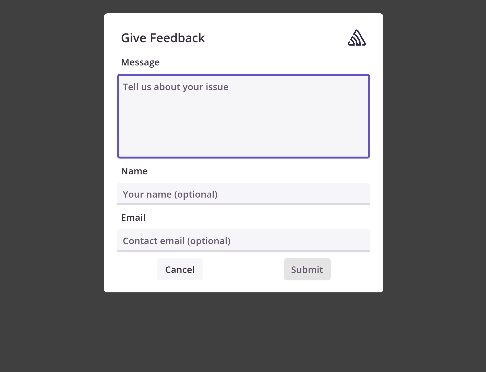

Sentry makes it possible to collect user feedback, and optionally associate it with an error event.

<Alert level="info">

The User Feedback feature requires Sentry Godot SDK version `1.1.0` or higher.

</Alert>

## Using User Feedback UI

The Sentry Godot SDK includes a reference User Feedback UI, which you can find in `addons/sentry/user_feedback/`. This folder contains:

- `user_feedback_gui.tscn` + script: A complete, ready-to-use user feedback UI scene that automatically scales to different viewport resolutions.
- `user_feedback_form.tscn` + script: A minimal user feedback form, designed for integration into existing UI.
- `sentry_theme.tres`: The reference theme file used to customize the looks of user feedback UI.

For quick implementation, drag and drop `user_feedback_gui.tscn` from the addon folder to your scene tree under a `CanvasLayer` node and call `show()` to display the feedback form. The form automatically scales to different viewport resolutions and handles its own visibility, hiding when users click "Submit" (sending feedback to Sentry) or "Cancel".



You can customize which elements are displayed by toggling optional components such as the logo, name input field, and email input field through the inspector properties. `minimum_words` property controls the minimum number of words required in the feedback message.

To customize the form's appearance, use the provided reference theme file (`sentry_theme.tres`). You can duplicate this file, and edit it to create custom styling, then assign your theme to the `theme` property in the Inspector for the feedback UI node. It can be used to customize fonts, colors, separation, etc. For more advanced customizations involving layout changes, copy the entire `user_feedback/` folder into your project and modify the scenes and scripts as needed.

<Alert level="success" title="Tip">

Add `user_feedback_form.tscn` as a preview while editing the theme file to see your changes in real-time.

</Alert>

### Integrating the Form Into Existing UI

For custom UI integration, use `user_feedback_form.tscn` instead. This component scene provides a flexible panel that can be embedded into other UI controls. Unlike the standalone GUI, you'll need to manage its visibility manually. The form exposes two signals for handling user interactions: `feedback_submitted` (triggered when feedback is sent) and `feedback_cancelled` (triggered when the user cancels the operation). After you instantiate the form inside your UI scene, you can use the provided signals to hide the form when it's no longer needed (or perform some other action):

```GDScript
# Assuming you have already added the form to your scene with "UserFeedbackForm" unique name.
@onready var user_feedback_form = %UserFeedbackForm

func _ready():
	user_feedback_form.feedback_submitted.connect(
		func(_feedback: SentryFeedback) -> void:
			user_feedback_form.hide()
			print("User feedback submitted.")
	)
	user_feedback_form.feedback_cancelled.connect(
		func() -> void:
			user_feedback_form.hide()
			print("User feedback cancelled.")
	)
```

To customize the form's appearance, use the provided reference theme file (`sentry_theme.tres`), which can be duplicated to create a custom UI style. Simply assign your customized theme to the form's `theme` property in the Inspector to apply your styling changes.

## User Feedback API

The User Feedback API allows you to collect user feedback while using your own UI controls. You can submit feedback directly by creating an instance of `SentryFeedback` class, setting the required `message` and optional fields, then submitting it using `SentrySDK.capture_feedback(feedback)`.

```GDScript
var feedback := SentryFeedback.new()
feedback.message = "I'm stuck in the wall!"
feedback.contact_email = "bob@example.com"
feedback.name = "Bob"

SentrySDK.capture_feedback(feedback)
```

Sentry can optionally pair this feedback with an event, giving you additional insight into issues. Sentry needs the `event_id` to be able to associate the user feedback to the corresponding event. For example, to get the `event_id`, you can use <PlatformLink to="/configuration/options/#before_send">before_send</PlatformLink>, or the return value of the method capturing an event.

```GDScript
var event_id = SentrySDK.capture_message("An event that will get user feedback.")
# ...
feedback.associated_event_id = event_id
```
