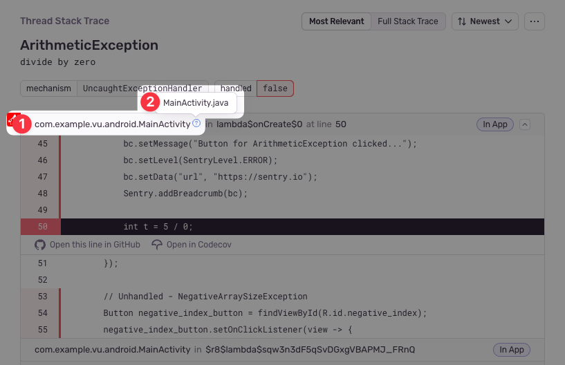

<PlatformContent includePath="source-context" />

## Setting Up Code Mappings

To use suspect commits and stack trace linking, you'll need to set up a code mapping. This is a mapping between the source code in your repository and the source code in your stack traces. You can find information on how to set up code mappings in our [Set Up Code Mappings](/product/issues/suspect-commits/#2-set-up-code-mappings) docs.

Use the following steps to determine the correct **Stack Trace Root** **Source Code Root** while setting up your code mapping:

First, navigate to a stack trace that you wish to map. Find an **In App** frame, which is denoted by a bubble on the right side of the frame. The Java module will be shown as the first piece of text at the left hand side of the frame header (marked as **1** in the below screenshot). In this example, it is `com.example.vu.android.MainActivity`. Hovering over the module will show the absolute path to the file (marked as **2** in the below screenshot). In this example, it is `MainActivity.java`.

Next, calculate the derived file path. Take the frame `module` and replace all `.` characters with `/`. Then, replace the last item (`MainActivity` in this example) with the absolute path found earlier (`MainActivity.java`). In this example, the derived file path is `com/example/vu/android/MainActivity.java`.

Finally, compare the derived with the path found in your source repository. In this example, the `com/example/vu/android/` folder may match the `src/com/example/vu/android/` folder in the source code. Using that information, set the **Stack Trace Root** to `com/example/vu/android/` and the **Source Code Root** to `src/com/example/vu/android/`. This tells Sentry to replace all file paths beginning in `com/example/vu/android/` with `src/com/example/vu/android/` when searching for the source code.

Because Sentry will use the first matching code mapping, it is recommended to always provide a non-empty value for the **Stack Trace Root** when possible. An empty value in the **Stack Trace Root** will match all file paths, which will work poorly if multiple code mapprings are required.
