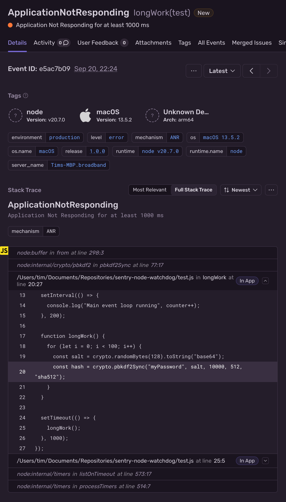

Application Not Responding (ANR) errors, or Event Loop Stall errors, are triggered when the Node.js main thread event loop of an application is blocked for more than five seconds. The Node SDK reports ANR errors as Sentry events and can optionally attach a stack trace of the blocking code to the ANR event.

<Include name="feature-stage-beta.mdx" />

<Note>

ANR detection is not supported for [Node.js clusters](https://nodejs.org/api/cluster.html).

</Note>

_(Available in version 7.91.0 and above)_

To enable ANR detection, add the `Anr` integration from the `@sentry/node` package.

<Alert level="info">

ANR detection requires Node 16 or higher and can only be used in the Node.js runtime.

</Alert>

```javascript
Sentry.init({
  dsn: "___PUBLIC_DSN___",
  integrations: [Sentry.anrIntegration({ captureStackTrace: true })],
});
```



## Configuration options

You can pass a configuration object to the `Anr` integration to customize the ANR detection behavior.

```ts
interface Options {
  /**
   * Interval to send heartbeat messages to the ANR thread.
   *
   * Defaults to 50ms.
   */
  pollInterval: number;
  /**
   * Threshold in milliseconds to trigger an ANR event.
   *
   * Defaults to 5000ms.
   */
  anrThreshold: number;
  /**
   * Whether to capture a stack trace when the ANR event is triggered.
   *
   * Defaults to `false`.
   *
   * This uses the node debugger which enables the inspector API.
   */
  captureStackTrace: boolean;
}
```

## ANR Implementation and Overhead

ANR detection with the Node SDK uses a worker thread to monitor the event loop
in the main app thread. The main app thread sends a heartbeat message to the ANR
worker thread every 50ms. If the ANR worker does not receive a heartbeat message
for 5 seconds, it triggers an ANR event. If the `captureStackTrace` option is
enabled, the ANR worker uses the `inspector` module to capture stack traces via the [v8
inspector API](https://nodejs.org/api/inspector.html).

Once an ANR event is reported, the ANR worker thread exits to prevent further
duplicate events and the main app thread will continue to run as usual.

Overhead from Node.js ANR tracking should be minimal. With no ANR detected, the
only overhead in the main app thread is polling the ANR worker over IPC every 50ms by
default. The ANR worker thread consumes around 10-20 MB of RAM to keep track of
the polling. Once an ANR has been detected, the main thread is paused briefly
in the debugger to capture the stack trace frames. At this point, the event loop
has been blocked for seconds so the debugging overhead is negligible.
