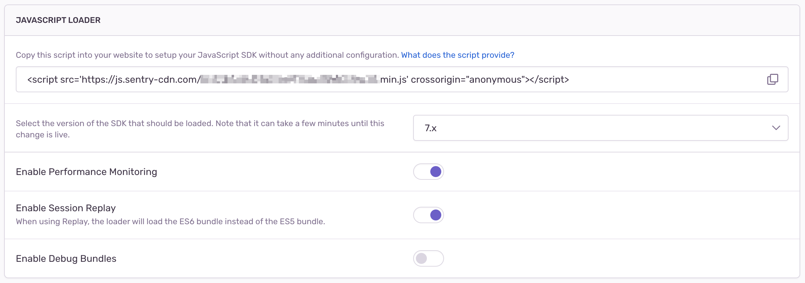

The Loader Script is the easiest way to initialize the Sentry SDK. The Loader Script also automatically keeps your Sentry SDK up to date and offers configuration for different Sentry features.

## Using the Loader

To use the loader, go in the Sentry UI to **Settings > Projects > (select project) > Client Keys (DSN)**, and then press the "Configure" button. Copy the script tag from the "JavaScript Loader" section and include it as the first script on your page. By including it first, you allow it to catch and buffer events from any subsequent scripts, while still ensuring the full SDK doesn't load until after everything else has run.

<SignInNote />

```html
<script
  src="https://js.sentry-cdn.com/___PUBLIC_KEY___.min.js"
  crossorigin="anonymous"
></script>
```

By default, Performance Monitoring and Session Replay are enabled.

## Source Maps

To have correct stack traces for minified asset files when using the Loader Script, you will have to either [host your Source Maps publicly](/platforms/javascript/sourcemaps/uploading/hosting-publicly/) or [upload them to Sentry](/platforms/javascript/sourcemaps/).

## Loader Configuration

The loader has a few configuration options:

- What version of the SDK to load
- Using Performance Monitoring
- Using Session Replay
- Showing debug logs

### SDK Version

To configure the version, use the dropdown in the "JavaScript Loader" settings, directly beneath the script tag you copied earlier.



Note that because of caching, it can take a few minutes for version changes made here to take effect.

### Load Timing

If you only use the Loader for errors, the loader won't load the full SDK until triggered by one of the following:

- an unhandled error
- an unhandled promise rejection
- a call to `Sentry.captureException`
- a call to `Sentry.captureMessage`
- a call to `Sentry.captureEvent`

Once one of those occurs, the loader will buffer that event and immediately request the full SDK from our CDN. Any events that occur between that request being made and the completion of SDK initialization will also be buffered, and all buffered events will be sent to Sentry once the SDK is fully initialized.

Alternatively, you can set the loader to request the full SDK earlier: still as part of page load, but _after_ all of the other JavaScript on the page has run. (In other words, in a subsequent event loop.) To do this, include `data-lazy="no"` in your script tag.

```html
<script
  src="https://js.sentry-cdn.com/___PUBLIC_KEY___.min.js"
  crossorigin="anonymous"
  data-lazy="no"
></script>
```

Finally, if you want to control the timing yourself, you can call `Sentry.forceLoad()`. You can do this as early as immediately after the loader runs (which has the same effect as setting `data-lazy="no"`) and as late as the first unhandled error, unhandled promise rejection, or call to `Sentry.captureMessage` or `Sentry.captureEvent` (which has the same effect as not calling it at all). Note that you can't delay loading past one of the aforementioned triggering events.

If Performance Monitoring and/or Session Replay is enabled, the SDK will immediately fetch and initialize the bundle to make sure it can capture transactions and/or replays once the page loads.

## SDK Configuration

While the Loader Script will work out of the box without any configuration in your application, you can still configure the SDK according to your needs.

### Default Configuration

For Performance Monitoring, the SDK will be initialized with `tracesSampleRate: 1` by default. This means that the SDK will capture all traces.

For Session Replay, the defaults are `replaysSessionSampleRate: 0.1` and `replaysOnErrorSampleRate: 1`. This means Replays will be captured for 10% of all normal sessions and for all sessions with an error.

### Release Configuration

You can configure the release by adding the following to your page:

```html
<script>
  window.SENTRY_RELEASE = {
    id: "...",
  };
</script>
```

### Custom Configuration

The loader script always includes a call to `Sentry.init` with a default configuration, including your DSN. If you want to <PlatformLink to="/configuration/options/">configure your SDK</PlatformLink> beyond that, you can configure a custom init call by defining a `window.sentryOnLoad` function. Whatever is defined inside of this function will _always_ be called first, before any other SDK method is called. 

**Be sure to define this function _before_ you add the loader script, to ensure it can be called at the right time:**

```html
<script>
  // Configure sentryOnLoad before adding the Loader Script
  window.sentryOnLoad = function () {
    Sentry.init({
      // add custom config here
    });
  };
</script>

<script
  src="https://js.sentry-cdn.com/___PUBLIC_KEY___.min.js"
  crossorigin="anonymous"
></script>
```

Inside of the `window.sentryOnLoad` function, you can configure a custom `Sentry.init()` call. You can configure your SDK exactly the way you would if you were using the CDN, with one difference: your `Sentry.init()` call doesn't need to include your DSN, since it's already been set. Inside of this function, the full Sentry SDK is guaranteed to be loaded & available.

```html
<script>
  // Configure sentryOnLoad before adding the Loader Script
  window.sentryOnLoad = function () {
    Sentry.init({
      release: " ... ",
      environment: " ... "
    });
    Sentry.setTag(...);
    // etc.
  };
</script>
```

### Guarding SDK Function Calls

By default, the loader will make sure you can call these functions directly on `Sentry` at any time, even if the SDK is not yet loaded:

- `Sentry.captureException()`
- `Sentry.captureMessage()`
- `Sentry.captureEvent()`
- `Sentry.addBreadcrumb()`
- `Sentry.withScope()`
- `Sentry.showReportDialog()`

If you want to call any other method when using the Loader, you have to guard it with `Sentry.onLoad()`. Any callback given to `onLoad()` will be called either immediately (if the SDK is already loaded), or later once the SDK has been loaded:

```javascript
// Guard against window.Sentry not being available, e.g. due to Ad-blockers
window.Sentry &&
  Sentry.onLoad(function () {
    // Inside of this callback,
    // we guarantee that `Sentry` is fully loaded and all APIs are available
    const client = Sentry.getClient();
    // do something custom here
  });
```

## Limitations of error-only capturing

When using the Loader Script with just errors, the script injects the SDK asynchronously. This means that only _unhandled errors_ and _unhandled promise rejections_ will be caught and buffered before the SDK is fully loaded. Specifically, capturing [breadcrumb data](../../enriching-events/breadcrumbs/) will not be available until the SDK is fully loaded and initialized. To reduce the amount of time these features are unavailable, set `data-lazy="no"` or call `forceLoad()` as described above.

If you want to understand the inner workings of the loader itself, you can read the documented source code in all its glory over at the [Sentry repository](https://github.com/getsentry/sentry/blob/master/src/sentry/templates/sentry/js-sdk-loader.ts).

## CDN

Sentry supports loading the JavaScript SDK from a CDN. Generally we suggest using our Loader instead. If you _must_ use a CDN, see [Available Bundles](#available-bundles) below.

## Default Bundle

To use Sentry for error and performance monitoring, you can use the following bundle:

```html {tabTitle: CDN}
<script
  src="https://browser.sentry-cdn.com/{{@inject packages.version('sentry.javascript.browser') }}/bundle.tracing.min.js"
  integrity="sha384-{{@inject packages.checksum('sentry.javascript.browser', 'bundle.tracing.min.js', 'sha384-base64') }}"
  crossorigin="anonymous"
></script>
```

## Performance & Replay Bundle

To use Sentry for error and performance monitoring, as well as for [Session Replay](../../session-replay), you can use the following bundle:

```html {tabTitle: CDN}
<script
  src="https://browser.sentry-cdn.com/{{@inject packages.version('sentry.javascript.browser') }}/bundle.tracing.replay.min.js"
  integrity="sha384-{{@inject packages.checksum('sentry.javascript.browser', 'bundle.tracing.replay.min.js', 'sha384-base64') }}"
  crossorigin="anonymous"
></script>
```

## Errors & Replay Bundle

To use Sentry for error monitoring, as well as for [Session Replay](../../session-replay), but **not for performance monitoring**, you can use the following bundle:

```html {tabTitle: CDN}
<script
  src="https://browser.sentry-cdn.com/{{@inject packages.version('sentry.javascript.browser') }}/bundle.replay.min.js"
  integrity="sha384-{{@inject packages.checksum('sentry.javascript.browser', 'bundle.replay.min.js', 'sha384-base64') }}"
  crossorigin="anonymous"
></script>
```

## Errors-only Bundle

If you only use Sentry for error monitoring, and don't need performance tracing or replay functionality, you can use the following bundle:

```html {tabTitle: CDN}
<script
  src="https://browser.sentry-cdn.com/{{@inject packages.version('sentry.javascript.browser') }}/bundle.min.js"
  integrity="sha384-{{@inject packages.checksum('sentry.javascript.browser', 'bundle.min.js', 'sha384-base64') }}"
  crossorigin="anonymous"
></script>
```

## Usage & Configuration

Once you've included the Sentry SDK bundle in your page, you can use Sentry in your own bundle:

```javascript {tabTitle: CDN}
Sentry.init({
  dsn: "___PUBLIC_DSN___",
  // this assumes your build process replaces `process.env.npm_package_version` with a value
  release: "my-project-name@" + process.env.npm_package_version,
  integrations: [
    // If you use a bundle with performance monitoring enabled, add the BrowserTracing integration
    Sentry.browserTracingIntegration(),
    // If you use a bundle with session replay enabled, add the Replay integration
    Sentry.replayIntegration(),
  ],

  // We recommend adjusting this value in production, or using tracesSampler
  // for finer control
  tracesSampleRate: 1.0,

  // Set `tracePropagationTargets` to control for which URLs distributed tracing should be enabled
  tracePropagationTargets: ["localhost", /^https:\/\/yourserver\.io\/api/],
});
```

## Available Bundles

Our CDN hosts a variety of bundles:

- `@sentry/browser` with error monitoring only (named `bundle.<modifiers>.js`)
- `@sentry/browser` with error and performance monitoring (named `bundle.tracing.<modifiers>.js`)
- `@sentry/browser` with error and session replay (named `bundle.replay.<modifiers>.js`)
- `@sentry/browser` with error, performance monitoring and session replay (named `bundle.tracing.replay.<modifiers>.js`)
- each of the integrations in `@sentry/integrations` (named `<integration-name>.<modifiers>.js`)

Each bundle is offered in both ES6 and ES5 versions. Since v7 of the SDK, the bundles are ES6 by default. To use the ES5 bundle, add the `.es5` modifier.

Each version has three bundle varieties:

- minified (`.min`)
- unminified (no `.min`), includes debug logging
- minified with debug logging (`.debug.min`)

Bundles that include debug logging output more detailed log messages, which can be helpful for debugging problems. Make sure to <PlatformLink to="/configuration/options/#debug">enable debug</PlatformLink> to see debug messages in the console.
Unminified and debug logging bundles have a greater bundle size than minified ones.

For example:

- `bundle.js` is `@sentry/browser`, compiled to ES6 but not minified, with debug logging included (as it is for all unminified bundles)
- `rewriteframes.es5.min.js` is the `RewriteFrames` integration, compiled to ES5 and minified, with no debug logging
- `bundle.tracing.es5.debug.min.js` is `@sentry/browser` with performance monitoring enabled, compiled to ES5 and minified, with debug logging included

<JsBundleList />

## Additional Configuration

### Using defer

If you use the [`defer` script attribute](https://developer.mozilla.org/en-US/docs/Web/HTML/Element/script#attr-defer), we strongly recommend that you place the script tag for the browser SDK first and mark all of your other scripts with `defer` (but not `async`). This will guarantee that that the Sentry SDK is executed before any of the others.

Without doing this you will find that it's possible for errors to occur before Sentry is loaded, which means you'll be flying blind to those issues.

### Content Security Policy

If you have a Content Security Policy (CSP) set up on your site, you will need to add the `script-src` of wherever you're loading the SDK from, and the origin of your DSN. For example:

- `script-src: https://browser.sentry-cdn.com https://js.sentry-cdn.com`
- `connect-src: *.sentry.io`
