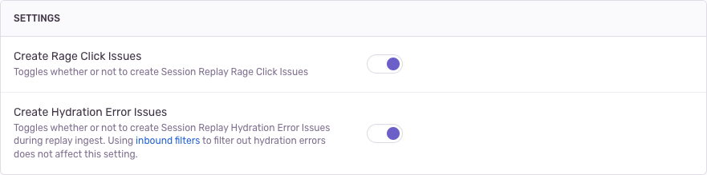

A _[replay issue](/product/issues/issue-details/replay-issues/)_ is an issue detected using captured Session Replay data. If your application is configured with [Session Replay](/product/session-replay/), problems will be detected on the server side during replay ingest, and grouped into issues. We group similar events into issues based on a fingerprint. For replay issues, a fingerprint is primarily based on the problem type and the url or transaction name where the problem occurred.

You can configure which issue types are created by visiting Project Settings > Replay and toggling detection on or off for each issue type. By default all issue types are enabled.

## Configuring Rage Click Issues

"Dead clicks" (also called "slow clicks") are only detected on `<button>`, `<input>`, and `<a>` elements that don't lead to updates to the DOM or a page scroll within 7 seconds. When the user clicks on one of these elements 3 or more times within that 7-second timeframe, it indicates frustration, and the SDK registers a ["rage click"](/product/issues/issue-details/replay-issues/rage-clicks/).

Sometimes rage or dead clicks will be detected on elements which are not expected to mutate the DOM, like a "Print" or "Download" button. In this case, you can configure `slowClickIgnoreSelectors`, which will prevent those buttons from generating new issues.

<Alert>
  You'll need to have SDK version 7.60.1 or higher in order to be able to see
  **rage click issues**.
</Alert>

## Configuring Hydration Errors

When a [hydration error](/product/issues/issue-details/replay-issues/hydration-error/) occurs in your React app, the SDK will emit an error object as well as a replay breadcrumb, both of which contain data about the hydration problem. Both of these are sent to the server for processing. When you're looking at the issue stream you'll see Hydration Error issues which could come from either data source. However, you will only see the diff tools which make debugging easier if a replay is associated with the error.

For this reason we recommend having both [Inbound Filter](/concepts/data-management/filtering/) enabled and the "Create Hydration Error Issues" Replay setting enabled as well. This is also the default!

You can have your preferences configured in one of four ways:
| Inbound Filters | Replay Hydration Error toggle | Result |
| --- | --- | --- |
| enabled | enabled | (recommended) Issue created based on replay data. |
| enabled | disabled | No issues will be created. |
| disabled | enabled | Two issues created from both replay, and error data. The issues are duplicates. |
| disabled | disabled | Issue created from captured error data. |

<Alert>
  You'll need to have SDK version 7.87.0 or higher in order to be able to detect
  **hydration error issues** from replay data.
</Alert>
