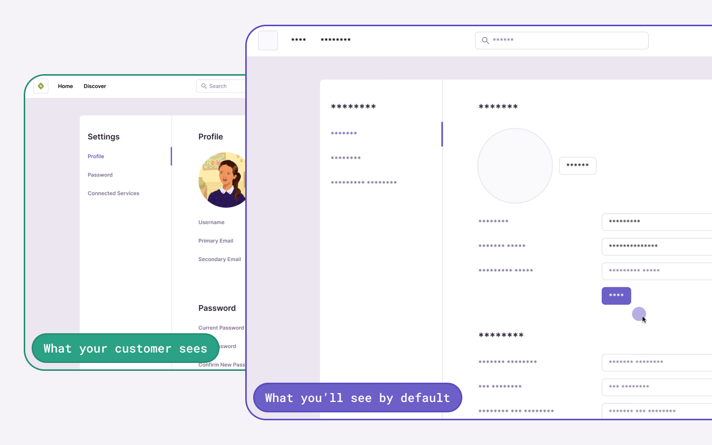
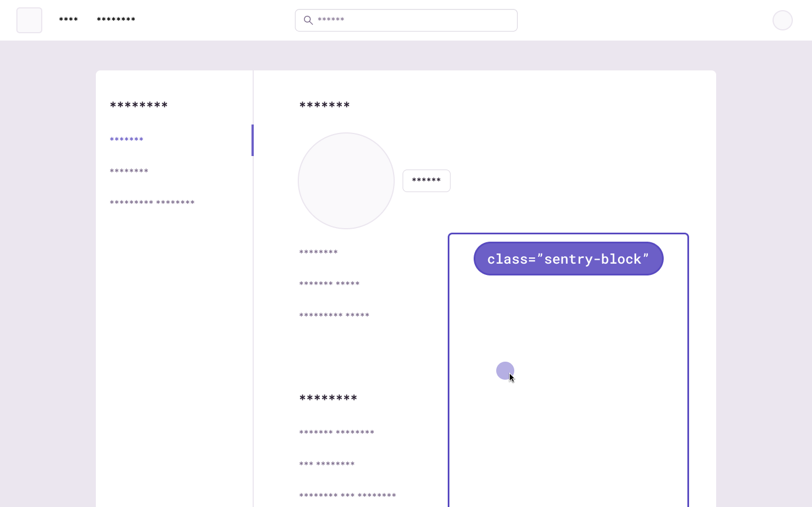
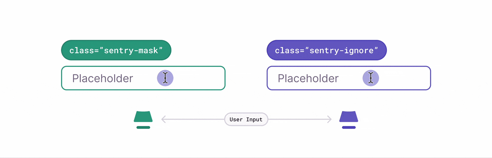

<Include name="feature-stage-beta-session-replay.mdx" />

There are several ways to deal with personally identifiable information (PII). By default, the Session Replay SDK will mask all text content with `*` and block all media elements (`img`, `svg`, `video`, `object`, `picture`, `embed`, `map`, `audio`) on the client, before it is sent to the server. This can be disabled by setting `maskAllText` to `false`. It's also possible to add the following CSS classes to specific DOM elements to prevent recording their contents: `sentry-block`, `sentry-ignore`, and `sentry-mask`. The following sections will show examples of how content is handled by the differing methods.

## Masking

Masking replaces the text content with something else. The default masking behavior is to replace each character with a `*`. Elements with class name `sentry-mask` or the attribute `data-sentry-mask` will be blocked. In this example, the relevant HTML code is: `<table class="sentry-mask">...</table>`:



You can configure what to mask or unmask via the following [configuration](#privacy-configuration):

```javascript
replayIntegration({
  mask: [".mask-me"],
  unmask: [".unmask-me"],
});
```

## Blocking

Blocking replaces the element with a placeholder that has the same dimensions. The recording will show an empty space in place of the content. Elements with class name `sentry-block` or the attribute `data-sentry-block` will be blocked. In this example, the relevant HTML code is: `<table data-sentry-block>...</table>`:



You can configure what to block or unblock via the following [configuration](#privacy-configuration):

```javascript
replayIntegration({
  block: [".block-me"],
  unblock: [".unblock-me"],
});
```

## Ignoring

Ignoring only applies to form inputs. Events will be ignored on the input element so that the replay doesn't show what occurs inside of the input. Any event on an input element with class name `sentry-ignore` or the attribute `data-sentry-ignore` will be ignored. Notice how the results in the table below show input changes, but no visible text:



You can configure what to ignore via the following [configuration](#privacy-configuration):

```javascript
replayIntegration({
  ignore: [".ignore-me"],
});
```

## Privacy Configuration

<PlatformContent includePath="replay/privacy-configuration" />

## Network Request and Response Bodies and Headers

Collecting request and response bodies is an opt-in feature. That's because the best way to avoid getting PII into Sentry is by not adding URLs of endpoints that may contain PII.
Additionally, Sentry attempts to [scrub](/security-legal-pii/scrubbing/server-side-scrubbing/) certain types of sensitive data from request and response bodies, if you accidentally opt-in to a URL that includes this type of data. This mechanism happens on our ingestion service, before data hits our disks. This is a best effort approach which pattern-matches the content with things like credit card information, social security numbers, and [passwords](https://github.com/search?q=repo%3Agetsentry%2Frelay%20PASSWORD_KEY_REGEX&type=code).

More details about this feature can be found in the [configuration page](/platforms/javascript/session-replay/configuration/#network-details).

## Custom Scrubbing

The `beforeAddRecordingEvent` has been added starting with SDK version 7.53.0. It allows you to modify, scrub the recordings to remove PII, or ignore recording events before they leave the browser. These events include console logs, network requests, and response data.

```javascript
Sentry.replayIntegration({
  beforeAddRecordingEvent: (event) => {
    // Filter out specific events
    if (event.data.tag === "foo") {
      return null;
    }

    // Remember to return an event if you want to keep it!
    return event;
  },
});
```

### Example: Capturing 500 Status Codes Only

Here's an example showing how to only capture fetch requests that return a 500 status code. (Non-fetch requests would continue to be captured normally.)

```javascript
Sentry.replayIntegration({
  beforeAddRecordingEvent: (event) => {
    // Do not capture fetch/xhr requests, unless the response code is 500
    if (
      event.data.tag === "performanceSpan" &&
      (event.data.payload.op === "resource.fetch" ||
        event.data.payload.op === "resource.xhr") &&
      event.data.payload.data.statusCode !== 500
    ) {
      return null;
    }

    return event;
  },
});
```

We also have [server-side PII scrubbing](/security-legal-pii/scrubbing/server-side-scrubbing/) for this data. It looks for certain patterns such as American social security numbers, credit cards, and private keys.

### Example: Scrubbing URLs

By default, URLs are stored in both recording and replay events.

To scrub the URL in a recording event, use the above `beforeAddRecordingEvent`.

To scrub the URL in a replay event, use `addEventProcessor`:

```javascript
Sentry.addEventProcessor(event) => {
  // Ensure that we specifically look at replay events
  if (event.type !== 'replay_event') {
    // Return the event, otherwise the event will be dropped
    return event;
  }

  // Your URL scrubbing function
  function urlScrubber(url: string) {
    return url.replace(/([a-z0-9]{3}\.[a-z]{5}\.[a-z]{7})/, '[Filtered]');
  }

  // Scrub all URLs with your scrubbing function
  event.urls = event.urls.map(urlScrubber);

  return event;
});
```

### Deprecated Options

Note that the privacy API prior to version 7.35.0 has been deprecated and replaced with the options above. Please see the [Replay migration guide](https://github.com/getsentry/sentry-javascript/blob/master/packages/replay/MIGRATION.md#upgrading-replay-from-7340-to-7350---6645) for further information.
