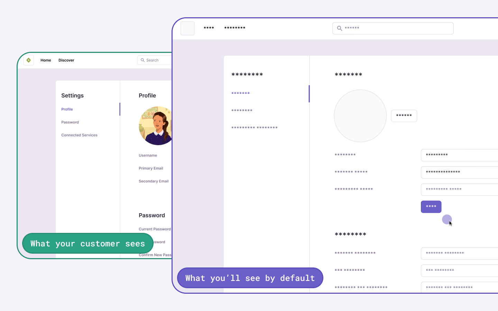
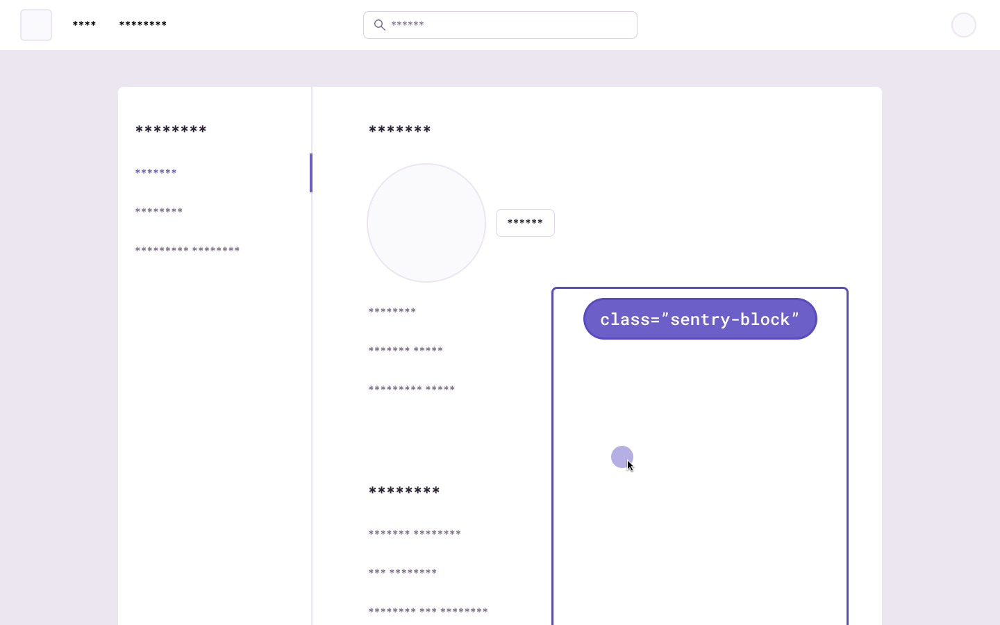
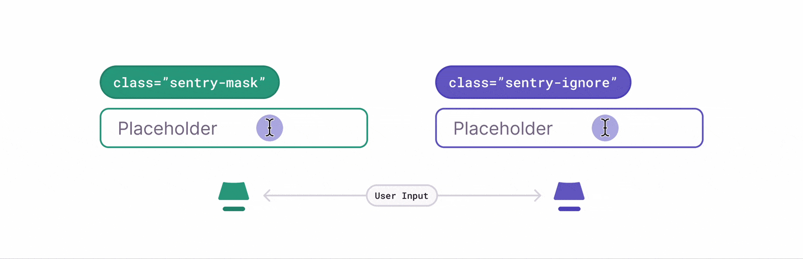

<Include name="session-replay-web-report-bug.mdx" />

<Alert level="warning">

Before enabling Session Replay in production, verify your masking configuration to ensure no sensitive data is captured. Our default settings aggressively mask potentially sensitive data, but if you modify these settings or update UI frameworks or system SDKs, you must thoroughly test your application. If you find any masking issues or sensitive data that should be masked but isn't, please [create a GitHub issue](https://github.com/getsentry/sentry-javascript/issues/new/choose) and avoid deploying to production with Session Replay enabled until the issue is resolved.

</Alert>

There are several ways to deal with personally identifiable information (PII). By default, the Session Replay SDK will mask all text content with `*` and block all media elements (`img`, `svg`, `video`, `object`, `picture`, `embed`, `map`, `audio`) on the client, before it is sent to the server. This can be disabled by setting `maskAllText` to `false`. It's also possible to add the following CSS classes to specific DOM elements to prevent recording their contents: `sentry-block`, `sentry-ignore`, and `sentry-mask`. The following sections will show examples of how content is handled by the differing methods.

## Masking

Masking replaces the text content with something else. The default masking behavior is to replace each character with a `*`. Elements with class name `sentry-mask` or the attribute `data-sentry-mask` will be blocked. In this example, the relevant HTML code is: `<table class="sentry-mask">...</table>`:



You can configure what to mask or unmask via the following [configuration](#privacy-configuration):

```javascript
replayIntegration({
  mask: [".mask-me"],
  unmask: [".unmask-me"],
});
```

## Blocking

Blocking replaces the element with a placeholder that has the same dimensions. The recording will show an empty space in place of the content. Elements with class name `sentry-block` or the attribute `data-sentry-block` will be blocked. In this example, the relevant HTML code is: `<table data-sentry-block>...</table>`:



You can configure what to block or unblock via the following [configuration](#privacy-configuration):

```javascript
replayIntegration({
  block: [".block-me"],
  unblock: [".unblock-me"],
});
```

## Ignoring

Ignoring only applies to form inputs. Events will be ignored on the input element so that the replay doesn't show what occurs inside of the input. Any event on an input element with class name `sentry-ignore` or the attribute `data-sentry-ignore` will be ignored. Notice how the results in the table below show input changes, but no visible text:



You can configure what to ignore via the following [configuration](#privacy-configuration):

```javascript
replayIntegration({
  ignore: [".ignore-me"],
});
```

## Privacy Configuration

<PlatformContent includePath="replay/privacy-configuration" />

## Best Practices for Masking and Blocking in Your Codebase

Manually classifying every screen as sensitive or safe doesn't scale as your app grows. Instead, bake privacy rules into the shared primitives your UI is built from — your i18n layer, your design-system components, your avatar component — so every screen inherits the right behavior automatically.

### Hook into your i18n layer to unmask known-safe static text

If your app renders copy through a translation function (`t()`, `formatMessage()`, and similar), you already have a reliable signal for "this string came from my translation catalog, not from user data." Record every string that flows through that function, then wire it into a custom `maskFn` so only text that *didn't* come from your catalog (which is more likely to be dynamic or user-generated) gets masked:

```javascript
// i18n.js — track every string that comes out of the translation layer
export const staticStrings = new Set();

export function t(key, ...args) {
  const translated = translate(key, ...args);
  // Only remember strings that have no interpolated placeholders (e.g. "{name}"),
  // since an interpolated result can contain user data ("Hello " + name) even
  // though the template itself is static copy.
  if (translated === translate(key)) {
    staticStrings.add(translated);
  }
  return translated;
}
```

```javascript
// sentry.js
import {staticStrings} from "./i18n";

Sentry.replayIntegration({
  maskAllText: true,
  maskFn: (text) => (staticStrings.has(text) ? text : text.replace(/\S/g, "*")),
});
```

This is the same pattern Sentry uses in its own web app: static UI copy (labels, button text, empty states) rendered through the translation function is unmasked automatically, while everything else — usernames, issue titles, free-text fields — stays masked. New UI copy is safe by construction, since it flows through the same `t()` call, so nobody has to remember to add a `sentry-unmask` class to it later.

### Make privacy explicit in shared React components

Rather than auditing individual pages, add `data-sentry-mask`, `data-sentry-block`, or `data-sentry-unmask` to the low-level components your app is built from, so every consumer inherits the right behavior for free:

```jsx
// components/SensitiveText.jsx — wrap any field that can hold user data
export function SensitiveText({children, ...props}) {
  return (
    <span data-sentry-mask {...props}>
      {children}
    </span>
  );
}

// components/StaticCopy.jsx — for copy you control, like labels and headings
export function StaticCopy({children, ...props}) {
  return (
    <span data-sentry-unmask {...props}>
      {children}
    </span>
  );
}
```

<Alert level="warning">

Starting with SDK v8, `unblock` and `unmask` no longer add default DOM selectors. If you use `data-sentry-unmask` (or `sentry-unmask`) anywhere in your codebase, you must also opt in explicitly:

```javascript
Sentry.replayIntegration({
  unmask: [".sentry-unmask", "[data-sentry-unmask]"],
});
```

</Alert>

Or centralize the decision in a small HOC so reviewers only need to check the primitive once, not every call site:

```jsx
export function withReplayMask(Component) {
  return function Wrapped(props) {
    return (
      <div data-sentry-mask>
        <Component {...props} />
      </div>
    );
  };
}

export const CustomerName = withReplayMask(RawCustomerName);
```

Use a `div` (not `span`) so the wrapper doesn't produce invalid HTML — and a hydration mismatch in SSR apps — if `Component` ever renders a block-level element.

### Block avatar and profile image components

`img`, `svg`, and `video` elements are blocked by default, but many avatar components render the image as a CSS `background-image` on a `div` — for letter-avatar fallbacks, Gravatar, or a custom image pipeline. The default element blocklist only matches actual media elements, so a `background-image` avatar can slip through unblocked. Add `data-sentry-block` explicitly wherever that happens:

```jsx
function ProfileAvatar({user}) {
  if (user.avatarUrl) {
    return (
      <div
        data-sentry-block
        className="avatar"
        style={{backgroundImage: `url(${user.avatarUrl})`}}
        role="img"
        aria-label={user.name}
      />
    );
  }

  // Fallback initials avatar — still block it, since initials can be identifying.
  return (
    <div data-sentry-block className="avatar avatar--letter">
      {user.initials}
    </div>
  );
}
```

Putting `data-sentry-block` directly inside a shared `Avatar` component means every place that renders a user, team, or organization avatar is protected — nobody has to remember to add it page by page.

<Alert level="info">

As a rule of thumb: put `sentry-mask`/`sentry-block`/`sentry-unmask` in your design-system primitives (`Avatar`, `UserName`, `Input`, and so on) rather than on individual pages, and consider a lint rule or snapshot test that fails when a new component rendering user- or account-identifying data ships without one.

</Alert>

## Network Request and Response Bodies and Headers

Collecting request and response bodies is an opt-in feature. That's because the best way to avoid getting PII into Sentry is by not adding URLs of endpoints that may contain PII.
Additionally, Sentry attempts to [scrub](/security-legal-pii/scrubbing/server-side-scrubbing/) certain types of sensitive data from request and response bodies, if you accidentally opt-in to a URL that includes this type of data. This mechanism happens on our ingestion service, before data hits our disks. This is a best effort approach which pattern-matches the content with things like credit card information, social security numbers, and [passwords](https://github.com/search?q=repo%3Agetsentry%2Frelay%20PASSWORD_KEY_REGEX&type=code).

More details about this feature can be found in the [configuration page](/platforms/javascript/session-replay/configuration/#network-details).

## Custom Scrubbing

The `beforeAddRecordingEvent` has been added starting with SDK version 7.53.0. It allows you to modify, scrub the recordings to remove PII, or ignore recording events before they leave the browser. These events include console logs, network requests, and response data.

```javascript
Sentry.replayIntegration({
  beforeAddRecordingEvent: (event) => {
    // Filter out specific events
    if (event.data.tag === "foo") {
      return null;
    }

    // Remember to return an event if you want to keep it!
    return event;
  },
});
```

### Example: Capturing 500 Status Codes Only

Here's an example showing how to only capture fetch requests that return a 500 status code. (Non-fetch requests would continue to be captured normally.)

```javascript
Sentry.replayIntegration({
  beforeAddRecordingEvent: (event) => {
    // Do not capture fetch/xhr requests, unless the response code is 500
    if (
      event.data.tag === "performanceSpan" &&
      (event.data.payload.op === "resource.fetch" ||
        event.data.payload.op === "resource.xhr") &&
      event.data.payload.data.statusCode !== 500
    ) {
      return null;
    }

    return event;
  },
});
```

We also have [server-side PII scrubbing](/security-legal-pii/scrubbing/server-side-scrubbing/) for this data. It looks for certain patterns such as American social security numbers, credit cards, and private keys.

### Example: Scrubbing URLs

By default, URLs are stored in both recording and replay events.

To scrub the URL in a recording event, use the above `beforeAddRecordingEvent`.

To scrub the URL in a replay event, use `addEventProcessor`:

```javascript
Sentry.addEventProcessor((event) => {
  // Ensure that we specifically look at replay events
  if (event.type !== "replay_event") {
    // Return the event, otherwise the event will be dropped
    return event;
  }

  // Your URL scrubbing function
  function urlScrubber(url) {
    return url.replace(/([a-z0-9]{3}\.[a-z]{5}\.[a-z]{7})/, "[Filtered]");
  }

  // Scrub all URLs with your scrubbing function
  event.urls = event.urls && event.urls.map(urlScrubber);

  return event;
});
```

### Deprecated Options

Note that the privacy API prior to version 7.35.0 has been deprecated and replaced with the options above. Please see the [Replay migration guide](https://github.com/getsentry/sentry-javascript/blob/develop/docs/migration/replay.md#upgrading-replay-from-7340-to-7350---6645) for further information.
