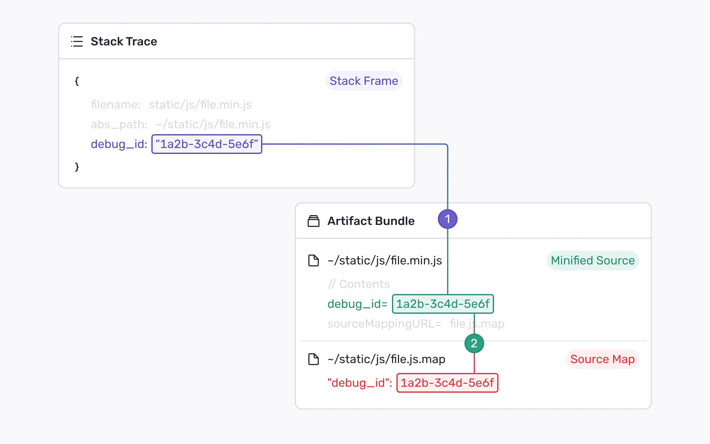
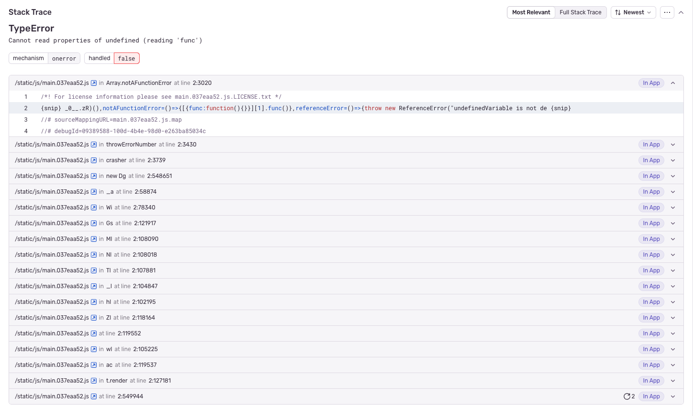
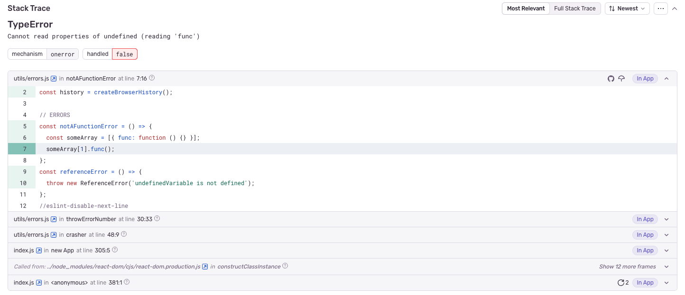

## Introduction

Developers of modern websites often use some kind of build process when they add JavaScript to the site. This build process takes some input JavaScript, transforms it in some way, then outputs JavaScript that is served alongside the website. Some example transformations include minifying JavaScript code (so the final JavaScript bundle is smaller and faster to load) or removing TypeScript types (only JavaScript can run on the browser).

As a result, the JavaScript code running in production is typically not the same as the code written by the developer in the source editor. Instead, it has undergone several transformations, such as [minification](https://developer.mozilla.org/en-US/docs/Glossary/Minification), [transpilation](https://www.typescriptlang.org/), [downcompilation](https://babeljs.io/), [transformation](https://rollupjs.org/), [polyfilling](https://developer.mozilla.org/en-US/docs/Glossary/Polyfill), and others, aimed at improving performance and ensuring cross-browser compatibility.

Stack traces are essential to debug errors, but stack traces that come from generated JavaScript are often unreadable or unusable! They look nothing like the code you wrote, you can’t connect them to your source code repository, and minified variables or function names make you lose context about what is happening.

To ensure Sentry (and other tools) can provide stack traces that are both readable and useful, you’ll want to generate and use [source maps](https://firefox-source-docs.mozilla.org/devtools-user/debugger/how_to/use_a_source_map/index.html). Source maps are files that map the transformed JavaScript back to the original code. This allows Sentry to trace the error to your original source, which means you’ll get stack traces that look like the code you wrote, not the code you generated.

To connect source maps to a JavaScript file, we relied on filenames, but these often were unreliable. For example, a new deploy of a source map with the same filename would mean the source mapping gets incorrectly applied.

`//# source mappingURL=http://example.com/path/to/your/source map.map`

Given the url-based filename approach was unreliable, we came up with [Debug IDs](/platforms/javascript/sourcemaps/debug-ids#what-is-a-debug-id).

## What is a Debug ID

Inspired by approaches in native language ecosystems, Debug IDs are globally unique, deterministic ids that identify a transformed JavaScript file and its associated source map.

## How Sentry uses Debug IDs

To use Debug IDs, you need **version 7.47** or higher of one of our [JavaScript SDKs](https://github.com/getsentry/sentry-javascript). Once you're using a supported SDK, the process works as follows:

1. **A globally unique debug id is generated**: During the build process a **debug id** is generated, which is globally unique and ideally deterministic (typically a UUID).

2. **Debug IDs are embedded in minified files**: Each minified JavaScript file includes a special comment, such as `//# debugId=DEBUG_ID`, where `DEBUG_ID` is the unique identifier generated in the previous step.

3. **The same debug id is added to source maps**: Source maps also include the same **debug id** as a new attribute, linking the minified JavaScript file to its corresponding source map.

4. **Stack traces in Sentry link the debug id**: When an error occurs, Sentry's event contains the **debug id**, which allows Sentry to automatically link the error to the correct source map. This ensures the stack trace is resolved back to the original source code, providing you with clearer and more accurate debugging information—even if the JavaScript has been minified or transformed.

### Why use Debug IDs to uniminify your code?

Unminifying your code is essential for effective debugging. While there are other [legacy ways](https://docs.sentry.io/platforms/javascript/sourcemaps/troubleshooting_js/legacy-uploading-methods/) to achieve this at Sentry, using Debug IDs is recommended by Sentry as it is the most reliable and deterministic method. By unminifying your code, you get much clearer stack traces when errors occur. Instead of seeing obfuscated code, you'll see the exact code you originally wrote, making it far easier to understand and resolve issues. Below are examples that demonstrates the difference:

#### Bad Stack Trace

#### Good Stack Trace

